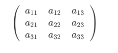
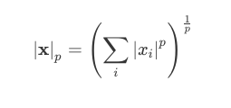
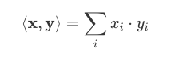
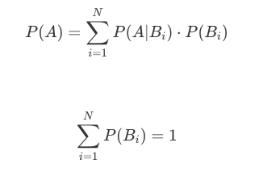
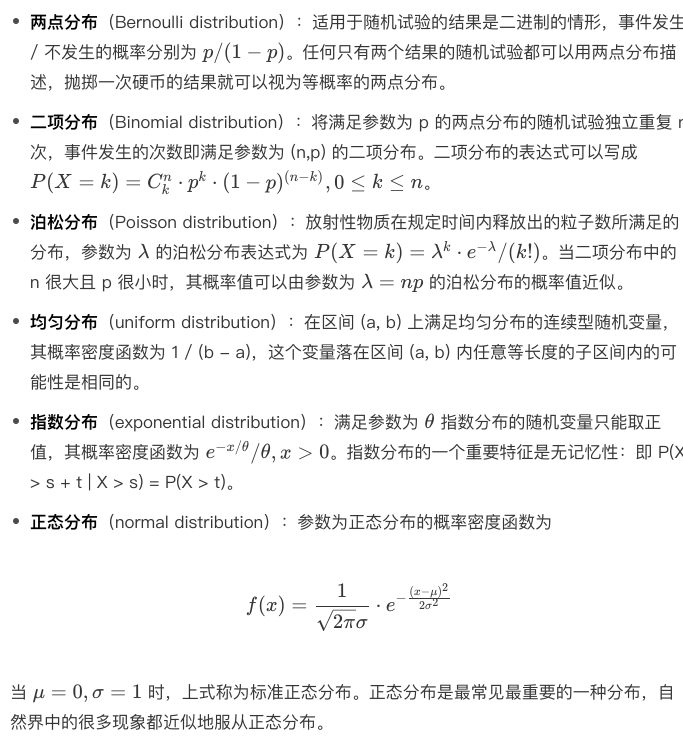
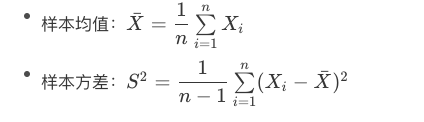
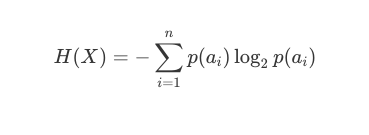
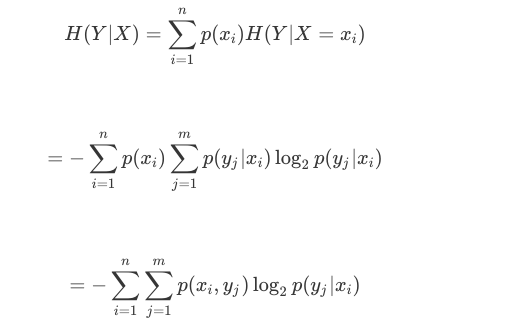
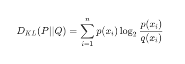
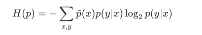

# 人工智能基础

学习资料：极客时间王天一老师的《人工智能基础课》《机器学习40讲》，此篇仅作为个人学习笔记记录。

- [人工智能基础](#人工智能基础)
  - [1. 数学基础](#1-数学基础)
    - [1.1. 线性代数](#11-线性代数)
    - [1.2. 概率论](#12-概率论)
    - [1.3. 数理统计](#13-数理统计)
      - [参数估计](#参数估计)
      - [假设检验](#假设检验)
    - [1.4. 最优化方法](#14-最优化方法)
    - [1.5. 信息论](#15-信息论)
    - [1.6. 形式逻辑](#16-形式逻辑)
  - [2. 机器学习](#2-机器学习)
    - [2.1. 机器学习概论](#21-机器学习概论)
    - [2.2. 基础线性回归：一元与多元](#22-基础线性回归一元与多元)
    - [2.3. 正则化处理：收缩方法与边际化](#23-正则化处理收缩方法与边际化)
    - [2.4. 线性降维：主成分的使用](#24-线性降维主成分的使用)
    - [2.5. 非线性降维：流形学习](#25-非线性降维流形学习)
    - [2.6. 从回归到分类：联系函数与降维](#26-从回归到分类联系函数与降维)
    - [2.7. 建模非正态分布：广义线性模型](#27-建模非正态分布广义线性模型)
    - [2.8. 几何角度看分类：支持向量机](#28-几何角度看分类支持向量机)
    - [2.9. 从全局到局部：核技巧](#29-从全局到局部核技巧)
    - [2.10. 非参数化的局部模型：K近邻](#210-非参数化的局部模型k近邻)
    - [2.11. 基于距离的学习：聚类与度量学习](#211-基于距离的学习聚类与度量学习)
    - [2.12. 基函数扩展：属性的非线性化](#212-基函数扩展属性的非线性化)
    - [2.13. 自适应的基函数：神经网络](#213-自适应的基函数神经网络)
    - [2.14. 层次化的神经网络：深度学习](#214-层次化的神经网络深度学习)
    - [2.15. 深度编解码：表示学习](#215-深度编解码表示学习)
    - [2.16. 基于特征的区域划分：树模型](#216-基于特征的区域划分树模型)
    - [2.17. 集成化处理：Boosting与Bagging](#217-集成化处理boosting与bagging)
    - [2.18. 万能模型：梯度提升与随机森林](#218-万能模型梯度提升与随机森林)
    - [2.19. 最简单的概率图：朴素贝叶斯](#219-最简单的概率图朴素贝叶斯)
    - [2.20. 有向图模型：贝叶斯网络](#220-有向图模型贝叶斯网络)
    - [2.21. 无向图模型：马尔可夫随机场](#221-无向图模型马尔可夫随机场)
    - [2.22. 建模连续分布：高斯网络](#222-建模连续分布高斯网络)
    - [2.23. 从有限到无限：高斯过程](#223-从有限到无限高斯过程)
    - [2.24. 序列化建模：隐马尔可夫模型](#224-序列化建模隐马尔可夫模型)
    - [2.25. 连续序列化模型：线性动态系统](#225-连续序列化模型线性动态系统)
    - [2.26. 精确推断：变量消除及其拓展](#226-精确推断变量消除及其拓展)
    - [2.27. 确定近似推断：变分贝叶斯](#227-确定近似推断变分贝叶斯)
    - [2.28. 随机近似推断：MCMC](#228-随机近似推断mcmc)
    - [2.29. 完备数据下的参数学习：有向图与无向图](#229-完备数据下的参数学习有向图与无向图)
    - [2.30. 隐变量下的参数学习：EM方法与混合模型](#230-隐变量下的参数学习em方法与混合模型)
    - [2.31. 结构学习：基于约束与基于评分](#231-结构学习基于约束与基于评分)
  - [3. 人工神经网络](#3-人工神经网络)
  - [4. 深度学习](#4-深度学习)

## 1. 数学基础

### 1.1. 线性代数

线性代数不仅仅是人工智能的基础，更是现代数学和以现代数学作为主要分析方法的众多学科的基础。从量子力学到图像处理都离不开向量和矩阵的使用。而在向量和矩阵背后，线性代数的核心意义在于提供了⼀种看待世界的抽象视角：万事万物都可以被抽象成某些特征的组合，并在由预置规则定义的框架之下以静态和动态的方式加以观察。  

线性代数中最基本的概念是集合（set）。在数学上，集合的定义是由某些特定对象汇总而成的集体。集合中的元素通常会具有某些共性，因而可以用这些共性来表示。对于集合 { 苹果，橘子，梨 } 来说， 所有元素的共性是它们都是水果。  

集合的元素既可以是单个的数字或符号，也可以是多个数字或符号以某种方式排列形成的组合。  

在线性代数中，由单独的数 a 构成的元素被称为标量（scalar）：一个标量 a 可以是整数、实数或复数。如果多个标量 a1​,a2​,⋯,an​ 按一定顺序组成一个序列，这样的元素就被称为向量（vector）。显然，向量可以看作标量的扩展。原始的一个数被替代为一组数，从而带来了维度的增加，给定表示索引的下标才能唯一地确定向量中的元素。  

每个向量都由若干标量构成，如果将向量的所有标量都替换成相同规格的向量，得到的就是如下的矩阵（matrix）:

相对于向量，矩阵同样代表了维度的增加，矩阵中的每个元素需要使用两个索引（而非一个）确定。同理，如果将矩阵中的每个标量元素再替换为向量的话，得到的就是张量（tensor）。直观地理解，张量就是高阶的矩阵。  

在计算机存储中，标量占据的是零维数组；向量占据的是一维数组，例如语音信号；矩阵占据的是二维数组，例如灰度图像；张量占据的是三维乃至更高维度的数组，例如 RGB 图像和视频。  

描述作为数学对象的向量需要有特定的数学语言，范数和内积就是代表。范数（norm）是对单个向量大小的度量，描述的是向量自身的性质，其作用是将向量映射为一个非负的数值。通用的 $L^p$ 范数定义如下：  

对⼀个给定向量，$L^1$ 范数计算的是向量所有元素绝对值的和，$L^2$ 范数计算的是通常意义上的向量长度，$L^∞$ 范数计算的则是向量中最大元素的取值。  

范数计算的是单个向量的尺度，内积（inner product）计算的则是两个向量之间的关系。两个相同维数向量内积的表达式为

即对应元素乘积的求和。内积能够表示两个向量之间的相对位置，即向量之间的夹角。一种特殊的情况是内积为 0，即 ⟨x,y⟩=0。在二维空间上，这意味着两个向量的夹角为 90 度，即相互垂直。而在高维空间上，这种关系被称为正交（orthogonality）。如果两个向量正交，说明他们线性无关，相互独立，互不影响.  

在实际问题中，向量的意义不仅是某些数字的组合，更可能是某些对象或某些行为的特征。范数和内积能够处理这些表示特征的数学模型，进而提取出原始对象或原始行为中的隐含关系。  

如果有一个集合，它的元素都是具有相同维数的向量（可以是有限个或无限个）， 并且定义了加法和数乘等结构化的运算，这样的集合就被称为线性空间（linear space），定义了内积运算的线性空间则被称为内积空间（inner product space）。在线性空间中，任意一个向量代表的都是 n 维空间中的一个点；反过来， 空间中的任意点也都可以唯一地用一个向量表示。两者相互等效。  

人工神经网络要处理的通常是数以万计的特征，对应着维度同样数以万计的复杂空间，这时就需要正交基的概念了。  

在内积空间中，一组两两正交的向量构成这个空间的正交基（orthogonal basis），假若正交基中基向量的$L^2$ 范数都是单位长度 1，这组正交基就是标准正交基（orthonormal basis）。正交基的作用就是给内积空间定义出经纬度。⼀旦描述内积空间的正交基确定了，向量和点之间的对应关系也就随之确定。  

描述内积空间的正交基并不唯一。对二维空间来说，平面直角坐标系和极坐标系就对应了两组不同的正交基，也代表了两种实用的描述方式。  

线性空间的一个重要特征是能够承载变化。当作为参考系的标准正交基确定后，空间中的点就可以用向量表示。当这个点从一个位置移动到另一个位置时，描述它的向量也会发生改变。点的变化对应着向量的线性变换（linear transformation），而描述对象变化抑或向量变换的数学语言，正是矩阵。  

矩阵的作用就是对正交基进行变换。因此，对于矩阵和向量的相乘，就存在不同的解读方式：Ax=y  
这个表达式既可以理解为向量 x 经过矩阵 A 所描述的变换，变成了向量 y；也可以理解为一个对象在坐标系 A 的度量下得到的结果为向量 x，在标准坐标系 I（单位矩阵：主对角线元素为 1，其余元素为 0）的度量下得到的结果为向量 y。  

描述矩阵的⼀对重要参数是特征值（eigenvalue）和特征向量（eigenvector）。对于给定的矩阵 A，假设其特征值为λ，特征向量为 x，则它们之间的关系如下：  
Ax=λx  

矩阵代表了向量的变换，其效果通常是对原始向量同时施加方向变化和尺度变化。可对于有些特殊的向量，矩阵的作用只有尺度变化而没有方向变化，也就是只有伸缩的效果而没有旋转的效果。对于给定的矩阵来说，这类特殊的向量就是矩阵的特征向量，特征向量的尺度变化系数就是特征值。  

矩阵特征值和特征向量的动态意义在于表示了变化的速度和方向。  

求解给定矩阵的特征值和特征向量的过程叫做特征值分解，但能够进行特征值分解的矩阵必须是 n 维方阵。将特征值分解算法推广到所有矩阵之上，就是更加通用的奇异值分解。  

### 1.2. 概率论

在古典概率模型中，试验的结果只包含有限个基本事件，且每个基本事件发生的可能性相同。如此一来，假设所有基本事件的数目为 n，待观察的随机事件 A 中包含的基本事件数目为 k，则古典概率模型下事件概率的计算公式为P(A)=k/n

条件概率（conditional probability）是根据已有信息对样本空间进行调整后得到的新的概率分布。假定有两个随机事件 A 和 B，条件概率就是指事件 A 在事件 B 已经发生的条件下发生的概率，用以下公式表示P(A∣B)=P(AB)​/P(B)  

上式中的 P(AB) 称为联合概率（joint probability），表示的是 A 和 B 两个事件共同发生的概率。如果联合概率等于两个事件各自概率的乘积，即 P(AB)=P(A)⋅P(B)，说明这两个事件的发生互不影响，即两者相互独立。对于相互独立的事件，条件概率就是自身的概率，即 P(A∣B)=P(A)。  

基于条件概率可以得出全概率公式（law of total probability）。全概率公式的作用在于将复杂事件的概率求解转化为在不同情况下发生的简单事件的概率求和，即

所谓“逆概率”解决的是在事件结果已经确定的条件下（P(A)），推断各种假设发生的可能性（P(Bi​∣A)）。由于这套理论首先由英国牧师托马斯·贝叶斯提出，因而其通用的公式形式被称为贝叶斯公式：

式中的 P(H) 被称为先验概率（prior probability），即预先设定的假设成立的概率；P(D∣H) 被称为似然概率（likelihood function），是在假设成立的前提下观测到结果的概率；P(H∣D) 被称为后验概率（posterior probability），即在观测到结果的前提下假设成立的概率。  

它根据观测结果寻找合理的假设，或者说根据观测数据寻找最佳的理论解释，其关注的焦点在于后验概率。概率论的贝叶斯学派（Bayesian probability）正是诞生于这种理念。  

在贝叶斯学派眼中，概率描述的是随机事件的可信程度。如果手机里的天气预报应用给出明天下雨的概率是 85%，这就不能从频率的角度来解释了，而是意味着明天下雨这个事件的可信度是 85%。  

概率论是线性代数之外，人工智能的另一个理论基础，多数机器学习模型采用的都是基于概率论的方法。但由于实际任务中可供使用的训练数据有限，因而需要对概率分布的参数进行估计，这也是机器学习的核心任务。概率的估计有两种方法：最大似然估计法（maximum likelihood estimation）和最大后验概率法（maximum a posteriori estimation），两者分别体现出频率学派和贝叶斯学派对概率的理解方式。  

最大似然估计法的思想是使训练数据出现的概率最大化，依此确定概率分布中的未知参数，估计出的概率分布也就最符合训练数据的分布。最大后验概率法的思想则是根据训练数据和已知的其他条件，使未知参数出现的可能性最大化，并选取最可能的未知参数取值作为估计值。在估计参数时，最大似然估计法只需要使用训练数据，最大后验概率法除了数据外还需要额外的信息，就是贝叶斯公式中的先验概率。  

概率论的一个重要应用是描述随机变量（random variable）。根据取值空间的不同，随机变量可以分成两类：离散型随机变量（discrete random variable）和连续型随机变量（continuous random variable）。在实际应用中，需要对随机变量的每个可能取值的概率进行描述。  

离散变量的每个可能的取值都具有大于 0 的概率，取值和概率之间一一对应的关系就是离散型随机变量的分布律，也叫概率质量函数（probability mass function）。概率质量函数在连续型随机变量上的对应就是概率密度函数（probability density function）。  

概率密度函数体现的并非连续型随机变量的真实概率，而是不同取值可能性之间的相对关系。对连续型随机变量来说，其可能取值的数目为不可列无限个，当归一化的概率被分配到这无限个点上时，每个点的概率都是个无穷小量，取极限的话就等于零。而概率密度函数的作用就是对这些无穷小量加以区分。虽然在 x→∞ 时，1/x 和 2/x 都是无穷小量，但后者永远是前者的 2 倍。这类相对意义而非绝对意义上的差别就可以被概率密度函数所刻画。对概率密度函数进行积分，得到的才是连续型随机变量的取值落在某个区间内的概率。  

重要的离散分布包括两点分布、二项分布和泊松分布，重要的连续分布则包括均匀分布、指数分布和正态分布。  

除了概率质量函数 / 概率密度函数之外，另一类描述随机变量的参数是其数字特征。数字特征是用于刻画随机变量某些特性的常数，包括数学期望（expected value）、方差（variance）和协方差（covariance）。  

数学期望即均值，体现的是随机变量可能取值的加权平均，即根据每个取值出现的概率描述作为一个整体的随机变量的规律。方差表示的则是随机变量的取值与其数学期望的偏离程度。方差较小意味着随机变量的取值集中在数学期望附近，方差较大则意味着随机变量的取值比较分散。  

数学期望和方差描述的都是单个随机变量的数字特征，如果要描述两个随机变量之间的相互关系，就需要用到协方差和相关系数。协方差度量了两个随机变量之间的线性相关性，即变量 Y 能否表示成以另一个变量 X 为自变量的 aX+b 的形式。  

根据协方差可以进一步求出相关系数（correlation coefficient），相关系数是一个绝对值不大于 1 的常数，它等于 1 意味着两个随机变量满足完全正相关，等于 -1 意味着两者满足完全负相关，等于 0 则意味着两者不相关。需要说明的是，无论是协方差还是相关系数，刻画的都是线性相关的关系。如果随机变量之间的关系满足 Y=X^2，这样的非线性相关性就超出了协方差的表达能力。

### 1.3. 数理统计

在数理统计中，可用的资源是有限的数据集合，这个有限数据集被称为样本（sample）。相应地，观察对象所有的可能取值被称为总体（population）。数理统计的任务就是根据样本推断总体的数字特征。样本通常由对总体进行多次独立的重复观测而得到，这保证了不同的样本值之间相互独立，并且都与总体具有相同的分布。  

在统计推断中，应用的往往不是样本本身，而是被称为统计量的样本的函数。统计量本身是一个随机变量，是用来进行统计推断的工具。样本均值和样本方差是两个最重要的统计量：  

统计推断的基本问题可以分为两大类：参数估计（estimation theory）和假设检验（hypothesis test）。  

#### 参数估计

参数估计是通过随机抽取的样本来估计总体分布的方法，又可以进一步划分为点估计（point estimation）和区间估计（interval estimation）。在已知总体分布函数形式，但未知其一个或者多个参数时，借助于总体的一个样本来估计未知参数的取值就是参数的点估计。点估计的核心在于构造合适的统计量 $\hat{θ}$，并用这个统计量的观察值作为未知参数 θ 的近似值。点估计的具体方法包括矩估计法（method of moments）和最大似然估计法（maximum likelihood estimation）。  

相对于基于大数定律的矩估计法，最大似然估计法源于频率学派看待概率的方式。对最大似然估计的直观理解是：既然抽样得到的是已有的样本值，就可以认为取到这一组样本值的概率较大，因而在估计参数 θ 的时候就需要让已有样本值出现的可能性最大.  

在最大似然估计中，似然函数被定义为样本观测值出现的概率，确定未知参数的准则是让似然函数的取值最大化，也就是微积分中求解函数最大值的问题。由于不同的样本值之间相互独立，因而似然函数可以写成若干概率质量函数 / 概率密度函数相乘的形式，并进一步转化为对数方程求解。  

矩估计法和最大似然估计法代表了两种推断总体参数的思路，但对于同一个参数，用不同的估计方法求出的估计量很可能存在差异，这就引出了如何对估计量进行评价的问题。在实际应用中，估计量的评价通常要考虑以下三个基本标准。  

- 无偏性：估计量的数学期望等于未知参数的真实值；
- 有效性：无偏估计量的方差尽可能小；
- 一致性：当样本容量趋近于无穷时，估计量依概率收敛于未知参数的真实值。  

以上三个要求构成了对点估计量的整体判定标准。无偏性意味着给定样本值时，根据估计量得到的估计值可能比真实值更大，也可能更小。但如果保持估计量的构造不变，而是进行多次重新抽样，每次都用新的样本计算估计值，那么这些估计值与未知参数真实值的偏差在平均意义上等于 0，这意味着不存在系统误差。  

对估计量的判别标准涉及了估计误差的影响，这是和估计值同样重要的参量。在估计未知参数 θ 的过程中，除了求出估计量，还需要估计出一个区间，并且确定这个区间包含 θ 真实值的可信程度。在数理统计中，这个区间被称为置信区间（confidence interval），这种估计方式则被称为区间估计。  

置信区间可以用如下的方式直观解释：对总体反复抽样多次，每次得到容量相同的样本，则根据每一组样本值都可以确定出一个置信区间 (θ​,θ)，其上界和下界是样本的两个统计量，分别代表了置信上限和置信下限。  

每个置信区间都存在两种可能性：包含 θ 的真实值或不包含 θ 的真实值。如果对所有置信区间中包含 θ 真实值的比率进行统计，得到的比值就是置信水平。因此，区间估计相当于在点估计的基础上进一步提供了取值范围和误差界限，分别对应着置信区间和置信水平。  

#### 假设检验

参数估计的对象是总体的某个参数，假设检验的对象则是关于总体的某个论断，即关于总体的假设。假设检验中的假设包含原假设 H0​ 和备择假设 H1​；检验的过程就是根据样本在 H0​ 和 H1​ 之间选择一个接受的过程。  

理想的情况是假设 H0​(H1​) 为真并且这个假设被接受。但由于检验是基于样本做出的，错误的决策终归会出现，其形式可以分为两种：第 I 类错误对应假设 H0​ 为真但是被拒绝的情况，也就是“弃真”类型的错误；第 II 类错误对应假设 H0​ 不真但是被接受的情况，也就是“取伪”类型的错误。  

在数理统计中，发生概率小于 1% 的事件被称作小概率事件，在单次实验中被认为是不可能发生的。如果在一次观测得到的样本中出现了小概率事件，那么就有理由认为这不是真正意义上的小概率事件，原始的假设也就此被推翻。如果是备择假设被推翻，就意味着接受原假设；反之，如果是原假设被推翻，则意味着拒绝原假设。  

从数理统计的角度看，监督学习算法的任务就是在假设空间中搜索能够针对特定问题做出良好预测的假设。学习器通过对测试数据集的学习得到具有普适性的模型，这个模型适用于不属于测试集的新样本的能力被称为泛化能力。显然，泛化能力越强，学习器就越好。  

假设检验的作用就在于根据学习器在测试集上的性能推断其泛化能力的强弱，并确定所得结论的精确程度，可以进一步推广为比较不同学习器的性能。由于度量学习器性能的常用指标是错误率，假设检验中的假设就是对学习器的泛化错误率的推断，推断的依据就是在测试数据集上的测试错误率。  

除了推断之外，对泛化性能的解释也是机器学习算法分析的重要内容。泛化误差的构成可以分为三部分：偏差（bias）、方差（variance）和噪声（noise）。  

偏差表示算法预测值和真实结果之间的偏离程度，刻画的是模型的欠拟合特性；方差表示数据的扰动对预测性能的影响，刻画的是模型的过拟合特性；噪声表示在当前学习任务上能够达到的最小泛化误差，刻画的是任务本身的难度。对任何实际的模型来说，偏差和方差都难以实现同时优化，反映出欠拟合与过拟合之间难以调和的矛盾。  

### 1.4. 最优化方法

最优化理论（optimization）研究的问题是判定给定目标函数的最大值（最小值）是否存在，并找到令目标函数取到最大值（最小值）的数值。  

要实现最小化或最大化的函数被称为目标函数（objective function）或评价函数，大多数最优化问题都可以通过使目标函数 f(x) 最小化解决，最大化问题则可以通过最小化 −f(x) 实现。  

实际的最优化算法既可能找到目标函数的全局最小值（global minimum），也可能找到局部极小值（local minimum），两者的区别在于全局最小值比定义域内所有其他点的函数值都小；而局部极小值只是比所有邻近点的函数值都小。  

当目标函数的输入参数较多、解空间较大时，绝大多数实用算法都不能满足全局搜索对计算复杂度的要求，因而只能求出局部极小值。但在人工智能和深度学习的应用场景下，只要目标函数的取值足够小，就可以把这个值当作全局最小值使用，作为对性能和复杂度的折中。  

根据约束条件的不同，最优化问题可以分为无约束优化（unconstrained optimization）和约束优化（constrained optimization）两类。无约束优化对自变量 x 的取值没有限制，约束优化则把 x 的取值限制在特定的集合内，也就是满足一定的约束条件。  

线性规划（linear programming）就是一类典型的约束优化，其解决的问题通常是在有限的成本约束下取得最大的收益。约束优化问题通常比无约束优化问题更加复杂，但通过拉格朗日乘子（Lagrange multiplier）的引入可以将含有 n 个变量和 k 个约束条件的问题转化为含有 (n+k) 个变量的无约束优化问题。拉格朗日函数最简单的形式如下  

L(x,y,λ)=f(x,y)+λφ(x,y)  

式中 f(x,y) 为目标函数，φ(x,y) 则为等式约束条件，λ 是拉格朗日乘数。从数学意义上讲，由原目标函数和约束条件共同构成的拉格朗日函数与原目标函数具有共同的最优点集和共同的最优目标函数值，从而保证了最优解的不变性。  

求解无约束优化问题最常用的方法是梯度下降法（gradient descent）。直观地说，梯度下降法就是沿着目标函数值下降最快的方向寻找最小值，就像爬山时要沿着坡度最陡的路径寻找山顶一样。在数学上，梯度的方向是目标函数导数（derivative）的反方向。  

当函数的输入为向量时，目标函数的图象就变成了高维空间上的曲面，这时的梯度就是垂直于曲面等高线并指向高度增加方向的向量，也就携带了高维空间中关于方向的信息。而要让目标函数以最快的速度下降，就需要让自变量在负梯度的方向上移动。这个结论翻译成数学语言就是“多元函数沿其负梯度方向下降最快”，这也是梯度下降法的理论依据。  

在梯度下降算法中，另一个重要的影响因素是步长，也就是每次更新 f(x) 时 x 的变化值。较小的步长会导致收敛过程较慢，当 f(x) 接近最小值点时，步长太大反而会导致一步迈过最小值点，正所谓“过犹不及”。  

因而在梯度下降法中，步长选择的整体规律是逐渐变小的。这样的方式也符合我们的认识规律。  

以上是针对单个样本的梯度下降法，当可用的训练样本有多个时，样本的使用模式就分为两种。  

一种是批处理模式（batch processing），即计算出在每个样本上目标函数的梯度，再将不同样本的梯度进行求和，求和的结果作为本次更新中目标函数的梯度。在批处理模式中，每次更新都要遍历训练集中所有的样本，因而运算量较大。  

另一种模式叫做随机梯度下降法（stochastic gradient descent），它在每次更新中只使用一个样本，下一次更新再使用另外一个样本，在不断迭代的更新过程中实现对所有样本的遍历。有趣的是，事实表明当训练集的规模较大时，随机梯度下降法的性能更佳。  

梯度下降法只用到了目标函数的一阶导数（first-order derivative），并没有使用二阶导数（second-order derivative）。一阶导数描述的是目标函数如何随输入的变化而变化，二阶导数描述的则是一阶导数如何随输入的变化而变化，提供了关于目标函数曲率（curvature）的信息。曲率影响的是目标函数的下降速度。当曲率为正时，目标函数会比梯度下降法的预期下降得更慢；反之，当曲率为负时，目标函数则会比梯度下降法的预期下降得更快。  

梯度下降法不能利用二阶导数包含的曲率信息，只能利用目标函数的局部性质，因而难免盲目的搜索中。已知目标函数可能在多个方向上都具有增加的导数，意味着下降的梯度具有多种选择。但不同选择的效果显然有好有坏。遗憾的是，梯度下降法无法获知关于导数的变化信息，也就不知道应该探索导数长期为负的方向。由于不具备观察目标函数的全局视角，在使用中梯度下降法就会走出一些弯路，导致收敛速度变慢。而二阶导数所包含的全局信息能够为梯度下降的方向提供指导，进而获得更优的收敛性。  

如果将二阶导数引入优化过程，得到的典型方法就是牛顿法（Newton's method）。在牛顿法中，目标函数首先被泰勒展开，写成二阶近似的形式（相比之下，梯度下降法只保留了目标函数的一阶近似）。此时再对二阶近似后的目标函数求导，并令其导数等于 0，得到的向量表示的就是下降最快的方向。相比于梯度下降法，牛顿法的收敛速度更快。  

不管是利用一阶导数的梯度下降法，还是利用二阶导数的牛顿法，其寻找最小值点的基本思想都是先确定方向，再确定步长，因而统称为“线性搜索方法”（line search）。  

还有一类算法，其寻找最小值点的基本思路是先确定步长，以步长为参数划定一个区域，再在这个区域内寻找最快下降的方向。这类算法被称为“置信域方法”（trust region）。  

置信域算法的运行过程如下：设定一个置信域半径 s，并在以当前点为中心、以 s 为半径的封闭球形区域作为置信域，在置信域内寻找目标函数的二次近似模型的最优点，最优点和当前点之间的距离就是计算出来的备选位移。  

在备选位移上，如果目标函数的二次近似产生了充分的下降，就将当前点移动到计算出的最优点，则继续按此规则迭代计算下去，并可以适当增加 s；如果目标函数的近似下降不够理想，则说明步子跨得太大，需要缩小 s 并计算出新的备选位移，直到满足终止条件。  

### 1.5. 信息论

信息论使用“信息熵”的概念，对单个信源的信息量和通信中传递信息的数量与效率等问题做出了解释，并在世界的不确定性和信息的可测量性之间搭建起一座桥梁。  

在信息论中，如果事件 A 发生的概率为 p(A)，则这个事件的自信息量的定义为h(A)=−log2​p(A)  

根据单个事件的自信息量可以计算包含多个符号的信源的信息熵。信源的信息熵是信源可能发出的各个符号的自信息量在信源构成的概率空间上的统计平均值。如果一个离散信源 X 包含 n 个符号，每个符号 ai​ 的取值为 p(ai​)，则 X 的信源熵为

信源熵描述了信源每发送一个符号所提供的平均信息量，是信源总体信息测度的均值。当信源中的每个符号的取值概率相等时，信源熵取到最大值 log2​n，意味着信源的随机程度最高。  

在概率论中有条件概率的概念，将条件概率扩展到信息论中，就可以得到条件熵。如果两个信源之间具有相关性，那么在已知其中一个信源 X 的条件下，另一个信源 Y 的信源熵就会减小。条件熵 H(Y∣X) 表示的是在已知随机变量 X 的条件下另一个随机变量 Y 的不确定性，也就是在给定 X 时，根据 Y 的条件概率计算出的熵再对 X 求解数学期望：  

条件熵的意义在于先按照变量 X 的取值对变量 Y 进行了一次分类，对每个分出来的类别计算其单独的信息熵，再将每个类的信息熵按照 X 的分布计算其数学期望。  

定义了条件信息熵后，就可以进一步得到互信息的概念I(X;Y)=H(Y)−H(Y∣X)  

互信息等于 Y 的信源熵减去已知 X 时 Y 的条件熵，即由 X 提供的关于 Y 的不确定性的消除，也可以看成是 X 给 Y 带来的信息增益。互信息这个名称在通信领域经常使用，信息增益则在机器学习领域中经常使用，两者的本质是一样的。  

在机器学习中，信息增益常常被用于分类特征的选择。对于给定的训练数据集 Y，H(Y) 表示在未给定任何特征时，对训练集进行分类的不确定性；H(Y∣X) 则表示了使用特征 X 对训练集 Y 进行分类的不确定性。信息增益表示的就是特征 X 带来的对训练集 Y 分类不确定性的减少程度，也就是特征 X 对训练集 Y 的区分度。  

显然，信息增益更大的特征具有更强的分类能力。但信息增益的值很大程度上依赖于数据集的信息熵 H(Y)，因而并不具有绝对意义。为解决这一问题，研究者又提出了信息增益比的概念，并将其定义为 g(X,Y)=I(X;Y)/H(Y)。  

另一个在机器学习中经常使用的信息论概念叫作“Kullback-Leibler 散度”，简称 KL 散度。KL 散度是描述两个概率分布 P 和 Q 之间的差异的一种方法，其定义为  

KL 散度是对额外信息量的衡量。给定一个信源，其符号的概率分布为 P(X)，就可以设计一种针对 P(X) 的最优编码，使得表示该信源所需的平均比特数最少（等于该信源的信源熵）。  

可是当信源的符号集合不变，而符合的概率分布变为 Q(X) 时，再用概率分布 P(X) 的最优编码对符合分布 Q(X) 的符号编码，此时编码结果的字符数就会比最优值多一些比特。  

KL 散度就是用来衡量这种情况下平均每个字符多用的比特数，也可以表示两个分布之间的距离。  

KL 散度的两个重要性质是非负性和非对称性。  

非负性是指 KL 散度是大于或等于 0 的，等号只在两个分布完全相同时取到。  

非对称性则是指 $D_{KL}​(P∣∣Q) \neq D_{KL}​(Q∣∣P)$，即用 P(X) 去近似 Q(X) 和用 Q(X) 去近似 P(X) 得到的偏差是不同的，因此 KL 散度并不满足数学意义上对距离的定义，这一点需要注意。  

事实上，$D_{KL}(P∣∣Q)$ 和 $D_{KL}(Q∣∣P)$ 代表了两种不同的近似方式。要让 $D_{KL}​(P∣∣Q)$ 最小，需要让 Q(X) 在 P(X) 不等于 0 的位置同样不等于 0；要让 $D_{KL}​(Q∣∣P)$ 最小，则需要让 Q(X) 在 P(X) 等于 0 的位置同样等于 0。  

除了以上定义的指标之外，信息论中还有一个重要定理，叫作“最大熵原理”。最大熵原理是确定随机变量统计特性时力图最符合客观情况的一种准则。对于一个未知的概率分布，最坏的情况就是它以等可能性取到每个可能的取值。这个时候的概率分布最均匀，也就是随机变量的随机程度最高，对它进行预测也就最困难。  

从这个角度看，最大熵原理的本质在于在推断未知分布时不引入任何多余的约束和假设，因而可以得到最不确定的结果，预测的风险也就最小。投资理财中的名言“不要把所有鸡蛋放在同一个篮子里”，就可以视为最大熵原理的一个实际应用。  

将最大熵原理应用到分类问题上就可以得到最大熵模型。在分类问题中，首先要确定若干特征函数作为分类的依据。为了保证特征函数的有效性，其在模型真实分布 P(X) 上的数学期望和在由训练数据集推导出的经验分布 $\tilde{P}(X)$ 上的数学期望应该相等，即对给定特征函数数学期望的估计应该是个无偏估计量。  

这样一来，每一个特征函数就对应了一个约束条件。分类的任务就是在这些约束条件下，确定一个最好的分类模型。由于除了这些约束条件之外，没有任何关于分类的先验知识，因而需要利用最大熵原理，求解出不确定性最大的条件分布，即让以下函数的取值最大化  

式中的 p(y∣x) 就是分类问题要确定的目标条件分布。计算上式的最大值实质上就是一个约束优化问题，由特征函数确定的约束条件可以通过拉格朗日乘子的引入去除其影响，转化为无约束优化问题。从数学上可以证明，这个模型的解是存在且唯一的。  

### 1.6. 形式逻辑

通俗地说，理想的人工智能应该具备抽象意义上的学习、推理与归纳能力，其通用性将远远强于解决国际象棋或是围棋这些具体问题的算法。要实现这样的人工智能，不可或缺的基础是形式逻辑。人工智能的早期研究者认为人类认知和思维的基本单元是符号，而认知过程就是对符号的逻辑运算，这样一来，人类抽象的逻辑思维就可以通过计算机中逻辑门的运算模拟，进而实现机械化的人类认知。  

反过来，形式逻辑也是智能行为的描述方式，任何能够将某些物理模式或符号转化成其他模式或符号的系统都有可能产生智能的行为，也就是人工智能。  

在人工智能中，常用的知识表示方法包括数据结构和处理算法。数据结构用于静态存储待解决的问题、问题的中间解答、问题的最终解答以及解答中涉及的知识；处理算法则用于在已有问题和知识之间进行动态交互，两者共同构成完整的知识表示体系。  

在人工智能中应用的主要是一阶谓词逻辑。谓词逻辑是最基本的逻辑系统，也是形式逻辑的根本部分。谓词逻辑的一个特例是命题逻辑。在命题逻辑中，命题是逻辑处理的基本单位，只能对其真伪做出判断。  

但命题这种表示法的局限性在于无法把其描述对象的结构及逻辑特征反映出来，也不能体现出不同事物的共同特征。假如单独给定命题“老李是小李的父亲”，在没有上下文时就无法确定老李和小李之间的关系，这个命题的真伪也就没有意义。  
为了扩展形式逻辑的表示能力，在命题逻辑的基础上又诞生了谓词逻辑。谓词逻辑将命题拆分为个体词、谓词和量词，三者的意义如下：

- 个体词是可以独立存在的具体或抽象的描述对象，比如前文例子中的“老李”和“小李”；
- 谓词用于描述个体词的属性与相互关系，比如前文例子中的“是... 的父亲”；
- 量词用于描述个体词的数量关系，包括全称量词 ∀ 和存在量词 ∃。  

以上三种元素可以共同构成命题。不同的命题之间则可以用逻辑联结词建立联系，由简单命题形成复合命题。按照优先级由高到低排列，逻辑联结词包括以下五种。  

- 否定(¬)：复合命题 ¬P 表示否定命题 P 的真值的命题，即“非 P” 。
- 合取(∧)：复合命题 P∧Q 表示命题 P 和命题 Q 的合取，即“P 且 Q”。
- 析取(∨)：复合命题 P∨Q 表示命题 P 或命题 Q 的析取，即“P 或 Q”。
- 蕴涵(→)：复合命题 P→Q 表示命题 P 是命题 Q 的条件，即“如果 P，那么 Q”。
- 等价(↔)：复合命题 P↔Q 表示命题 P 和命题 Q 相互蕴涵，即“如果 P，那么 Q 且如果 Q，那么 P”。

谓词逻辑既可以用于表示事物的概念、状态、属性等事实性知识，也可以用于表示事物间具有确定因果关系的规则性知识。  
事实性知识通常使用析取与合取符号连接起来的谓词公式表示，规则性知识则通常使用由蕴涵符号连接起来的谓词公式来表示。在一般意义上，使用谓词逻辑进行知识表示的步骤如下：

- 定义谓词及个体，确定每个谓词及每个个体的确切含义；
- 根据所要表达的事物或概念，为每个谓词中的变量赋以特定的值；
- 根据所要表达的知识的语义，用适当的逻辑联结词将各个谓词连接起来。  

经过以上步骤的处理后，抽象意义上的知识就能够转化为计算机可以识别并处理的数据结构。  

当一组产生式规则相互配合、协同作用时，一个产生式规则生成的结论就可以为另一个产生式规则作为已知的前提或条件使用，以进一步解决更加复杂的问题，这样的系统就是产生式系统。  

一般说来，产生式系统包括规则库、事实库和推理机三个基本部分。  

规则库是专家系统的核心与基础，存储着以产生式形式表示的规则集合，其中规则的完整性、准确性和合理性都将对系统性能产生直接的影响。  

事实库存储的是输入事实、中间结果与最终结果，当规则库中的某条产生式的前提可与事实库中的某些已知事实匹配时，该产生式就被激活，其结论也就可以作为已知事实存储在事实库中。  

推理机则是用于控制和协调规则库与事实库运行的程序，包括了推理方式和控制策略。  

具体而言，推理的方式可以分为三种：正向推理、反向推理和双向推理。  

正向推理采用的是自底向上的方式，即从已知事实出发，通过在规则库中不断选择匹配的规则前件，得到匹配规则的后件，进而推演出目标结论。  

反向推理采用的是自顶向下的方式，即从目标假设出发，通过不断用规则库中规则的后件与已知事实匹配，选择出匹配的规则前件，进而回溯已知事实。  

双向推理则是综合利用正向推理和反向推理，使推理从自顶向下和自底向上两个方向进行，直到在某个中间点汇合，这种方式具有更高的效率。  

## 2. 机器学习

### 2.1. 机器学习概论

机器学习是计算机基于数据构建概率统计模型并运用模型对数据进行预测与分析的学科。  

机器学习可说是从数据中来，到数据中去。假设已有数据具有一定的统计特性，则不同的数据可以视为满足独立同分布的样本。机器学习要做的就是根据已有的训练数据推导出描述所有数据的模型，并根据得出的模型实现对未知的测试数据的最优预测。  

在机器学习中，数据并非通常意义上的数量值，而是对于对象某些性质的描述。被描述的性质叫作属性，属性的取值称为属性值，不同的属性值有序排列得到的向量就是数据，也叫实例。  

黄种人相貌特征的典型属性便包括肤色、眼睛大小、鼻子长短、颧骨高度。标准的中国人实例甲就是属性值{浅、大、短、低 }的组合，标准的韩国人实例乙则是属性值{浅、小、长、高}的组合。根据线性代数的知识，数据的不同属性之间可以视为相互独立，因而每个属性都代表了一个不同的维度，这些维度共同张成了特征空间。  

每一组属性值的集合都是这个空间中的一个点，因而每个实例都可以视为特征空间中的一个向量，即特征向量。需要注意的是这里的特征向量不是和特征值对应的那个概念，而是指特征空间中的向量。根据特征向量对输入数据进行分类就能够得到输出。  

在前面的例子中，输入数据是一个人的相貌特征，输出数据就是中国人 / 日本人 / 韩国人 / 泰国人四中选一。而在实际的机器学习任务中，输出的形式可能更加复杂。根据输入输出类型的不同，预测问题可以分为以下三类。  

分类问题：输出变量为有限个离散变量，当个数为 2 时即为最简单的二分类问题；  
回归问题：输入变量和输出变量均为连续变量；  
标注问题：输入变量和输出变量均为变量序列。  

在机器学习中，误差被定义为学习器的实际预测输出与样本真实输出之间的差异。在分类问题中，常用的误差函数是错误率，即分类错误的样本占全部样本的比例。  

误差可以进一步分为训练误差和测试误差两类。训练误差指的是学习器在训练数据集上的误差，也称经验误差；测试误差指的是学习器在新样本上的误差，也称泛化误差。  

训练误差描述的是输入属性与输出分类之间的相关性，能够判定给定的问题是不是一个容易学习的问题。测试误差则反映了学习器对未知的测试数据集的预测能力，是机器学习中的重要概念。实用的学习器都是测试误差较低，即在新样本上表现较好的学习器。  

学习器依赖已知数据对真实情况进行拟合，即由学习器得到的模型要尽可能逼近真实模型，因此要在训练数据集中尽可能提取出适用于所有未知数据的普适规律。  

然而，一旦过于看重训练误差，一味追求预测规律与训练数据的符合程度，就会把训练样本自身的一些非普适特性误认为所有数据的普遍性质，从而导致学习器泛化能力的下降。  

在前面的例子中，如果接触的外国人较少，从没见过双眼皮的韩国人，思维中就难免出现“单眼皮都是韩国人”的错误定式，这就是典型的过拟合现象，把训练数据的特征错当做整体的特征。  

在前面的例子中，如果接触的外国人较少，从没见过双眼皮的韩国人，思维中就难免出现“单眼皮都是韩国人”的错误定式，这就是典型的过拟合现象，把训练数据的特征错当做整体的特征。  

与过拟合对应的是欠拟合。如果说造成过拟合的原因是学习能力太强，造成欠拟合的原因就是学习能力太弱，以致于训练数据的基本性质都没能学到。如果学习器的能力不足，甚至会把黑猩猩的图像误认为人，这就是欠拟合的后果。  

在实际的机器学习中，欠拟合可以通过改进学习器的算法克服，但过拟合却无法避免，只能尽量降低其影响。由于训练样本的数量有限，因而具有有限个参数的模型就足以将所有训练样本纳入其中。  

可模型的参数越多，能与这个模型精确相符的数据也就越少，将这样的模型运用到无穷的未知数据当中，过拟合的出现便不可避免。更何况训练样本本身还可能包含一些噪声，这些随机的噪声又会给模型的精确性带来额外的误差。  

整体来说，测试误差与模型复杂度之间呈现的是抛物线的关系。当模型复杂度较低时，测试误差较高；随着模型复杂度的增加，测试误差将逐渐下降并达到最小值；之后当模型复杂度继续上升时，测试误差会随之增加，对应着过拟合的发生。  

在模型选择中，为了对测试误差做出更加精确的估计，一种广泛使用的方法是交叉验证。交叉验证思想在于重复利用有限的训练样本，通过将数据切分成若干子集，让不同的子集分别组成训练集与测试集，并在此基础上反复进行训练、测试和模型选择，达到最优效果。  

如果将训练数据集分成 10 个子集 $D_{1−10}$​ 进行交叉验证，则需要对每个模型进行 10 轮训练，其中第 1 轮使用的训练集为 $D_2​~D_{10}$​ 这 9 个子集，训练出的学习器在子集 $D_1$​ 上进行测试；第 2 轮使用的训练集为 $D_1​$ 和 $D_3​~D_{10}​$ 这 9 个子集，训练出的学习器在子集 $D_2$​ 上进行测试。依此类推，当模型在 10 个子集全部完成测试后，其性能就是 10 次测试结果的均值。不同模型中平均测试误差最小的模型也就是最优模型。

除了算法本身，参数的取值也是影响模型性能的重要因素，同样的学习算法在不同的参数配置下，得到的模型性能会出现显著的差异。因此，调参，也就是对算法参数进行设定，是机器学习中重要的工程问题，这一点在今天的神经网络与深度学习中体现得尤为明显。  

在人类的学习中，有的人可能有高人指点，有的人则是无师自通。在机器学习中也有类似的分类。根据训练数据是否具有标签信息，可以将机器学习的任务分成以下三类。

- 监督学习：基于已知类别的训练数据进行学习；
- 无监督学习：基于未知类别的训练数据进行学习；
- 半监督学习：同时使用已知类别和未知类别的训练数据进行学习。  

受学习方式的影响，效果较好的学习算法执行的都是监督学习的任务。即使号称自学成才、完全脱离了对棋谱依赖的 AlphaGo Zero，其训练过程也要受围棋胜负规则的限制，因而也脱不开监督学习的范畴。  

监督学习假定训练数据满足独立同分布的条件，并根据训练数据学习出一个由输入到输出的映射模型。反映这一映射关系的模型可能有无数种，所有模型共同构成了假设空间。监督学习的任务就是在假设空间中根据特定的误差准则找到最优的模型。  

根据学习方法的不同，监督学习可以分为生成方法与判别方法两类。  

生成方法是根据输入数据和输出数据之间的联合概率分布确定条件概率分布 P(Y∣X)，这种方法表示了输入 X 与输出 Y 之间的生成关系；判别方法则直接学习条件概率分布 P(Y∣X) 或决策函数 f(X)，这种方法表示了根据输入 X 得出输出 Y 的预测方法。  

两相对比，生成方法具有更快的收敛速度和更广的应用范围，判别方法则具有更高的准确率和更简单的使用方式。  

### 2.2. 基础线性回归：一元与多元

### 2.3. 正则化处理：收缩方法与边际化

### 2.4. 线性降维：主成分的使用

### 2.5. 非线性降维：流形学习

### 2.6. 从回归到分类：联系函数与降维

### 2.7. 建模非正态分布：广义线性模型

### 2.8. 几何角度看分类：支持向量机

### 2.9. 从全局到局部：核技巧

### 2.10. 非参数化的局部模型：K近邻

### 2.11. 基于距离的学习：聚类与度量学习

### 2.12. 基函数扩展：属性的非线性化

### 2.13. 自适应的基函数：神经网络

### 2.14. 层次化的神经网络：深度学习

### 2.15. 深度编解码：表示学习

### 2.16. 基于特征的区域划分：树模型

### 2.17. 集成化处理：Boosting与Bagging

### 2.18. 万能模型：梯度提升与随机森林

### 2.19. 最简单的概率图：朴素贝叶斯

### 2.20. 有向图模型：贝叶斯网络

### 2.21. 无向图模型：马尔可夫随机场

### 2.22. 建模连续分布：高斯网络

### 2.23. 从有限到无限：高斯过程

### 2.24. 序列化建模：隐马尔可夫模型

### 2.25. 连续序列化模型：线性动态系统

### 2.26. 精确推断：变量消除及其拓展

### 2.27. 确定近似推断：变分贝叶斯

### 2.28. 随机近似推断：MCMC

### 2.29. 完备数据下的参数学习：有向图与无向图

### 2.30. 隐变量下的参数学习：EM方法与混合模型

### 2.31. 结构学习：基于约束与基于评分

## 3. 人工神经网络

## 4. 深度学习
