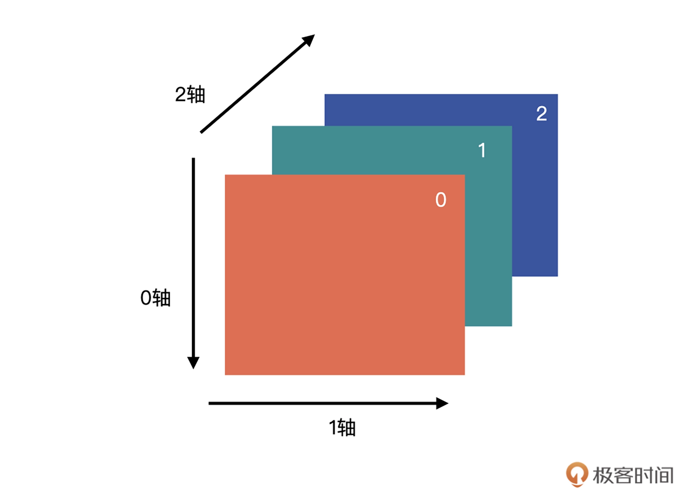
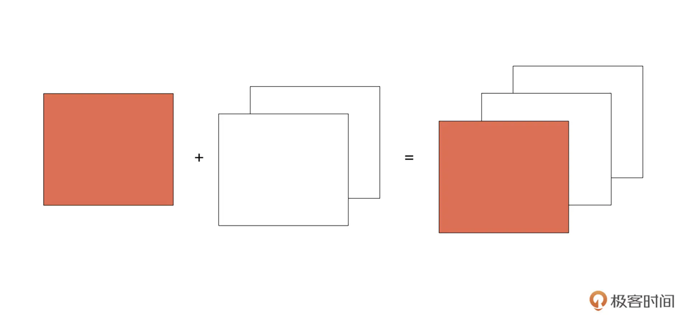
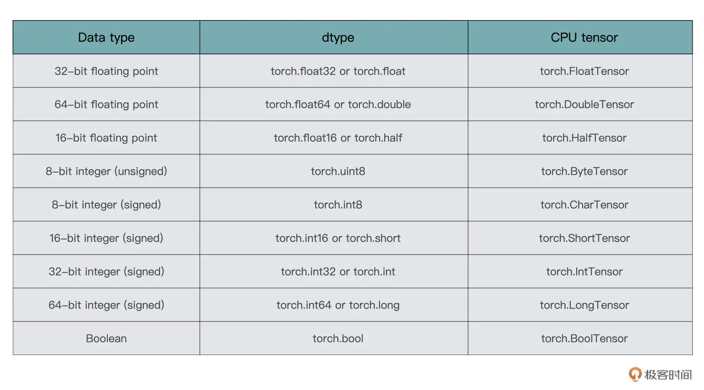

# pytorch

- [pytorch](#pytorch)
  - [1. NumPy](#1-numpy)
    - [1.1. NumPy 数组](#11-numpy-数组)
    - [1.2. 创建数组](#12-创建数组)
    - [1.3. 数组的属性](#13-数组的属性)
      - [1.3.1. ndim](#131-ndim)
      - [1.3.2. shape](#132-shape)
      - [1.3.3. size](#133-size)
      - [1.3.4. dtype](#134-dtype)
    - [1.4. 其他创建数组的方式](#14-其他创建数组的方式)
      - [1.4.1. np.ones() 与 np.zeros()](#141-npones-与-npzeros)
      - [1.4.2. np.arange()](#142-nparange)
      - [1.4.3. np.linspace()](#143-nplinspace)
    - [1.5. 数组的轴](#15-数组的轴)
    - [1.6. 深度学习中的常用操作](#16-深度学习中的常用操作)
      - [1.6.1. 数据加载阶段](#161-数据加载阶段)
      - [1.6.2. 索引与切片](#162-索引与切片)
      - [1.6.3. 数组的拼接](#163-数组的拼接)
      - [1.6.4. 深拷贝（副本）与浅拷贝（视图）](#164-深拷贝副本与浅拷贝视图)
      - [1.6.5. 模型评估](#165-模型评估)
  - [2. Tensor：PyTorch中最基础的计算单元](#2-tensorpytorch中最基础的计算单元)
    - [2.1. Tensor 的类型、创建及转换](#21-tensor-的类型创建及转换)
      - [2.1.1. Tensor 的类型](#211-tensor-的类型)
      - [2.1.4. Tensor 的创建](#214-tensor-的创建)
      - [2.1.5. Tensor 的转换](#215-tensor-的转换)

## 1. NumPy

NumPy 是用于 Python 中科学计算的一个基础包。它提供了一个多维度的数组对象，以及针对数组对象的各种快速操作，例如排序、变换，选择等。可以使用 Conda 安装，命令：conda install numpy  或使用 pip 进行安装，命令：pip install numpy

### 1.1. NumPy 数组

数组对象是 NumPy 中最核心的组成部分，这个数组叫做 ndarray，是“N-dimensional array”的缩写。其中的 N 是一个数字，指代维度，在 NumPy 中，数组是由 numpy.ndarray 类来实现的，它是 NumPy 的核心数据结构。

NumPy 数组的特点

1. Python 中的列表可以动态地改变，而 NumPy 数组是不可以的，它在创建时就有固定大小了。改变 Numpy 数组长度的话，会新创建一个新的数组并且删除原数组。
2. NumPy 数组中的数据类型必须是一样的，而列表中的元素可以是多样的。
3. NumPy 针对 NumPy 数组一系列的运算进行了优化，使得其速度特别快，并且相对于 Python 中的列表，同等操作只需使用更少的内存。

### 1.2. 创建数组

最简单的方法就是把一个列表传入到 np.array() 或 np.asarray() 中，这个列表可以是任意维度的。np.array() 属于深拷贝，np.asarray() 则是浅拷贝。

```py
import numpy as np

arr_1_d = np.asarray([1])
print(arr_1_d)  # [1]

arr_2_d = np.asarray([[1, 2], [3, 4]])
print(arr_2_d)  # [[1 2] [3 4]]
```

### 1.3. 数组的属性

数组维度、形状、size 与数据类型。

#### 1.3.1. ndim

ndim 表示数组维度（或轴）的个数。刚才创建的数组 arr_1_d 的轴的个数就是 1，arr_2_d 的轴的个数就是 2。

```py
print(arr_1_d.ndim) # 1
print(arr_2_d.ndim) # 2
```

#### 1.3.2. shape

shape 表示数组的维度或形状， 是一个整数的元组，元组的长度等于 ndim。

arr_1_d 的形状就是（1，）（一个向量）， arr_2_d 的形状就是 (2, 2)（一个矩阵）。

```py
print(arr_1_d.shape) # (1,)
print(arr_2_d.shape) # (2, 2)
```

对数组的形状进行变换，就可以使用 arr.reshape() 函数，在不改变数组元素内容的情况下变换数组的形状。注意的是，**变换前与变换后数组的元素个数需要是一样的。**

```py
# 将arr_2_d reshape为(4，1)的数组
>>>arr_2_d.reshape((4,1))
array([[1],
       [2],
       [3],
       [4]])
```

还可以使用 np.reshape(a, newshape, order) 对数组 a 进行 reshape，新的形状在 newshape 中指定。

order 参数，它是指以什么样的顺序读写元素，其中有这样几个参数。

- ‘C’：默认参数，使用类似 C-like 语言（行优先）中的索引方式进行读写。
- ‘F’：使用类似 Fortran-like 语言（列优先）中的索引方式进行读写。
- ‘A’：原数组如果是按照‘C’的方式存储数组，则用‘C’的索引对数组进行 reshape，否则使用’F’的索引方式。

#### 1.3.3. size

size，也就是数组元素的总数，它就等于 shape 属性中元素的乘积。

```py
print(arr_2_d.size) # 4
```

#### 1.3.4. dtype

它是一个描述数组中元素类型的对象。使用 dtype 属性可以查看数组所属的数据类型。

NumPy 中大部分常见的数据类型都是支持的，例如 int8、int16、int32、float32、float64 等。dtype 是一个常见的属性，在创建数组，数据类型转换时都可以看到它。

```py
print(arr_2_d.dtype) # int64
```

如果没有指定数据类型，NumPy 会自动进行判断，然后给一个默认的数据类型。

```py
arr_3_d = np.asarray([[1, 2], [3, 4]], dtype="float")
print(arr_3_d.dtype) # float64
```

数组的数据类型可以改变，使用 astype() 改变数组的数据类型，不过改变数据类型会创建一个新的数组，而不是改变原数组的数据类型。

```py
arr_3_d_int = arr_3_d.astype('int32')
print(arr_3_d.dtype) # float64
print(arr_3_d_int.dtype) # int32
```

**不能通过直接修改数据类型来修改数组的数据类型**，这样代码虽然不会报错，但是数据会发生改变.

```py
print(arr_3_d) # [[ 1.  2.] [ 3.  4.]]
```

### 1.4. 其他创建数组的方式

#### 1.4.1. np.ones() 与 np.zeros()

np.ones() 用来创建一个全 1 的数组，必须参数是指定数组的形状，可选参数是数组的数据类型。  

```py
print(np.ones(shape=(2, 3)))  # [[ 1.  1.  1.][ 1.  1.  1.]]
print(np.ones(shape=(2, 3), dtype="int32"))  # [[1 1 1][1 1 1]]
```

创建全 0 的数组是 np.zeros()，用法与 np.ones() 类似.

这两个函数一般什么时候用呢？例如，如果需要初始化一些权重的时候就可以用上，比如说生成一个 2x3 维的数组，每个数值都是 0.5，可以这样做。

```py
print(np.ones((2, 3)) * 0.5)
# [[ 0.5  0.5  0.5]
#  [ 0.5  0.5  0.5]]
```

#### 1.4.2. np.arange()

np.arange([start, ]stop, [step, ]dtype=None) 创建一个在[start, stop) 区间的数组，元素之间的跨度是 step。

start 是可选参数，默认为 0。stop 是必须参数，区间的终点，**区间是一个左闭右开区间**，所以数组并不包含 stop。step 是可选参数，默认是 1。

```py
print(np.arange(5)) # [0 1 2 3 4]
print(np.arange(2, 5)) # [2 3 4]
print(np.arange(2, 9, 3)) # [2 5 8]
```

#### 1.4.3. np.linspace()

np.linspace（start, stop, num=50, endpoint=True, retstep=False, dtype=None）创建一个从开始数值到结束数值的等差数列。

- start：必须参数，序列的起始值。
- stop：必须参数，序列的终点。
- num：序列中元素的个数，默认是 50。
- endpoint：默认为 True，如果为 True，则数组最后一个元素是 stop。
- retstep：默认为 False，如果为 True，则返回数组与公差。# 从2到10，有3个元素的等差数列>>>np.linspace(start=2, stop=10, num=3)

```py
print(np.linspace(start=2, stop=10, num=3)) # [  2.   6.  10.]
```

np.arange 与 np.linspace 也是比较常见的函数，比如要作图的时候，可以用它们生成 x 轴的坐标。例如，生成一个 y=x2 的图片，x 轴可以用 np.linespace() 来生成。

```py
import numpy as np
import matplotlib.pyplot as plt

X = np.arange(-50, 51, 2)
Y = X ** 2

plt.plot(X, Y, color='blue')
plt.legend()
plt.show()
```

### 1.5. 数组的轴

经常出现在 np.sum()、np.max() 这样关键的聚合函数中。

数组的轴即数组的维度，它是从 0 开始的。对于我们这个二维数组来说，有两个轴，分别是代表行的 0 轴与代表列的 1 轴。

```text

>>>interest_score = np.random.randint(10, size=(4, 3))
>>>interest_score
array([[4, 7, 5],
       [4, 2, 5],
       [7, 2, 4],
       [1, 2, 4]])
```


多维数据, 当 axis=i 时，就是按照第 i 个轴的方向进行计算的，或者可以理解为第 i 个轴的数据将会被折叠或聚合到一起。

形状为 (a, b, c) 的数组，沿着 0 轴聚合后，形状变为 (b, c)；沿着 1 轴聚合后，形状变为 (a, c)；沿着 2 轴聚合后，形状变为 (a, b)；更高维数组以此类推。  

```py
a = np.arange(18).reshape(3, 2, 3)
print(a)
# [[[ 0  1  2]
#   [ 3  4  5]]

#  [[ 6  7  8]
#   [ 9 10 11]]

#  [[12 13 14]
#   [15 16 17]]]
```

将同一个轴上的数据看做同一个单位，那聚合的时候，只需要在同级别的单位上进行聚合就可以了。  

绿框代表沿着 0 轴方向的单位，蓝框代表着沿着 1 轴方向的单位，红框代表着 2 轴方向的单位。


当 axis=0 时，就意味着将三个绿框的数据聚合在一起，结果是一个（2，3）的数组，数组内容为：  
[ [(max(a000​,a100​,a200​),max(a001​,a101​,a201​),max(a002​,a102​,a202​))],  
[(max(a010​,a110​,a210​),max(a011​,a111​,a211​),max(a012​,a112​,a212​))] ]​

```py
b = a.max(axis=0)
print(b)

# [[12 13 14]
#  [15 16 17]]
```

当 axis=1 时，就意味着每个绿框内的蓝框聚合在一起，结果是一个（3，3）的数组，数组内容为：  
[ [(max(a000​,a010​),max(a001​,a011​),max(a002​,a012​))],  
[(max(a100​,a110​),max(a101​,a111​),max(a102​,a112​))],  
[(max(a200​,a210​),max(a201​,a211​),max(a202​,a212​))], ]​  

```py
c = a.max(axis=1)
print(c)

# [[ 3  4  5]
#  [ 9 10 11]
#  [15 16 17]]
```

当 axis=2 时，就意味着每个绿框中的红框聚合在一起，结果是一个（3，2）的数组，数组内容如下所示：  
[ [(max(a000​,a001​,a002​),max(a010​,a011​,a012​))],  
[(max(a100​,a101​,a102​),max(a110​,a111​,a112​))],  
[(max(a200​,a201​,a202​),max(a210​,a211​,a212​))], ]​

```py
d = a.max(axis=2)
print(d)

# [[ 2  5]
#  [ 8 11]
#  [14 17]]
```

### 1.6. 深度学习中的常用操作

解决图片分类问题，可以分解成数据加载、训练与模型评估三部分）。其中数据加载跟模型评估中，就经常会用到 NumPy 数组的相关操作。

#### 1.6.1. 数据加载阶段

对于图片的处理，一般会使用 Pillow 与 OpenCV 这两个模块。虽然 Pillow 和 OpenCV 功能看上去都差不多，但还是有区别的。在 PyTorch 中，很多图片的操作都是基于 Pillow 的，所以当使用 PyTorch 编程出现问题，或者要思考、解决一些图片相关问题时，要从 Pillow 的角度出发。

1. Pillow 方式

```py

from PIL import Image
im = Image.open('jk.jpg')
im.size
# 输出: 318, 116
```

利用 NumPy 的 asarray 方法，就可以将 Pillow 的数据转换为 NumPy 的数组格式。

```py
import numpy as np

im_pillow = np.asarray(im)

im_pillow.shape
# 输出：(116, 318, 3)
```

2. OpenCV 方式

直接读入图片后，就是以 NumPy 数组的形式来保存数据的

```py
import cv2
im_cv2 = cv2.imread('jk.jpg')
type(im_cv2)
# 输出：numpy.ndarray

im_cv2.shape
# 输出：(116, 318, 3)
```

数组的最后一个维度是 3，这是因为图片的格式是 RGB 格式，表示有 R、G、B 三个通道。对于计算视觉任务来说，绝大多数处理的图片都是 RGB 格式，如果不是 RGB 格式的话，要记得事先转换成 RGB 格式。  

**Pillow 读入后通道的顺序就是 R、G、B，而 OpenCV 读入后顺序是 B、G、R。**  

如果一个通道的数据再加另外两个全 0 的通道（相当于关闭另外两个通道），最终图像以红色格调（可以先看一下后文中的最终输出结果）呈现出来的话，就可以认为该通道的数据是来源于 R 通道，G 与 B 通道的证明同样可以如此。

#### 1.6.2. 索引与切片

索引用来定位数组中的某一个值。切片就相当于提取图书中从某一页到某一页的内容。  

在 NumPy 数组中经常会出现用冒号来检索数据的形式，如下所示：

```py
im_pillow[:, :, 0]
```

“：”代表全部选中的意思。上述代码的含义就是取第三个维度索引为 0 的全部数据，换句话说就是，取图片第 0 个通道的所有数据。  



通过下面的代码，我们就可以获得每个通道的数据了。

```py
im_pillow_c1 = im_pillow[:, :, 0]
im_pillow_c2 = im_pillow[:, :, 1]
im_pillow_c3 = im_pillow[:, :, 2]
```

生成一个 3 维全 0 数组，全 0 数组的形状除了最后一维为 2，其余两维要与 im_pillow 的形状相同。

```py
zeros = np.zeros((im_pillow.shape[0], im_pillow.shape[1], 2))
zeros.shape
# 输出：(116, 318, 2)
```

将全 0 的数组与 im_pillow_c1、im_pillow_c2、im_pillow_c3 进行拼接，就可以获得对应通道的图像数据了。  

#### 1.6.3. 数组的拼接

把一个分离出来的数据跟一个全 0 数组拼接起来。如下图所示，红色的可以看作单通道数据，白色的为全 0 数据。



NumPy 数组提供了 np.concatenate((a1, a2, …), axis=0) 方法进行数组拼接。其中，a1，a2, …就是要合并的数组；axis 是要沿着哪一个维度进行合并，默认是沿着 0 轴方向。

```text
im_pillow_c1_3ch = np.concatenate((im_pillow_c1, zeros), axis=2)
---------------------------------------------------------------------------
AxisError                                 Traceback (most recent call last)
<ipython-input-65-90bba90337ff> in <module>
----> 1 im_pillow_c1_3ch = np.concatenate((im_pillow_c1, zeros), axis=2)
<__array_function__ internals> in concatenate(*args, **kwargs)
AxisError: axis 2 is out of bounds for array of dimension 2
```

错误的原因是在 2 维数组中，axis 如果等于 2 的话会越界。

看看 im_pillow_c1 与 zeros 的形状。

```py
im_pillow_c1.shape
输出：(116, 318)
zeros.shape
输出：(116, 318, 2)
```

合并的两个数组维度不一样。如何统一维度呢？将 im_pillow_c1 变成 (116, 318, 1) 即可。

> 方法一：使用 np.newaxis

```py
im_pillow_c1 = im_pillow_c1[:, :, np.newaxis]
im_pillow_c1.shape
# 输出：(116, 318, 1)
```

运行上面的代码，就可以将 2 个维度的数组转换为 3 个维度的数组了。

```py
im_pillow_c1_3ch = np.concatenate((im_pillow_c1, zeros), axis=2)
im_pillow_c1_3ch.shape
# 输出：(116, 318, 3)
```

> 方法二：直接赋值

生成一个与 im_pillow 形状完全一样的全 0 数组，然后将每个通道的数值赋值为 im_pillow_c1、im_pillow_c2 与 im_pillow_c3 就可以了

```py
im_pillow_c2_3ch = np.zeros(im_pillow.shape)
im_pillow_c2_3ch[:,:,1] = im_pillow_c2

im_pillow_c3_3ch = np.zeros(im_pillow.shape)
im_pillow_c3_3ch[:,:,2] = im_pillow_c3
```

#### 1.6.4. 深拷贝（副本）与浅拷贝（视图）

浅拷贝或称视图，指的是与原数组共享数据的数组，注意，只是数据，没有说共享形状。视图通常使用 view() 来创建。常见的切片操作也会返回对原数组的浅拷贝。

下面的代码，数组 a 与 b 的数据是相同的，形状确实不同，但是修改 b 中的数据后，a 的数据同样会发生变化。

```py
import numpy as np

a = np.arange(6)
print(a.shape)
# 输出：(6,)
print(a)
# 输出：[0 1 2 3 4 5]

b = a.view()
print(b.shape)
# 输出：(6,)
b.shape = 2, 3
print(b)
# 输出：[[0 1 2]
#  [3 4 5]]
b[0, 0] = 111
print(a)
# 输出：[111   1   2   3   4   5]
print(b)
# 输出：[[111   1   2]
#  [  3   4   5]]
```

深拷贝又称副本，也就是完全复制原有数组，创建一个新的数组，修改新的数组不会影响原数组。深拷贝使用 copy() 方法。  

#### 1.6.5. 模型评估

将图片分为 2 个类别，包含的图片与不包含的图片。模型会输出形状为 (2, ) 的数组，把它叫做 probs，它存储了两个概率，如果对应的概率大，则可以推断该图片为包含的图片，否则为其他图片。

1. Argmax Vs Argmin：求最大 / 最小值对应的索引

NumPy 的 argmax(a, axis=None) 方法可以为我们解决求最大值索引的问题。如果不指定 axis，则将数组默认为 1 维。

2. Argsort：数组排序后返回原数组的索引

将图片分成 10 个类别，要找到具有最大概率的前三个类别。模型输出的概率如下：

```py
probs = np.array([0.075, 0.15, 0.075, 0.15, 0.0, 0.05, 0.05, 0.2, 0.25])
```

np.argsort 的作用是对原数组进行从小到大的排序，返回的是对应元素在原数组中的索引。

np.argsort 包括后面这几个关键参数：

- a 是要进行排序的原数组；
- axis 是要沿着哪一个轴进行排序，默认是 -1，也就是最后一个轴；
- kind 是采用什么算法进行排序，默认是快速排序，还有其他排序算法，具体可以看数据结构的排序算法。

```py
probs_idx_sort = np.argsort(-probs)  #注意，加了负号，是按降序排序
probs_idx_sort
# 输出：array([8, 7, 1, 3, 0, 2, 5, 6, 4])
#概率最大的前三个值的坐标
probs_idx_sort[:3]
# 输出：array([8, 7, 1])
```

## 2. Tensor：PyTorch中最基础的计算单元

几种数据表示：

1. 标量，也称 Scalar，是一个只有大小，没有方向的量，比如 1.8、e、10 等。
2. 向量，也称 Vector，是一个有大小也有方向的量，比如 (1,2,3,4) 等。
3. 矩阵，也称 Matrix，是多个向量合并在一起得到的量，比如[(1,2,3),(4,5,6)]等。

标量可以组合成向量，向量可以组合成矩阵。这种统一的数据形式，在 PyTorch 中我们称之为张量 (Tensor)。

用 Rank（秩）来表示这种“维度”，比如标量，就是 Rank 为 0 阶的 Tensor；向量就是 Rank 为 1 阶的 Tensor；矩阵就是 Rank 为 2 阶的 Tensor。也有 Rank 大于 2 的 Tensor。

### 2.1. Tensor 的类型、创建及转换

#### 2.1.1. Tensor 的类型



一般来说，torch.float32、torch.float64、torch.uint8 和 torch.int64 用得相对较多一些.

#### 2.1.4. Tensor 的创建

1. 直接创建

```py
torch.tensor(data, dtype=None, device=None,requires_grad=False)
```

- data，也就是要传入模型的数据。PyTorch 支持通过 list、 tuple、numpy array、scalar 等多种类型进行数据传入，并转换为 tensor。
- dtype，它声明了你需要返回一个怎样类型的 Tensor，具体类型可以参考前面表格里列举的 Tensor 的 8 种类型。
- device，这个参数指定了数据要返回到的设备.
- requires_grad，用于说明当前量是否需要在计算中保留对应的梯度信息。在 PyTorch 中，只有当一个 Tensor 设置 requires_grad 为 True 的情况下，才会对这个 Tensor 以及由这个 Tensor 计算出来的其他 Tensor 进行求导，然后将导数值存在 Tensor 的 grad 属性中，便于优化器来更新参数。

把 requires_grad 设置成 true 或者 false 要灵活处理。如果是训练过程就要设置为 true，目的是方便求导、更新参数。而到了验证或者测试过程，目的是检查当前模型的泛化能力，那就要把 requires_grad 设置成 Fasle，避免这个参数根据 loss 自动更新。


2. 从 NumPy 中创建

PyTorch 提供了一个从 NumPy 转到 Tensor 的语句：

```py
torch.from_numpy(ndarry)
```

3. 创建特殊形式的 Tensor

- 创建零矩阵 Tensor：零矩阵顾名思义，就是所有的元素都为 0 的矩阵。

```py
torch.zeros(*size, dtype=None...)
```

size 定义输出张量形状的整数序列。

- 创建单位矩阵 Tensor：单位矩阵是指主对角线上的元素都为 1 的矩阵。

```py
torch.eye(size, dtype=None...)
```

- 创建全一矩阵 Tensor：就是所有的元素都为 1 的矩阵。

```py
torch.ones(size, dtype=None...)
```

- 创建随机矩阵 Tensor

```py
torch.rand(size)
torch.randn(size)
torch.normal(mean, std, size)
torch.randint(low, high, size）
```

torch.rand 用于生成数据类型为浮点型且维度指定的随机 Tensor，随机生成的浮点数据在 0~1 区间均匀分布。  

torch.randn 用于生成数据类型为浮点型且维度指定的随机 Tensor，随机生成的浮点数的取值满足均值为 0、方差为 1 的标准正态分布。

torch.normal 用于生成数据类型为浮点型且维度指定的随机 Tensor，可以指定均值和标准差。  

torch.randint 用于生成随机整数的 Tensor，其内部填充的是在[low,high) 均匀生成的随机整数。

#### 2.1.5. Tensor 的转换

1. Int 与 Tensor 的转换：

```py
a = torch.tensor(1)
b = a.item()
```


