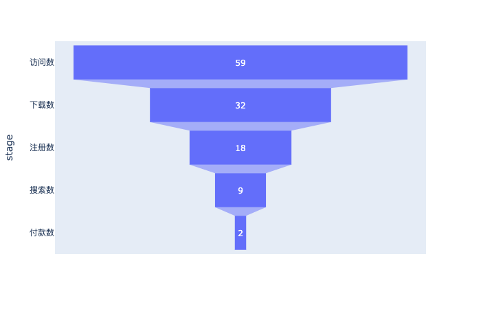
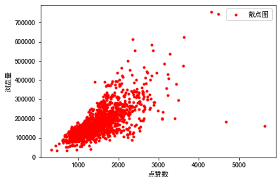
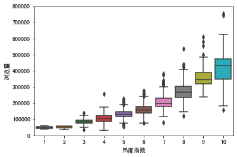
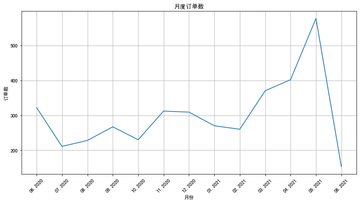
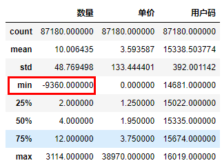
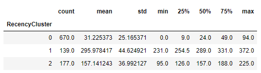
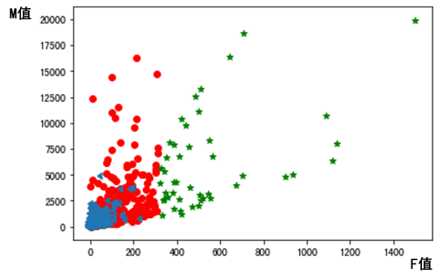
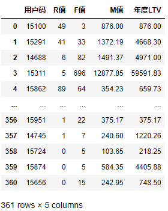
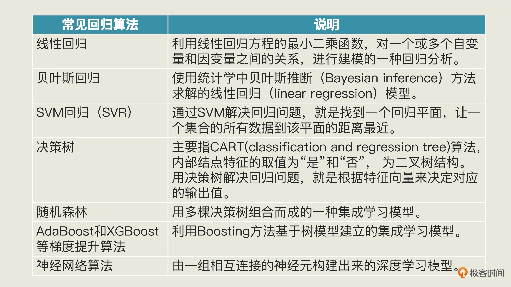
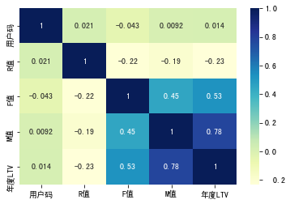

# 机器学习

基于Jupyter Notebook的编辑器，或者用vscode，里面的插件支持该语法，语言用python。  

- [机器学习](#机器学习)
  - [1. 漏斗图](#1-漏斗图)
  - [2. 线性回归](#2-线性回归)
  - [3. RFM](#3-rfm)
    - [3.1. 数据预处理](#31-数据预处理)
    - [3.2. 求 RFM 值](#32-求-rfm-值)
    - [3.3. 给用户分组](#33-给用户分组)
    - [3.4. 创建和训练模型](#34-创建和训练模型)
    - [3.5. 使用模型进行聚类，并给用户分组](#35-使用模型进行聚类并给用户分组)
    - [3.6. 为用户整体分组画像](#36-为用户整体分组画像)
  - [4. 回归分析：用模型预测用户的生命周期价值](#4-回归分析用模型预测用户的生命周期价值)
    - [4.1. 数据预处理](#41-数据预处理)
    - [4.2. 选择算法创建模型](#42-选择算法创建模型)
    - [4.3. 训练模型](#43-训练模型)
    - [4.4. 评估模型](#44-评估模型)
    - [4.5. 模型优化: 用特征工程提高模型效率](#45-模型优化-用特征工程提高模型效率)

## 1. 漏斗图

漏斗分析：一个呈现用户流失情况的图。 例如有多少人浏览这个网页，接下来的几层分别展示的是有多少人下载这个 App、注册 App、搜索商品、下单购买。

demo路径：/src/1_funnel

```py
import plotly.express as px #导入Plotly.express工具，命名为px
import pandas as pd

data = dict( #准备漏斗数据
    number=[59, 32, 18, 9, 2],
    stage=["访问数", "下载数", "注册数", "搜索数", "付款数"])
fig = px.funnel(data, x='number', y='stage') #把数据传进漏斗图
fig.show() #显示漏斗图
```

  

## 2. 线性回归

一个机器学习项目从开始到结束大致分为 5 步，分别是定义问题、收集数据和预处理、选择算法和确定模型、训练拟合模型、评估并优化模型性能。  

> 第 1 步 定义问题  

> 例子：  
因为微信公众号阅读量超过 10 万之后，就不能显示它的具体阅读量了。所以针对这个问题，我们项目的目标就是，建立一个机器学习模型，根据点赞数和转发数等指标，估计一篇文章能实现多大的浏览量。因为要估计浏览量，所以在这个数据集中：点赞数、转发数、热度指数、文章评级，这 4 个字段都是特征，浏览量就是标签。  

> 第 2 步 收集数据和预处理  

> 1. 收集数据
   
> 2. 数据可视化

可以看一看特征和标签之间可能存在的关系，也可以看看数据里有没有“脏数据”和“离群点”等。  
需要用到两个包：一个是 Python 画图工具库“Matplotlib ”，另一个是统计学数据可视化工具库“Seaborn”。这两个包都是 Python 数据可视化的必备工具包，它们是 Anaconda 默认安装包的一部分，不需要 pip install 语句重复安装。  

```py
import pandas as pd # 导入Pandas数据处理工具包
#导入数据可视化所需要的库
import matplotlib.pyplot as plt # Matplotlib – Python画图工具库
import seaborn as sns # Seaborn – 统计学数据可视化工具库
df_ads = pd.read_csv('data.csv') # 读入数据
plt.plot(df_ads['点赞数'],df_ads['浏览量'],'r.', label='Training data') # 用matplotlib.pyplot的plot方法显示散点图
plt.xlabel('点赞数') # x轴Label
plt.ylabel('浏览量') # y轴Label
plt.legend() # 显示图例
plt.show() # 显示绘图结果！
```

 

从这张图中我们可以看出来，这些数据基本上集中在一条线附近，所以它的标签和特征之间，好像真的存在着线性的关系，这可以为我们将来选模型提供参考信息。  

用 Seaborn 的 boxplot 工具画个箱线图。来看看这个数据集里有没有“离群点”。随便选择了热度指数这个特征，也可以为其它特征试试绘制箱线图。  

```py
data = pd.concat([df_ads['浏览量'], df_ads['热度指数']], axis=1) # 浏览量和热度指数
fig = sns.boxplot(x='热度指数', y="浏览量", data=data) # 用seaborn的箱线图画图
fig.axis(ymin=0, ymax=800000); #设定y轴坐标
```

箱线图是由五个数值点组成，分别是最小值 (min)、下四分位数 (Q1)、中位数 (median)、上四分位数 (Q3) 和最大值 (max)。在统计学上，这叫做五数概括。这五个数值可以清楚地为我们展示数据的分布和离散程度。  

 


发现热度指数越高，浏览量的中位数越大。我们还可以看到，有一些离群的数据点，比其它的文章浏览量大了很多，这些“离群点”就是我们说的“爆款文章”了。  

> 3. 数据清洗

清洗的数据一般分为 4 种情况：

- 第一种是处理缺失的数据。如果备份系统里面有缺了的数据，那我们尽量补录；如果没有，我们可以剔除掉残缺的数据，也可以用其他数据记录的平均值、随机值或者 0 值来补值。这个补值的过程叫数据修复。
- 第二个是处理重复的数据：如果是完全相同的重复数据处理，删掉就行了。可如果同一个主键出现两行不同的数据，比如同一个身份证号后面有两条不同的地址，我们就要看看有没有其他辅助的信息可以帮助我们判断（如时戳），要是无法判断的话，只能随机删除或者全部保留。
- 第三个是处理错误的数据：比如商品的销售量、销售金额出现负值，这时候就需要删除或者转成有意义的正值。再比如表示百分比或概率的字段，如果值大于 1，也属于逻辑错误数据。
- 第四个是处理不可用的数据：这指的是整理数据的格式，比如有些商品以人民币为单位，有些以美元为单位，就需要先统一。另一个常见例子是把“是”、“否”转换成“1”、“0”值再输入机器学习模型。

在 DataFrame 图中发现，行索引为 6 的数据中“转发数”的值是“NaN”，这是典型的脏数据。我们可以通过 DataFrame 的 isna().sum() 函数来统计所有的 NaN 的个数。这样，我们就可以在看看有没有 NaN 的同时，也看看 NaN 出现的次数。如果 NaN 过多的话，那么说明这个数据集质量不好，就要找找数据源出了什么问题。

```py
df_ads.isna().sum() # NaN出现的次数
```

可以用 dropna() 这个 API 把出现了 NaN 的数据行删掉

```py
df_ads = df_ads.dropna() # 把出现了NaN的数据行删掉
```

> 4. 特征工程

特征工程是一个专门的机器学习子领域，特征工程做得好不好，非常影响机器学习模型的效率。

以 BMI 特征工程为例，它降低了特征数据集的维度。BMI 这一个指数就替代了原来的两个特征——体重和身高，而且完全能客观地描绘我们的身材情况。维度就是数据集特征的个数。在数据集中，每多一个特征，模型拟合时的特征空间就更大，运算量也就更大。所以，摒弃掉冗余的特征、降低特征的维度，能使机器学习模型训练得更快。

> 5. 构建特征集和标签集

特征就是所收集的各个数据点，是要输入机器学习模型的变量。而标签是要预测、判断或者分类的内容。对于所有监督学习算法，我们都需要向模型中输入“特征集”和“标签集”这两组数据。因此，在开始机器学习的模型搭建之前，我们需要先构建一个特征数据集和一个标签数据集。  

只要从原始数据集删除我们不需要的数据就行了。在这个项目中，特征是点赞数、转发数、热度指数和文章评级，所以只需要从原始数据集中删除“浏览量”就行了。

```py
X = df_ads.drop(['浏览量'],axis=1) # 特征集，Drop掉标签相关字段
```

标签是我们想要预测的浏览量，因此，我们在标签数据集中只保留“浏览量”字段：

```py
y = df_ads.浏览量 # 标签集
```

> 6. 拆分训练集、验证集和测试集

拆分的时候，留作测试的数据比例一般是 20% 或 30%。不过如果数据量非常庞大，比如超过 1 百万的时候，那你也不一定非要留这么多。一般来说有上万条的测试数据就足够了。这里按照 80/20 的比例来拆分数据。具体的拆分，用机器学习工具包 scikit-learn 里的数据集拆分工具 train_test_split 来完成：

```py
#将数据集进行80%（训练集）和20%（验证集）的分割
from sklearn.model_selection import train_test_split #导入train_test_split工具
X_train, X_test, y_train, y_test = train_test_split(X, y, 
                                   test_size=0.2, random_state=0)
```

原始数据现在变成了四个数据集，分别是：

- 特征训练集（X_train）
- 特征测试集（X_test）
- 标签训练集（y_train）
- 标签测试集（y_test）

> 第 3 步 选择算法并建立模型

对于机器学习来说，最常用的算法工具包是 scikit-learn，简称 sklearn，它是使用最广泛的开源 Python 机器学习库，堪称机器学习神器。sklearn 提供了大量用于数据挖掘的机器学习工具，覆盖数据预处理、可视化、交叉验证和多种机器学习算法。

已经选定使用线性回归算法，但是在 sklearn 中又有很多线性回归算法包，比如说基本的线性回归算法 LinearRegression，以及在它的基础上衍生出来的 Lasso 回归和 Ridge 回归等。

选择 LinearRegression，它也是机器学习中最常见、最基础的回归算法包。

```py
from sklearn.linear_model import LinearRegression # 导入线性回归算法模型
linereg_model = LinearRegression() # 使用线性回归算法创建模型
```

数据集中有 4 个特征，所以就是：y=w1​x1​+w2​x2​+w3​x3​+w4​x4​+b  

模型的参数有两种：内部参数和外部参数。内部参数是属于算法本身的一部分，不用我们人工来确定，权重 w 和截距 b，都是线性回归模型的内部参数；而外部参数也叫做超参数，它们的值是在创建模型时由我们自己设定的。

对于 LinearRegression 模型来讲，它的外部参数主要包括两个布尔值：

- fit_intercept ，默认值为 True，代表是否计算模型的截距。
- normalize，默认值为 False，代表是否对特征 X 在回归之前做规范化。

> 第 4 步 训练模型

训练模型就是用训练集中的特征变量和已知标签，根据当前样本的损失大小来逐渐拟合函数，确定最优的内部参数，最后完成模型。虽然看起来挺复杂，但这些步骤，都通过调用 fit 方法来完成。

fit 方法是机器学习的核心环节，里面封装了很多具体的机器学习核心算法，我们只需要把特征训练数据集和标签训练数据集，同时作为参数传进 fit 方法就行了。

```py
linereg_model.fit(X_train, y_train) # 用训练集数据，训练机器，拟合函数，确定内部参数
```

运行该语句后的输出如下：

```py
LinearRegression()
```

fit 的核心就是减少损失，使函数对特征到标签的模拟越来越贴切。  

 

这个拟合的过程，同时也是机器学习算法优化其内部参数的过程。而优化参数的关键就是减小损失。

在机器学习中，追求的是比较小的损失。不过，模型好不好，还不能仅看单个样本，还要针对所有数据样本，找到一组平均损失“较小”的函数模型。样本的损失大小，从几何意义上基本可以理解为预测值和真值之间的几何距离。平均距离越大，说明误差越大，模型越离谱。

因此，针对每一组不同的参数，机器都会基于样本数据集，用损失函数算一次平均损失。而机器学习的最优化过程，就是逐步减小训练集上损失的过程。具体到这个回归模型的拟合，它的关键环节就是通过梯度下降，逐步优化模型的参数，使训练集误差值达到最小。这也就是 fit 语句所要实现的最优化过程。

> 第 5 步 模型的评估和优化

梯度下降是在用训练集拟合模型时最小化误差，这时候算法调整的是模型的内部参数。而在验证集或者测试集进行模型效果评估的过程中，我们则是通过最小化误差来实现超参数（模型外部参数）的优化。  


机器学习工具包（如 scikit-learn）中都会提供常用的工具和指标，对验证集和测试集进行评估，进而计算当前的误差。比如 R2 或者 MSE 均方误差指标，就可以用于评估回归分析模型的优劣。  

对于这个项目来说，预测测试集的浏览量，只需要用训练好的模型 linereg_model 中的 predict 方法，在 X_test（特征测试集）上进行预测，这个方法就会返回对测试集的预测结果。

```py
y_pred = linereg_model.predict(X_test) #预测测试集的Y值
```

在几乎所有的机器学习项目中，你都可以用 predict 方法来进行预测，它就是用模型在任意的同类型数据集上去预测真值的，可以应用于验证集、测试集，当然也可以应用于训练集本身。

拿到预测结果后，再通过下面的代码，把测试数据集的原始特征数据、原始标签真值，以及模型对标签的预测值组合在一起进行显示、比较。

```py
df_ads_pred = X_test.copy() # 测试集特征数据
df_ads_pred['浏览量真值'] = y_test # 测试集标签真值
df_ads_pred['浏览量预测值'] = y_pred # 测试集标签预测值
df_ads_pred #显示数据
```

通过 LinearRegression 的 coef_ 和 intercept_ 属性打印出各个特征的权重和模型的偏置来。它们也就是模型的内部参数。


```py
print('当前模型的4个特征的权重分别是: ', model.coef_)
print('当前模型的截距（偏置）是: ', model.intercept_)
```

输出如下：

```py
当前模型的4个特征的权重分别是:  [   48.08395224    34.73062229 29730.13312489  2949.62196343]
当前模型的截距（偏置）是:  -127493.90606857178
```

现在的模型的线性回归公式是：

yy=48.08x1​（点赞）+34.73x2​（转发）+29730.13x3​（热度）+2949.62x4​（评级）−127493.91

给出当前这个模型的评估分数：

```py
print("线性回归预测评分：", linereg_model.score(X_test, y_test)) # 评估模型
```

常用于评估回归分析模型的指标有两种：R2 分数和 MSE 指标，并且大多数机器学习工具包中都会提供相关的工具。线性回归预测评分： 0.7085754407718876

一般来说，R2 的取值在 0 到 1 之间，R2 越大，说明所拟合的回归模型越优。现在我们得到的 R2 值约为 0.708，在没有与其它模型进行比较之前，实际上也没法确定它是否能令人满意。因为分数的高低，与数据集预测的难易程度、模型的类型和参数都有关系。

如果模型的评估分数不理想，我们就需要回到第 3 步，调整模型的外部参数，重新训练模型。要是得到的结果依旧不理想，那我们就要考虑选择其他算法，创建全新的模型了。如果很不幸，新模型的效果还是不好的话，我们就得回到第 2 步，看看是不是数据出了问题。

 

## 3. RFM

案例：为公司的用户分组画像，RFM（Recency、Frequency、Monetary ），它是用户画像的衍生品，也是目前很多互联网厂商普遍采用的分析方式。具体来看：  

- R 是新进度，代表自用户上次消费以来的天数。这个指标其实也就是用户的热乎度，比如说你上次使用 App 是一个月前，你的系统里 R 值就是 30。如果你今天又用了一次 App，那 R 值就会立刻被更新为 1；
- F 是消费频率，代表用户是否频繁使用服务。这也是用户黏性的风向标；
- M 是消费金额，代表用户在一段时间内消费的总金额

项目整体上可以分为两个阶段：第一个阶段是求出 RFM 值，第二个阶段就是利用 RFM 值，给用户分组画像，进而绘制出高价值、中等价值和低价值用户的分布情况。

### 3.1. 数据预处理

> 1. 数据可视化

```py
import matplotlib.pyplot as plt #导入Matplotlib的pyplot模块
#构建月度的订单数的DataFrame
df_sales['消费日期'] = pd.to_datetime(df_sales['消费日期']) #转化日期格式
df_orders_monthly = df_sales.set_index('消费日期')['订单号'].resample('M').nunique() #每个月的订单数量
#设定绘图的画布
ax = pd.DataFrame(df_orders_monthly.values).plot(grid=True,figsize=(12,6),legend=False)
ax.set_xlabel('月份') # X轴label
ax.set_ylabel('订单数') # Y轴Label
ax.set_title('月度订单数') # 图题
#设定X轴月份显示格式
plt.xticks(
    range(len(df_orders_monthly.index)), 
    [x.strftime('%m.%Y') for x in df_orders_monthly.index], 
    rotation=45)
plt.show() # 绘图
```

这个数据集收集了“易速鲜花”公司一整年的订单量。

  

> 2. 数据清洗

在刚才的可视化过程中，完成了对消费日期的观察，并没有发现什么异常。  
所以，现在重点要处理的是用户码、单价和（订单中产品的）数量。首先，用 Pandas 中的 drop_duplicates 方法把完全相同的重复数据行删除掉。 

```py
df_sales = df_sales.drop_duplicates() #删除重复的数据行
```

对于数量、金额等类型的数据，会使用 describe 方法来查看这些字段的统计信息是否有脏数据。  

```py
plain
df_sales.describe() #df_sales的统计信息
```

  

（订单中产品的）数量的最小值（min）是一个负数（-9360），这显然是不符合逻辑的，所以我们要把这种脏数据清洗掉。具体的处理方式是，用 loc 属性通过字段名（也就是列名）访问数据集，同时只保留“数量”字段大于 0 的数据行：

```py
df_sales = df_sales.loc[df_sales['数量'] > 0] #清洗掉数量小于等于0的数据
```

在 DataFrame 对象中，loc 属性是通过行、列的名称来访问数据的，我们做数据预处理时会经常用到；还有一个常被用到的属性是 iloc，它是通过行列的位置（也就是序号）来访问数据的。  

### 3.2. 求 RFM 值

R 值（最近一次消费的天数）和 F 值（消费频率），我们通过数据集中的消费日期就能得到，但是对于 M 值（消费金额），你会发现数据集中有采购数量，有单价，但是还没有每一笔消费的总价。因此，我们通过一个语句对原有的数据集进行一个小小的扩展。在 df_sales 这个 DataFrame 对象中增加一个数据列计算总价，总价等于由单价乘以数量：

```py
df_sales['总价'] = df_sales['数量'] * df_sales['单价'] #计算每单的总价
df_sales.head() #显示头几行数据
```

在这个数据集中，用户码、总价和消费日期这三个字段，给我们带来了每一个用户的 R、F、M 信息。其中：

- 一个用户上一次购物的日期，也就是最新的消费日期，就可以转化成这个用户的 R 值；
- 一个用户下的所有订单次数之和，就是消费频率值，也就是该用户的 F 值；
- 把一个用户所有订单的总价加起来，就是消费金额值，也就是该用户的 M 值。

目前的这个数据集是一个订单的历史记录，并不是以用户码为主键的数据表。而 R、F、M 信息是和用户相关的，每一个用户都拥有一个独立的 R 值、F 值和 M 值，所以，在计算 RFM 值之前，我们需要先构建一个用户层级表。

> 1. 构建用户层级表

生成一个以用户码为关键字段的 Dataframe 对象 df_user，然后在这个 Dataframe 对象中，逐步加入每一个用户的新近度（R）、消费频率（F）、消费金额（M），以及最终总的分组信息。  

用 Dataframe 的 unique() 这个 API，就能创建出以用户码为关键字段的用户层级表 df_user，然后我们再设定字段名，并根据用户码进行排序.  

```py
df_user = pd.DataFrame(df_sales['用户码'].unique()) #生成以用户码为主键的结构df_user
df_user.columns = ['用户码'] #设定字段名
df_user = df_user.sort_values(by='用户码',ascending=True).reset_index(drop=True) #按用户码排序
df_user #显示df_user
```

> 2. 求出 R 值

R 值代表自用户上次消费以来的天数，它与最近一次消费的日期相关。所以，用表中最新订单的日期（拉出来这张表的日期）减去上一次消费的日期，就可以确定对应用户的 R 值。  

```py
df_sales['消费日期'] = pd.to_datetime(df_sales['消费日期']) #转化日期格式
df_recent_buy = df_sales.groupby('用户码').消费日期.max().reset_index() #构建消费日期信息
df_recent_buy.columns = ['用户码','最近日期'] #设定字段名
df_recent_buy['R值'] = (df_recent_buy['最近日期'].max() - df_recent_buy['最近日期']).dt.days #计算最新日期与上次消费日期的天数
df_user = pd.merge(df_user, df_recent_buy[['用户码','R值']], on='用户码') #把上次消费距最新日期的天数（R值）合并至df_user结构
df_user.head() #显示df_user头几行数据
```

R 值越大，说明该用户最近一次购物日距离当前日期越久，那么这样的用户就越是处于休眠状态。

> 3. 求出 F 值

```py
df_frequency = df_sales.groupby('用户码').消费日期.count().reset_index() #计算每个用户消费次数，构建df_frequency对象
df_frequency.columns = ['用户码','F值'] #设定字段名称
df_user = pd.merge(df_user, df_frequency, on='用户码') #把消费频率整合至df_user结构
df_user.head() #显示头几行数据
```

> 4. 求出 M 值

```py
df_revenue = df_sales.groupby('用户码').总价.sum().reset_index() #根据消费总额，构建df_revenue对象
df_revenue.columns = ['用户码','M值'] #设定字段名称
df_user = pd.merge(df_user, df_revenue, on='用户码') #把消费金额整合至df_user结构
df_user.head() #显示头几行数据
```

### 3.3. 给用户分组

看 R 值、F 值和 M 值的分布情况，以便为用户分组作出指导。

```py
df_user['R值'].plot(kind='hist', bins=20, title = '新进度分布直方图') #R值直方图

df_user.query('F值 < 800')['F值'].plot(kind='hist', bins=50, title = '消费频率分布直方图') #F值直方图

df_user.query('M值 < 20000')['M值'].plot(kind='hist', bins=50, title = '消费金额分布直方图') #M值直方图
```

通过机器学习算法，根据数据的实际情况来动态地确定分组。因为只有这样的模型才是动态的，才能长期投入使用。  

> 聚类算法中的 K-Means 算法

在无监督学习中，聚类和降维是两种最常见的算法，不过它们应用场景很不一样。聚类我们说过了，主要可以用来做分组；而降维，则是通过数学变换，将原始高维属性空间转变为一个低维“子空间”，它本质上是通过最主要的几个特征维度实现对数据的描述。我们的问题适合用聚类算法来解决。

聚类算法可以让机器把数据集中的样本按照特征的性质分组，不过它只是帮我们把数据特征彼此邻近的用户聚成一组（这里的组称为聚类的簇）。而这里说的“特征彼此邻近”，指的这些用户的数据特征在坐标系中有更短的向量空间距离。也就是说，聚类算法是把空间位置相近的特征数据归为同一组。  

聚类算法本身并不知道哪一组用户是高价值，哪一组用户是低价值。分完组之后，我们还要根据机器聚类的结果，人为地给这些用户组贴标签，看看哪一组价值高，哪一组价值低。我这里把这种人为贴标签的过程称为“聚类后概念化”。  

在 K-Means 算法中，“K”是一个关键。K 代表聚类的簇（也就是组）的个数。比如说，我们想把 M 值作为特征，将用户分成 3 个簇（即高、中、低三个用户组），那这里的 K 值就是 3，并且需要我们人工指定。  
指定 K 的数值后，K-Means 算法会在数据中随机挑选出 K 个数据点，作为簇的质心（centroid），这些质心就是未来每一个簇的中心点，算法会根据其它数据点和它的距离来进行聚类。挑选出质心后，K-Means 算法会遍历每一个数据点，计算它们与每一个质心的距离（比如欧式距离）。数据点离哪个质心近，就跟哪个质心属于一类。  

在整个聚类过程中，为了选择出更好的质心，“挑选质心”和“遍历数据点与质心的距离”会不断重复，直到质心的移动变化很小了，或者说固定不变了，那 K-Means 算法就可以停止了。  

K 值需要人工指定，那怎么在算法的辅助下确定 K 值呢？手肘法选取 K 值

> 手肘法选取 K 值

在事先并不是很确定分成多少组比较合适的情况下，“手肘法”（elbow method）可以帮我们决定，在某一批数据点中，数据分为多少组比较合适。要把用户分为高、中、低三个价值组，但是 R、F、M 的值却可以分成很多组，并不一定都是 3 组。  

手肘法是通过聚类算法的损失值曲线来直观确定簇的数量。损失值曲线，就是以图像的方法绘出，取每一个 K 值时，各个数据点距离质心的平均距离。如下图所示，当 K 取值很小的时候，整体损失很大，也就是说各个数据点距离质心的距离特别大。而随着 K 的增大，损失函数的值会在逐渐收敛之前出现一个拐点。此时的 K 值就是一个比较好的值。  


```py
from sklearn.cluster import KMeans #导入KMeans模块
def show_elbow(df): #定义手肘函数
    distance_list = [] #聚质心的距离（损失）
    K = range(1,9) #K值范围
    for k in K:
        kmeans = KMeans(n_clusters=k, max_iter=100) #创建KMeans模型
        kmeans = kmeans.fit(df) #拟合模型
        distance_list.append(kmeans.inertia_) #创建每个K值的损失
    plt.plot(K, distance_list, 'bx-') #绘图
    plt.xlabel('k') #X轴
    plt.ylabel('距离均方误差') #Y轴
    plt.title('k值手肘图') #标题
```

显示 R 值、F 值和 M 值聚类的 K 值手肘图：

```py
show_elbow(df_user[['R值']]) #显示R值聚类K值手肘图
show_elbow(df_user[['F值']]) #显示F值聚类K值手肘图
show_elbow(df_user[['M值']]) #显示M值聚类K值手肘图
```


R、F、M 值的拐点大概都在 2 到 4 之间附近，这就意味着我们把用户分成 2、3、4 个组都行。这里我选择 3 作为 R 值的簇的个数，选择 4 作为 F 值的簇的个数，选择 3 作为 M 值的簇的个数。

### 3.4. 创建和训练模型

1. 创建一个 K-Means 聚类模型。

```py
from sklearn.cluster import KMeans #导入KMeans模块
kmeans_R = KMeans(n_clusters=3) #设定K=3
kmeans_F = KMeans(n_clusters=4) #设定K=4
kmeans_M = KMeans(n_clusters=4) #设定K=4
```

2. 借助 fit 方法，用 R 值的数据，训练模型

```py
kmeans_R.fit(df_user[['R值']]) #拟合模型
kmeans_F.fit(df_user[['F值']]) #拟合模型
kmeans_M.fit(df_user[['M值']]) #拟合模型
```

### 3.5. 使用模型进行聚类，并给用户分组

> 1. 给 R、F、M 值聚类

用 kmeans 模型中的 predict 方法给 R 值聚类

```py
df_user['R值层级'] = kmeans_R.predict(df_user[['R值']]) #通过聚类模型求出R值的层级
```

用 groupby 语句来看看 0、1、2 这几个簇的用户基本统计数据：

```py
df_user.groupby('R值层级')['R值'].describe() #R值层级分组统计信息
```



注意看 0、1 和 2 这三个簇，也就是三个组，就会发现形成的簇没有顺序。你看，0 群的用户最多 670 个人，均值显示他们平均购物间隔是 31 天，上次购物距今是 0 天到 94 天，这是相对频繁的购物用户群。1 群的用户平均购物间隔为 295 天，上次购物距现在是 231 天到 372 天，这是在休眠中的用户；而 2 群的用户平均购货间隔则变成了 157 天，介于两者之间，他们上次购物距今是从 95 天到 225 天。你会发现这个从０到２的顺序既不是升序，也不是降序。  

聚类，作为一种无监督学习算法，是不知道顺序的重要性的，它只是盲目地把用户分群（按照其空间距离的临近性），而不管每个群的具体意义，因此也就没有排序的功能。  

> 2. 为聚类的层级做排序

把聚类的结果做一个排序，让 0、1、2 这三个组体现出价值的高低。

```py
#定义一个order_cluster函数为聚类排序
def order_cluster(cluster_name, target_name,df,ascending=False):
    new_cluster_name = 'new_' + cluster_name #新的聚类名称
    df_new = df.groupby(cluster_name)[target_name].mean().reset_index() #按聚类结果分组，创建df_new对象
    df_new = df_new.sort_values(by=target_name,ascending=ascending).reset_index(drop=True) #排序
    df_new['index'] = df_new.index #创建索引字段
    df_new = pd.merge(df,df_new[[cluster_name,'index']], on=cluster_name) #基于聚类名称把df_new还原为df对象，并添加索引字段
    df_new = df_new.drop([cluster_name],axis=1) #删除聚类名称
    df_new = df_new.rename(columns={"index":cluster_name}) #将索引字段重命名为聚类名称字段
    return df_new #返回排序后的df_new对象
```

调用这个 order_cluster 函数，把用户表重新排序。消费天数间隔的均值越小，用户的价值就越高，采用降序，也就是把 ascending 参数设为 False：

```py
df_user = order_cluster('R值层级', 'R值', df_user, False) #调用簇排序函数
df_user = df_user.sort_values(by='用户码',ascending=True).reset_index(drop=True) #根据用户码排序
df_user.head() #显示头几行数据
```

### 3.6. 为用户整体分组画像

这里采用简单叠加的方法把 R、F、M 三个层级的值相加，用相加后得到的值，作为总体价值，来给用户进行最终的分层。如果对其中某一个指标看得比较重，也可以加权之后再相加。

```py
df_user['总分'] = df_user['R值层级'] + df_user['F值层级'] + df_user['M值层级'] #求出每个用户RFM总分
```

- 0-2 分，低价值用户
- 3-4 分，中价值用户
- 5-8 分，高价值用户

根据总分，来确定出每一个用户的总体价值的。

```py
#在df_user对象中添加总体价值这个字段
df_user.loc[(df_user['总分']<=2) & (df_user['总分']>=0), '总体价值'] = '低价值' 
df_user.loc[(df_user['总分']<=4) & (df_user['总分']>=3), '总体价值'] = '中价值' 
df_user.loc[(df_user['总分']<=8) & (df_user['总分']>=5), '总体价值'] = '高价值'
df_user #显示df_user
```

有了用户的价值分组标签，就可以做很多进一步的分析，比如说选取 R、F、M 中任意两个维度，并把高、中、低价值用户的散点图进行呈现：



可以发现，高价值用户（绿色五星）覆盖在消费频率较高的区域，和 F 值相关度高。而在总消费金额大于 5000 元的用户中，中高价值的用户（绿色五星和红色圆点）都有。

## 4. 回归分析：用模型预测用户的生命周期价值

### 4.1. 数据预处理

可以用头 3 个月的 R、F、M 这 3 个数值作为特征，也就是回归模型的自变量。而回归模型所要预测的因变量，即数据集的标签，就是一年的总消费额，可以认为它就是用户的 LTV。  
这里的 3 个月、12 个月都只是思路上的示意，不去考虑用户平均会使用该 App 一年还是两年、三年。在不同业务场景中，计算 RFM 特征值的时间区间和 LTV 的时间区间可以视情况而定。  

> 1. 整理数据集记录的时间范围

当前数据集一共覆盖了多长的时间

```py
import numpy as np #导入NumPy
import pandas as pd #导入Pandas
df_sales = pd.read_csv('易速鲜花订单记录.csv') #载入数据
print('日期范围: %s ~ %s' % (df_sales['消费日期'].min(), df_sales['消费日期'].max())) #显示日期范围（格式转换前）
df_sales['消费日期'] = pd.to_datetime(df_sales['消费日期']) #转换日期格式
print('日期范围: %s ~ %s' % (df_sales['消费日期'].min(), df_sales['消费日期'].max()))#显示日期范围
```

输出如下：

```text
日期范围（格式转化前）: 1/1/2021 10:11 ~ 9/9/2020 9:20
日期范围（格式转化后）: 2020-06-01 09:09:00 ~ 2021-06-09 12:31:00
```

希望求的是整年的 LTV，所以，把不完整的 2021 年 6 月份的数据删除：

```py
df_sales = df_sales.loc[df_sales['消费日期'] < '2021-06-01'] #只保留整月数据
print('日期范围: %s ~ %s' % (df_sales['消费日期'].min(), df_sales['消费日期'].max())) #显示日期范围
```

> 2. 构建特征和标签

用前 3 个月的 R、F、M 值作为特征字段，然后把整个 12 个月的消费金额视为 LTV，作为标签字段。

首先，把头 3 个月的销售数据拆分出来，形成独立的 df_sales_3m 对象。这部分数据将是对用户 LTV 预测的依据。  

```py
df_sales_3m = df_sales[(df_sales.消费日期 > '2020-06-01') & (df_sales.消费日期 <= '2020-08-30')] #构建仅含头三个月数据的数据集
df_sales_3m.reset_index(drop=True) #重置索引
```

创建以用户码为主键的 df_user_LTV 对象，利用头 3 个月的数据，构建 R、F、M 层级，形成新特征。  

```py
df_user_LTV = pd.DataFrame(df_sales['用户码'].unique()) #生成以用户码为主键的结构
df_user_LTV.columns = ['用户码'] #设定字段名
df_user_LTV.head() #显示头几行数据
df_R_value = df_sales_3m.groupby('用户码').消费日期.max().reset_index() #找到每个用户的最近消费日期，构建df_R_value对象
df_R_value.columns = ['用户码','最近购买日期'] #设定字段名
df_R_value['R值'] = (df_R_value['最近购买日期'].max() - df_R_value['最近购买日期']).dt.days #计算最新日期与上次消费日期的天数
df_user_LTV = pd.merge(df_user_LTV, df_R_value[['用户码','R值']], on='用户码') #把上次消费距最新日期的天数（R值）合并至df_user结构
df_F_value = df_sales_3m.groupby('用户码').消费日期.count().reset_index() #计算每个用户消费次数，构建df_F_value对象
df_F_value.columns = ['用户码','F值'] #设定字段名
df_user_LTV = pd.merge(df_user_LTV, df_F_value[['用户码','F值']], on='用户码') #把消费频率(F值)整合至df_user结构
df_M_value = df_sales_3m.groupby('用户码').总价.sum().reset_index() #计算每个用户三个月消费总额，构建df_M_value对象
df_M_value.columns = ['用户码','M值'] #设定字段名
df_user_LTV = pd.merge(df_user_LTV, df_M_value, on='用户码') #把消费总额整合至df_user结构
df_user_LTV #显示用户表结构
```

根据一整年的数据计算出每一个用户的 LTV 值，也就是 12 个月的总消费金额, 再把得到的 LTV 值整合到之前构建的 df_user_LTV 中，就形成了完整的、带标签的 LTV 数据集。

```py
df_user_1y = df_sales.groupby('用户码')['总价'].sum().reset_index() #计算每个用户整年消费总额，构建df_user_1y对象
df_user_1y.columns = ['用户码','年度LTV'] #设定字段名
df_user_1y.head() #显示头几行数据
df_LTV = pd.merge(df_user_LTV, df_user_1y, on='用户码', how='left') #构建整体LTV训练数据集
df_LTV #显示df_LTV
```



在这个数据集中，R、F、M 值来自于头 3 个月收集的数据，是模型的特征；LTV 值来自于整年的数据，是模型的标签。用短期数据，来预测用户的长期价值。  

> 3. 创建特征集和标签集

先来构建特征集 X：

```py
X = df_LTV.drop(['用户码','年度LTV'],axis=1) #特征集
X.head() #显示特征集
```

在这段代码中，移除了 LTV 值之外，还移除了用户码字段。因为用户码对于回归模型的训练毫无意义，而且用户码也是数字，会对模型形成干扰。如果不移除的话，机器就会把它也视作一个变量.

在机器学习中，特征集的 X 大写，标签集的 y 小写，似乎是个惯例。这可能是因为通常情况下，X 是一个向量，而 y 是一个数值。

```py
y = df_LTV['年度LTV'] #标签集
y.head() #显示标签集
```

> 4. 拆分训练集、验证集和测试集

用 scikit-learn 工具包中的拆分工具 train_test_split，进行拆分

```py
from sklearn.model_selection import train_test_split
# 先拆分训练集和其它集
X_train, X_rem, y_train, y_rem = train_test_split(X,y, train_size=0.7,random_state = 36)
# 再把其它集拆分成验证集和测试集 
X_valid, X_test, y_valid, y_test = train_test_split(X_rem,y_rem, test_size=0.5,random_state = 36)
```

### 4.2. 选择算法创建模型

回归问题的常见算法



比较 3 种基本算法的效率：最基本的线性回归模型、决策树模型和随机森林模型

```py
from sklearn.linear_model import LinearRegression #导入线性回归模型
from sklearn.tree import DecisionTreeRegressor #导入决策树回归模型
from sklearn.ensemble import RandomForestRegressor #导入随机森林回归模型
model_lr = LinearRegression() #创建线性回归模型
model_dtr = DecisionTreeRegressor() #创建决策树回归模型
model_rfr = RandomForestRegressor() #创建随机森林回归模型
```

### 4.3. 训练模型

对线性回归、决策树模型和随机森林模型进行训练、拟合：

```py
model_lr.fit(X_train, y_train) #拟合线性回归模型
model_dtr.fit(X_train, y_train) #拟合决策树模型
model_rfr.fit(X_train, y_train) #拟合随机森林模型
```

在线性回归算法中，机器是通过梯度下降，逐步减少数据集拟合过程中的损失，让线性函数对特征到标签的模拟越来越贴切。而在决策树模型中，算法是通过根据特征值选择划分点来确定输出值的；在随机森林算法中，机器则是生成多棵决策树，并通过 Bagging 的方法得到最终的预测模型。

### 4.4. 评估模型

显示一下三个模型对这一行数据所预测的 LTV 值，以及该用户的 LTV 真值。

```py
print('真值:', y_valid.iloc[2])  #真值
print('线性回归预测值:', y_valid_preds_lr[2])  #线性回归模型预测值
print('决策树预测值:', y_valid_preds_dtr[2])  #决策树模型预测值
print('随机森林预测值:', y_valid_preds_rfr[2]) #随机森林模型预测值
```

输出：

```text
真值: 4391.9399999999905
线性回归预测值: 7549.22894678151
决策树预测值: 4243.209999999997
随机森林预测值: 4704.671799999999
```

对这个数据点来说，决策树和随机森林所预测的 y 值更接近真值。  

用 R2 指标，来评估模型的预测准确率：

```py
from sklearn.metrics import r2_score,   median_absolute_error #导入Sklearn评估模块
print('验证集上的R平方分数-线性回归: %0.4f' % r2_score(y_valid, model_lr.predict(X_valid)))
print('验证集上的R平方分数-决策树: %0.4f' % r2_score(y_valid, model_dtr.predict(X_valid)))
print('验证集上的R平方分数-随机森林: %0.4f' % r2_score(y_valid, model_rfr.predict(X_valid)))
```

输出：

```text
验证集上的R平方分数-线性回归: 0.4333
验证集上的R平方分数-决策树: 0.3093
验证集上的R平方分数-随机森林: 0.4677
```

### 4.5. 模型优化: 用特征工程提高模型效率

特征工程三个基本的思路：特征选择，特征变换和特征构建。

> 特征选择

在一个数据集中，每个特征在标签预测或分类过程中发挥的作用其实都不同。对于那些没作用和作用小的数据，就可以删掉，来降低数据的维度，节省模型拟合时的计算空间。这就是特征选择。  

怎么看哪个特征作用大，哪个作用小？一种常用的方法：相关性热力图。  

用 corr() 方法求出数据集中所有字段之间的相关性，然后用 seaborn 的 heatmap 方法，将它以热力图的形式呈现出来：

```py
# 对所有的标签和特征两两显示其相关性热力图(heatmap)
import seaborn as sns
sns.heatmap(df_LTV.corr(), cmap="YlGnBu", annot = True)
```



图中方格里的数字，这类数字叫做皮尔逊相关系数，表示两个变量间的线性相关性，数值越接近 1，就代表相关性越大。

发现M 值、F 值和 LTV 的相关度比较高，而 R 值和 LTV 的相关度比较低。就可以选择丢弃“R 值”这个字段。这就是一个特征选择。  

```py
X_train_less_feature = X_train.drop(['R值'], axis=1) #特征训练集
X_valid_less_feature = X_valid.drop(['R值'], axis=1) #特征验证集
model_lr_less_feature = LinearRegression() #创建线性回归模型
model_lr_less_feature.fit(X_train_less_feature, y_train) #拟合线性回归模型
print('测试集上的R平方分数-线性回归: %0.4f' % r2_score(y_valid, model_lr.predict(X_valid)))
print('测试集上的R平方分数-少R值特征的线性回归: %0.4f' % r2_score(y_valid, model_lr_less_feature.predict(X_valid_less_feature)))
```

输出：

```text
测试集上的R平方分数-线性回归: 0.4410
测试集上的R平方分数-少R值特征的线性回归: 0.4356
```

在 sklearn 的 feature_selection 模块中，有很多自动特征选择工具。一个常用的单变量特征选择工具，SelectKBest。SelectKBest 的原理和使用都非常简单，它是对每个特征和标签之间进行统计检验，根据 X 和 y 之间的相关性统计结果，来选择最好的 K 个特征，并返回。

```py
from sklearn.feature_selection import SelectKBest, mutual_info_regression  #导入特征选择工具
selector = SelectKBest(mutual_info_regression, k = 2) #选择最重要的两个特征
selector.fit(X, y) #用特征选择模型拟合数据集
X.columns[selector.get_support()] #输出选中的两个特征
```

输出

```text
Index(['F值', 'M值'], dtype='object')
```

从输出的结果来看，F 值和 M 值的分数比 R 值高。所以，在 K=2 的情况下，就需要在这 3 个特征中舍弃一个，这时候 R 值就要被舍弃。这个结果和前面观察到的一致。

单变量特征选择比较直接，速度快，并且独立于模型。但是，这种做法可能会有一个问题？那就是，如果一个特征表面上和标签不大相关，但是在与另一个特征组合之后，才会具有信息量，那么上面的做法可能会让你错误地舍弃这个特征。

在 sklearn 的 feature_selection 里，有下列几种在拟合特定模型时进行特征选择的工具，可以选择使用：


> 特征变换

对连续特征来说，最常见的特征变换就是特征缩放（feature scaling），也就是改变特征的分布或者压缩特征的区间。因为有很多模型都喜欢范围比较小、分布有规律的数据，比如采用梯度下降方法求解最优化的模型，较小的数值分布区间能够提升收敛速度，还有 SVM、KNN、神经网络等模型，都要求对特征进行缩放。

对数值型特征的缩放


各个特征缩放方法从原始特征到新特征的缩放效果图


选择其中最常见的两个特征缩放工具 StandardScaler 和 MinMaxScaler，来预测用户 LTV，比较一下它们的优劣。注意，这里所谓的优劣，仅针对于这个特定数据集和特定问题而言。

调用 StandardScaler，进行数值特征的标准化缩放，这个缩放将形成正态分布的新特征。

```py
from sklearn.preprocessing import StandardScaler #导入标准化缩放器
scaler = StandardScaler() #创建标准化缩放器
X_train_standard = scaler.fit_transform(X_train) #拟合并转换训练集数据
X_valid_standard = scaler.transform(X_valid) #转换验证集数据
X_test_standard = scaler.transform(X_test) #转换测试集数据
```

fit_transform 这个 API，这是 fit 和 transform 两个 API 的整合，它的意思是先根据训练集拟合数据，找到合适的标准化参数，然后再把参数应用在训练集上，给数据做缩放。  

而在验证集和测试集上，我们只使用 transform 这个 API，来通过从训练集中得到的参数，来转换数据，这个步骤中就没有 fit 的过程，这是因为对于模型来说，验证集和测试集是新的看不见的数据，因此在训练之前或训练期间它是不应该被访问的，使用来自验证集和测试集的任何信息都属于数据泄露，会导致评估性能的潜在偏差。  

用缩放后的特征训练模型，得到一个随机森林模型 model_rfr_standard。

```py
model_rfr_standard = RandomForestRegressor() #创建随机森林回归模型
model_rfr_standard.fit(X_train_standard, y_train) #拟合随机森林模型
```

用 MinMaxScaler 来预测用户 LTV。进行数值特征的归一化缩放。所谓“归一化”，就是把特征的值压缩到给定的最小值和最大值，比如 0-1 之间。如果有负值的话，那就是 -1 到 1 之间。

使用先前从训练集中获得的归一化参数，而不是在验证集和测试集上重新计算它们。

```py
from sklearn.preprocessing import MinMaxScaler #导入归一化缩放器
scaler = MinMaxScaler() #创建归一化缩放器
X_train_minmax = scaler.fit_transform(X_train) #拟合并转换训练集数据
X_valid_minmax = scaler.transform(X_valid) #转换验证集数据
X_test_minmax = scaler.transform(X_test) #转换测试集数据
```

用缩放之后的特征训练模型，得到一个随机森林模型 model_rfr_minmax。

```py
model_rfr_minmax = RandomForestRegressor() #创建随机森林回归模型
model_rfr_minmax.fit(X_train_minmax, y_train) #拟合随机森林模型
```

> 对类别型特征的变换：虚拟变量和独热编码

把类别特征转换成机器可以读取的编码, 如果数据表中的字段值是“男”、“女”这样的数据，就用下面的代码直接转换成 0、1 值即可。

```py
df['性别'].replace(to_replace='女', value=0, inplace=True)
df['性别'].replace(to_replace='男', value=1, inplace=True)
```

pandas 编码有一种非常简单的方法，就是 get_dummies 函数。get_dummies 函数会自动变换所有具有对象类型（比如字符串）的列或所有分类的列，而分类特征的每个可能取值都会被扩展为一个新特征，并且每一个新特征只有 0、1 两种取值。这个过程就是虚拟变量的生成过程.

```py
# 把多分类字段转换为二分类虚拟变量 
category_features = ['城市'] #要转换的特征列表
df_sales = pd.get_dummies(df_sales, drop_first=True, columns=category_features) #创建哑变量
df_sales #显示数据
```

drop_first 这个参数。这个参数实际上控制着 get_dummies 函数返回的结果，值为 True 返回结果是虚拟变量（Dummy Variable），值为 False 则返回独热编码（ One Hot Encoding）。

独热编码与虚拟变量非常相似，它们的不同之处在于：在虚拟编码方案中，当特征具有 m 个不同类别标签时，将得到  m-1  个二进制特征，作为基准的特征被完全忽略；而在独热编码方案中，将得到  m  个二进制特征。

区别主要有两个原因。第一个原因是，如果有 N 个特征，并且前 N-1 个特征的值是已知的，那么第 N 个特征的值也就知道了。因此，独热编码有冗余，虚拟变量没有冗余。

第二个原因是，独热编码的这种冗余会导致共线性问题，也就是自变量之间存在高度相关关系，不总是相互独立的，从而使模型参数估计不准确。不过，这也意味着，独热编码可以直接从“１”值看出所对应的类别，而虚拟变量需要进行推理。因此独热编码比较直观，虚拟变量没有那么直观。

那我们应该在什么时候使用虚拟变量，在什么时候使用独热编码呢？如果线性模型有截距项，就使用虚拟变量；如果线性模型无截距项，那么使用独热编码。

此外，在线性模型有截距项的情况下，如果使用正则化，那么也推荐使用独热编码，因为正则化能处理多余的自由度，可以约束参数；如果不使用正则化，那么就使用虚拟变量，这样多余的自由度都被统摄到截距项 intercept 里去了。

> 对数值型特征的离散化：分桶

当特征的数量级跨度过大，而且与标签的关系又非线性的时候，模型可能只对大数量级的特征值敏感，也就是说模型可能会向大特征值的那一侧倾斜。另外，模型的运算速度也会受到影响。

比如说，一个特征的数据值为[3.5, 2.7, 16.9, 5.5, 98]，这里的“98”明显偏离其他数据，很容易影响到模型的效果。这时候我们就可以把这些数值做个离散化，比如把小于 5 的值记为“0”，大于 5 且小于 10 的值记为“1”，大于 10 的值记为“2”，那么[3.5, 2.7, 16.9, 5.5, 98]就可以变成 0、1、2 这样的离散值，也就是[0，0，2，1，2]，这不仅能减弱像“98”这样的异常数据的权重，还能提高模型的运算速度。

分桶，分桶也叫分箱，就是指将连续型特征离散化为一系列的离散值。而这里的 0、1、2 呢，就是“桶”或者“箱”了。

常规的做法有三种：

1. 等距分桶：每个桶的宽度固定，如 0-99，100-199，200-299 等。这种方式适合样本分布比较均匀的情况，如果样本分布不均，就容易出现有的桶多、有的桶少的情况。
2. 等频分桶：每个桶有一样多的样本，但可能出现数值相差很大的样本放在同一个桶的情况。
3. 模型分桶：利用模型找到最佳分桶。比如决策树模型，它本身就具有对连续型特征切分的能力，因此我们可以利用分割点进行特征离散化。再比如聚类模型，可以将连续性特征分成多个类别。在之前的用户画像项目中，我们对 R 值、F 值、M 值进行聚类，就是一种模型分桶操作，即把连续的数值切分成这三维度的离散类别。

> 特征构建

特征构建是整个特征工程领域最具创造力的部分.从原始的订单数据集中，我们经过整理和组合原始数据，求出了三个完全不存在于原始数据集中的新值：R 值、F 值和 M 值，这就是一个典型的特征构建。

为什么要构建这三个值？就是因为我们具有运营领域的经验和相关知识，知道 R 值、F 值和 M 值对用户分组画像是重要的因子，能够输入到聚类模型和回归模型中去。所以，要想把原始数据集中的特征工程做好，就要不断积累经验和知识，展开自己的想象力，看看可以构建出什么样有用的新特征，能让机器学习模型学得更好。


 


