# 机器学习

基于Jupyter Notebook的编辑器，或者用vscode，里面的插件支持该语法，语言用python。  

- [机器学习](#机器学习)
  - [1. 漏斗图](#1-漏斗图)
  - [2. 线性回归](#2-线性回归)
  - [3. RFM](#3-rfm)
    - [3.1. 数据预处理](#31-数据预处理)
    - [3.2. 求 RFM 值](#32-求-rfm-值)
    - [3.3. 给用户分组](#33-给用户分组)
    - [3.4. 创建和训练模型](#34-创建和训练模型)
    - [3.5. 使用模型进行聚类，并给用户分组](#35-使用模型进行聚类并给用户分组)
    - [3.6. 为用户整体分组画像](#36-为用户整体分组画像)
  - [4. 回归分析：用模型预测用户的生命周期价值](#4-回归分析用模型预测用户的生命周期价值)
    - [4.1. 数据预处理](#41-数据预处理)
    - [4.2. 选择算法创建模型](#42-选择算法创建模型)
    - [4.3. 训练模型](#43-训练模型)
    - [4.4. 评估模型](#44-评估模型)
    - [4.5. 模型优化: 用特征工程提高模型效率](#45-模型优化-用特征工程提高模型效率)
    - [4.6. 模型优化: 防止过拟合](#46-模型优化-防止过拟合)
      - [4.6.1. 决策树模型的构造和剪枝](#461-决策树模型的构造和剪枝)
      - [4.6.2. 线性回归模型的正则化](#462-线性回归模型的正则化)
    - [4.7. 模型优化：交叉验证，同时寻找最优的参数](#47-模型优化交叉验证同时寻找最优的参数)
  - [5. 深度学习-CNN](#5-深度学习-cnn)
    - [5.1. 数据收集和预处理](#51-数据收集和预处理)
    - [5.2. 选择算法建立模型](#52-选择算法建立模型)
    - [5.3. 模型的训练和拟合](#53-模型的训练和拟合)
    - [5.4. 模型性能的评估](#54-模型性能的评估)
  - [6. 深度学习-RNN](#6-深度学习-rnn)
    - [6.1. 收集数据和预处理](#61-收集数据和预处理)
    - [6.2. 选择算法并建立模型](#62-选择算法并建立模型)
    - [6.3. 训练并评估模型](#63-训练并评估模型)
    - [6.4. 利用模型进行预测](#64-利用模型进行预测)
  - [7. 提升神经网络预测准确率](#7-提升神经网络预测准确率)
    - [7.1. 数据方面的考量：图像数据增广](#71-数据方面的考量图像数据增广)
    - [7.2. 训练时的考量：防止网络过拟合](#72-训练时的考量防止网络过拟合)
    - [7.3. 调参时的考量：更新优化器并设置学习速率](#73-调参时的考量更新优化器并设置学习速率)
  - [8. 留存分析：哪些因素会影响用户的留存率](#8-留存分析哪些因素会影响用户的留存率)
    - [8.1. 数据的预处理](#81-数据的预处理)
    - [8.2. Kaplan-Meier 生存模型：显示整体留存曲线](#82-kaplan-meier-生存模型显示整体留存曲线)
    - [8.3. Cox 危害系数模型：预测用户留存概率](#83-cox-危害系数模型预测用户留存概率)
    - [8.4. Cox 危害系数模型：分析影响留存的因子](#84-cox-危害系数模型分析影响留存的因子)

## 1. 漏斗图

漏斗分析：一个呈现用户流失情况的图。 例如有多少人浏览这个网页，接下来的几层分别展示的是有多少人下载这个 App、注册 App、搜索商品、下单购买。

demo路径：/src/1_funnel

```py
import plotly.express as px #导入Plotly.express工具，命名为px
import pandas as pd

data = dict( #准备漏斗数据
    number=[59, 32, 18, 9, 2],
    stage=["访问数", "下载数", "注册数", "搜索数", "付款数"])
fig = px.funnel(data, x='number', y='stage') #把数据传进漏斗图
fig.show() #显示漏斗图
```

  

## 2. 线性回归

一个机器学习项目从开始到结束大致分为 5 步，分别是定义问题、收集数据和预处理、选择算法和确定模型、训练拟合模型、评估并优化模型性能。  

> 第 1 步 定义问题  

例子：  
因为微信公众号阅读量超过 10 万之后，就不能显示它的具体阅读量了。所以针对这个问题，我们项目的目标就是，建立一个机器学习模型，根据点赞数和转发数等指标，估计一篇文章能实现多大的浏览量。因为要估计浏览量，所以在这个数据集中：点赞数、转发数、热度指数、文章评级，这 4 个字段都是特征，浏览量就是标签。  

> 第 2 步 收集数据和预处理  

> 1. 收集数据
   
> 2. 数据可视化

可以看一看特征和标签之间可能存在的关系，也可以看看数据里有没有“脏数据”和“离群点”等。  
需要用到两个包：一个是 Python 画图工具库“Matplotlib ”，另一个是统计学数据可视化工具库“Seaborn”。这两个包都是 Python 数据可视化的必备工具包，它们是 Anaconda 默认安装包的一部分，不需要 pip install 语句重复安装。  

```py
import pandas as pd # 导入Pandas数据处理工具包
#导入数据可视化所需要的库
import matplotlib.pyplot as plt # Matplotlib – Python画图工具库
import seaborn as sns # Seaborn – 统计学数据可视化工具库
df_ads = pd.read_csv('data.csv') # 读入数据
plt.plot(df_ads['点赞数'],df_ads['浏览量'],'r.', label='Training data') # 用matplotlib.pyplot的plot方法显示散点图
plt.xlabel('点赞数') # x轴Label
plt.ylabel('浏览量') # y轴Label
plt.legend() # 显示图例
plt.show() # 显示绘图结果！
```

 

从这张图中我们可以看出来，这些数据基本上集中在一条线附近，所以它的标签和特征之间，好像真的存在着线性的关系，这可以为我们将来选模型提供参考信息。  

用 Seaborn 的 boxplot 工具画个箱线图。来看看这个数据集里有没有“离群点”。随便选择了热度指数这个特征，也可以为其它特征试试绘制箱线图。  

```py
data = pd.concat([df_ads['浏览量'], df_ads['热度指数']], axis=1) # 浏览量和热度指数
fig = sns.boxplot(x='热度指数', y="浏览量", data=data) # 用seaborn的箱线图画图
fig.axis(ymin=0, ymax=800000); #设定y轴坐标
```

箱线图是由五个数值点组成，分别是最小值 (min)、下四分位数 (Q1)、中位数 (median)、上四分位数 (Q3) 和最大值 (max)。在统计学上，这叫做五数概括。这五个数值可以清楚地为我们展示数据的分布和离散程度。  

 


发现热度指数越高，浏览量的中位数越大。我们还可以看到，有一些离群的数据点，比其它的文章浏览量大了很多，这些“离群点”就是我们说的“爆款文章”了。  

> 3. 数据清洗

清洗的数据一般分为 4 种情况：

- 第一种是处理缺失的数据。如果备份系统里面有缺了的数据，那我们尽量补录；如果没有，我们可以剔除掉残缺的数据，也可以用其他数据记录的平均值、随机值或者 0 值来补值。这个补值的过程叫数据修复。
- 第二个是处理重复的数据：如果是完全相同的重复数据处理，删掉就行了。可如果同一个主键出现两行不同的数据，比如同一个身份证号后面有两条不同的地址，我们就要看看有没有其他辅助的信息可以帮助我们判断（如时戳），要是无法判断的话，只能随机删除或者全部保留。
- 第三个是处理错误的数据：比如商品的销售量、销售金额出现负值，这时候就需要删除或者转成有意义的正值。再比如表示百分比或概率的字段，如果值大于 1，也属于逻辑错误数据。
- 第四个是处理不可用的数据：这指的是整理数据的格式，比如有些商品以人民币为单位，有些以美元为单位，就需要先统一。另一个常见例子是把“是”、“否”转换成“1”、“0”值再输入机器学习模型。

在 DataFrame 图中发现，行索引为 6 的数据中“转发数”的值是“NaN”，这是典型的脏数据。我们可以通过 DataFrame 的 isna().sum() 函数来统计所有的 NaN 的个数。这样，我们就可以在看看有没有 NaN 的同时，也看看 NaN 出现的次数。如果 NaN 过多的话，那么说明这个数据集质量不好，就要找找数据源出了什么问题。

```py
df_ads.isna().sum() # NaN出现的次数
```

可以用 dropna() 这个 API 把出现了 NaN 的数据行删掉

```py
df_ads = df_ads.dropna() # 把出现了NaN的数据行删掉
```

> 4. 特征工程

特征工程是一个专门的机器学习子领域，特征工程做得好不好，非常影响机器学习模型的效率。

以 BMI 特征工程为例，它降低了特征数据集的维度。BMI 这一个指数就替代了原来的两个特征——体重和身高，而且完全能客观地描绘我们的身材情况。维度就是数据集特征的个数。在数据集中，每多一个特征，模型拟合时的特征空间就更大，运算量也就更大。所以，摒弃掉冗余的特征、降低特征的维度，能使机器学习模型训练得更快。

> 5. 构建特征集和标签集

特征就是所收集的各个数据点，是要输入机器学习模型的变量。而标签是要预测、判断或者分类的内容。对于所有监督学习算法，我们都需要向模型中输入“特征集”和“标签集”这两组数据。因此，在开始机器学习的模型搭建之前，我们需要先构建一个特征数据集和一个标签数据集。  

只要从原始数据集删除我们不需要的数据就行了。在这个项目中，特征是点赞数、转发数、热度指数和文章评级，所以只需要从原始数据集中删除“浏览量”就行了。

```py
X = df_ads.drop(['浏览量'],axis=1) # 特征集，Drop掉标签相关字段
```

标签是我们想要预测的浏览量，因此，我们在标签数据集中只保留“浏览量”字段：

```py
y = df_ads.浏览量 # 标签集
```

> 6. 拆分训练集、验证集和测试集

拆分的时候，留作测试的数据比例一般是 20% 或 30%。不过如果数据量非常庞大，比如超过 1 百万的时候，那你也不一定非要留这么多。一般来说有上万条的测试数据就足够了。这里按照 80/20 的比例来拆分数据。具体的拆分，用机器学习工具包 scikit-learn 里的数据集拆分工具 train_test_split 来完成：

```py
#将数据集进行80%（训练集）和20%（验证集）的分割
from sklearn.model_selection import train_test_split #导入train_test_split工具
X_train, X_test, y_train, y_test = train_test_split(X, y, 
                                   test_size=0.2, random_state=0)
```

原始数据现在变成了四个数据集，分别是：

- 特征训练集（X_train）
- 特征测试集（X_test）
- 标签训练集（y_train）
- 标签测试集（y_test）

> 第 3 步 选择算法并建立模型

对于机器学习来说，最常用的算法工具包是 scikit-learn，简称 sklearn，它是使用最广泛的开源 Python 机器学习库，堪称机器学习神器。sklearn 提供了大量用于数据挖掘的机器学习工具，覆盖数据预处理、可视化、交叉验证和多种机器学习算法。

已经选定使用线性回归算法，但是在 sklearn 中又有很多线性回归算法包，比如说基本的线性回归算法 LinearRegression，以及在它的基础上衍生出来的 Lasso 回归和 Ridge 回归等。

选择 LinearRegression，它也是机器学习中最常见、最基础的回归算法包。

```py
from sklearn.linear_model import LinearRegression # 导入线性回归算法模型
linereg_model = LinearRegression() # 使用线性回归算法创建模型
```

数据集中有 4 个特征，所以就是：y=w1​x1​+w2​x2​+w3​x3​+w4​x4​+b  

模型的参数有两种：内部参数和外部参数。内部参数是属于算法本身的一部分，不用我们人工来确定，权重 w 和截距 b，都是线性回归模型的内部参数；而外部参数也叫做超参数，它们的值是在创建模型时由我们自己设定的。

对于 LinearRegression 模型来讲，它的外部参数主要包括两个布尔值：

- fit_intercept ，默认值为 True，代表是否计算模型的截距。
- normalize，默认值为 False，代表是否对特征 X 在回归之前做规范化。

> 第 4 步 训练模型

训练模型就是用训练集中的特征变量和已知标签，根据当前样本的损失大小来逐渐拟合函数，确定最优的内部参数，最后完成模型。虽然看起来挺复杂，但这些步骤，都通过调用 fit 方法来完成。

fit 方法是机器学习的核心环节，里面封装了很多具体的机器学习核心算法，我们只需要把特征训练数据集和标签训练数据集，同时作为参数传进 fit 方法就行了。

```py
linereg_model.fit(X_train, y_train) # 用训练集数据，训练机器，拟合函数，确定内部参数
```

运行该语句后的输出如下：

```py
LinearRegression()
```

fit 的核心就是减少损失，使函数对特征到标签的模拟越来越贴切。  

 

这个拟合的过程，同时也是机器学习算法优化其内部参数的过程。而优化参数的关键就是减小损失。

在机器学习中，追求的是比较小的损失。不过，模型好不好，还不能仅看单个样本，还要针对所有数据样本，找到一组平均损失“较小”的函数模型。样本的损失大小，从几何意义上基本可以理解为预测值和真值之间的几何距离。平均距离越大，说明误差越大，模型越离谱。

因此，针对每一组不同的参数，机器都会基于样本数据集，用损失函数算一次平均损失。而机器学习的最优化过程，就是逐步减小训练集上损失的过程。具体到这个回归模型的拟合，它的关键环节就是通过梯度下降，逐步优化模型的参数，使训练集误差值达到最小。这也就是 fit 语句所要实现的最优化过程。

> 第 5 步 模型的评估和优化

梯度下降是在用训练集拟合模型时最小化误差，这时候算法调整的是模型的内部参数。而在验证集或者测试集进行模型效果评估的过程中，我们则是通过最小化误差来实现超参数（模型外部参数）的优化。  


机器学习工具包（如 scikit-learn）中都会提供常用的工具和指标，对验证集和测试集进行评估，进而计算当前的误差。比如 R2 或者 MSE 均方误差指标，就可以用于评估回归分析模型的优劣。  

对于这个项目来说，预测测试集的浏览量，只需要用训练好的模型 linereg_model 中的 predict 方法，在 X_test（特征测试集）上进行预测，这个方法就会返回对测试集的预测结果。

```py
y_pred = linereg_model.predict(X_test) #预测测试集的Y值
```

在几乎所有的机器学习项目中，你都可以用 predict 方法来进行预测，它就是用模型在任意的同类型数据集上去预测真值的，可以应用于验证集、测试集，当然也可以应用于训练集本身。

拿到预测结果后，再通过下面的代码，把测试数据集的原始特征数据、原始标签真值，以及模型对标签的预测值组合在一起进行显示、比较。

```py
df_ads_pred = X_test.copy() # 测试集特征数据
df_ads_pred['浏览量真值'] = y_test # 测试集标签真值
df_ads_pred['浏览量预测值'] = y_pred # 测试集标签预测值
df_ads_pred #显示数据
```

通过 LinearRegression 的 coef_ 和 intercept_ 属性打印出各个特征的权重和模型的偏置来。它们也就是模型的内部参数。


```py
print('当前模型的4个特征的权重分别是: ', model.coef_)
print('当前模型的截距（偏置）是: ', model.intercept_)
```

输出如下：

```py
当前模型的4个特征的权重分别是:  [   48.08395224    34.73062229 29730.13312489  2949.62196343]
当前模型的截距（偏置）是:  -127493.90606857178
```

现在的模型的线性回归公式是：

yy=48.08x1​（点赞）+34.73x2​（转发）+29730.13x3​（热度）+2949.62x4​（评级）−127493.91

给出当前这个模型的评估分数：

```py
print("线性回归预测评分：", linereg_model.score(X_test, y_test)) # 评估模型
```

常用于评估回归分析模型的指标有两种：R2 分数和 MSE 指标，并且大多数机器学习工具包中都会提供相关的工具。线性回归预测评分： 0.7085754407718876

一般来说，R2 的取值在 0 到 1 之间，R2 越大，说明所拟合的回归模型越优。现在我们得到的 R2 值约为 0.708，在没有与其它模型进行比较之前，实际上也没法确定它是否能令人满意。因为分数的高低，与数据集预测的难易程度、模型的类型和参数都有关系。

如果模型的评估分数不理想，我们就需要回到第 3 步，调整模型的外部参数，重新训练模型。要是得到的结果依旧不理想，那我们就要考虑选择其他算法，创建全新的模型了。如果很不幸，新模型的效果还是不好的话，我们就得回到第 2 步，看看是不是数据出了问题。

 

## 3. RFM

案例：为公司的用户分组画像，RFM（Recency、Frequency、Monetary ），它是用户画像的衍生品，也是目前很多互联网厂商普遍采用的分析方式。具体来看：  

- R 是新进度，代表自用户上次消费以来的天数。这个指标其实也就是用户的热乎度，比如说你上次使用 App 是一个月前，你的系统里 R 值就是 30。如果你今天又用了一次 App，那 R 值就会立刻被更新为 1；
- F 是消费频率，代表用户是否频繁使用服务。这也是用户黏性的风向标；
- M 是消费金额，代表用户在一段时间内消费的总金额

项目整体上可以分为两个阶段：第一个阶段是求出 RFM 值，第二个阶段就是利用 RFM 值，给用户分组画像，进而绘制出高价值、中等价值和低价值用户的分布情况。

### 3.1. 数据预处理

> 1. 数据可视化

```py
import matplotlib.pyplot as plt #导入Matplotlib的pyplot模块
#构建月度的订单数的DataFrame
df_sales['消费日期'] = pd.to_datetime(df_sales['消费日期']) #转化日期格式
df_orders_monthly = df_sales.set_index('消费日期')['订单号'].resample('M').nunique() #每个月的订单数量
#设定绘图的画布
ax = pd.DataFrame(df_orders_monthly.values).plot(grid=True,figsize=(12,6),legend=False)
ax.set_xlabel('月份') # X轴label
ax.set_ylabel('订单数') # Y轴Label
ax.set_title('月度订单数') # 图题
#设定X轴月份显示格式
plt.xticks(
    range(len(df_orders_monthly.index)), 
    [x.strftime('%m.%Y') for x in df_orders_monthly.index], 
    rotation=45)
plt.show() # 绘图
```

这个数据集收集了“易速鲜花”公司一整年的订单量。

  

> 2. 数据清洗

在刚才的可视化过程中，完成了对消费日期的观察，并没有发现什么异常。  
所以，现在重点要处理的是用户码、单价和（订单中产品的）数量。首先，用 Pandas 中的 drop_duplicates 方法把完全相同的重复数据行删除掉。 

```py
df_sales = df_sales.drop_duplicates() #删除重复的数据行
```

对于数量、金额等类型的数据，会使用 describe 方法来查看这些字段的统计信息是否有脏数据。  

```py
plain
df_sales.describe() #df_sales的统计信息
```

  

（订单中产品的）数量的最小值（min）是一个负数（-9360），这显然是不符合逻辑的，所以我们要把这种脏数据清洗掉。具体的处理方式是，用 loc 属性通过字段名（也就是列名）访问数据集，同时只保留“数量”字段大于 0 的数据行：

```py
df_sales = df_sales.loc[df_sales['数量'] > 0] #清洗掉数量小于等于0的数据
```

在 DataFrame 对象中，loc 属性是通过行、列的名称来访问数据的，我们做数据预处理时会经常用到；还有一个常被用到的属性是 iloc，它是通过行列的位置（也就是序号）来访问数据的。  

### 3.2. 求 RFM 值

R 值（最近一次消费的天数）和 F 值（消费频率），我们通过数据集中的消费日期就能得到，但是对于 M 值（消费金额），你会发现数据集中有采购数量，有单价，但是还没有每一笔消费的总价。因此，我们通过一个语句对原有的数据集进行一个小小的扩展。在 df_sales 这个 DataFrame 对象中增加一个数据列计算总价，总价等于由单价乘以数量：

```py
df_sales['总价'] = df_sales['数量'] * df_sales['单价'] #计算每单的总价
df_sales.head() #显示头几行数据
```

在这个数据集中，用户码、总价和消费日期这三个字段，给我们带来了每一个用户的 R、F、M 信息。其中：

- 一个用户上一次购物的日期，也就是最新的消费日期，就可以转化成这个用户的 R 值；
- 一个用户下的所有订单次数之和，就是消费频率值，也就是该用户的 F 值；
- 把一个用户所有订单的总价加起来，就是消费金额值，也就是该用户的 M 值。

目前的这个数据集是一个订单的历史记录，并不是以用户码为主键的数据表。而 R、F、M 信息是和用户相关的，每一个用户都拥有一个独立的 R 值、F 值和 M 值，所以，在计算 RFM 值之前，我们需要先构建一个用户层级表。

> 1. 构建用户层级表

生成一个以用户码为关键字段的 Dataframe 对象 df_user，然后在这个 Dataframe 对象中，逐步加入每一个用户的新近度（R）、消费频率（F）、消费金额（M），以及最终总的分组信息。  

用 Dataframe 的 unique() 这个 API，就能创建出以用户码为关键字段的用户层级表 df_user，然后我们再设定字段名，并根据用户码进行排序.  

```py
df_user = pd.DataFrame(df_sales['用户码'].unique()) #生成以用户码为主键的结构df_user
df_user.columns = ['用户码'] #设定字段名
df_user = df_user.sort_values(by='用户码',ascending=True).reset_index(drop=True) #按用户码排序
df_user #显示df_user
```

> 2. 求出 R 值

R 值代表自用户上次消费以来的天数，它与最近一次消费的日期相关。所以，用表中最新订单的日期（拉出来这张表的日期）减去上一次消费的日期，就可以确定对应用户的 R 值。  

```py
df_sales['消费日期'] = pd.to_datetime(df_sales['消费日期']) #转化日期格式
df_recent_buy = df_sales.groupby('用户码').消费日期.max().reset_index() #构建消费日期信息
df_recent_buy.columns = ['用户码','最近日期'] #设定字段名
df_recent_buy['R值'] = (df_recent_buy['最近日期'].max() - df_recent_buy['最近日期']).dt.days #计算最新日期与上次消费日期的天数
df_user = pd.merge(df_user, df_recent_buy[['用户码','R值']], on='用户码') #把上次消费距最新日期的天数（R值）合并至df_user结构
df_user.head() #显示df_user头几行数据
```

R 值越大，说明该用户最近一次购物日距离当前日期越久，那么这样的用户就越是处于休眠状态。

> 3. 求出 F 值

```py
df_frequency = df_sales.groupby('用户码').消费日期.count().reset_index() #计算每个用户消费次数，构建df_frequency对象
df_frequency.columns = ['用户码','F值'] #设定字段名称
df_user = pd.merge(df_user, df_frequency, on='用户码') #把消费频率整合至df_user结构
df_user.head() #显示头几行数据
```

> 4. 求出 M 值

```py
df_revenue = df_sales.groupby('用户码').总价.sum().reset_index() #根据消费总额，构建df_revenue对象
df_revenue.columns = ['用户码','M值'] #设定字段名称
df_user = pd.merge(df_user, df_revenue, on='用户码') #把消费金额整合至df_user结构
df_user.head() #显示头几行数据
```

### 3.3. 给用户分组

看 R 值、F 值和 M 值的分布情况，以便为用户分组作出指导。

```py
df_user['R值'].plot(kind='hist', bins=20, title = '新进度分布直方图') #R值直方图

df_user.query('F值 < 800')['F值'].plot(kind='hist', bins=50, title = '消费频率分布直方图') #F值直方图

df_user.query('M值 < 20000')['M值'].plot(kind='hist', bins=50, title = '消费金额分布直方图') #M值直方图
```

通过机器学习算法，根据数据的实际情况来动态地确定分组。因为只有这样的模型才是动态的，才能长期投入使用。  

> 聚类算法中的 K-Means 算法

在无监督学习中，聚类和降维是两种最常见的算法，不过它们应用场景很不一样。聚类我们说过了，主要可以用来做分组；而降维，则是通过数学变换，将原始高维属性空间转变为一个低维“子空间”，它本质上是通过最主要的几个特征维度实现对数据的描述。我们的问题适合用聚类算法来解决。

聚类算法可以让机器把数据集中的样本按照特征的性质分组，不过它只是帮我们把数据特征彼此邻近的用户聚成一组（这里的组称为聚类的簇）。而这里说的“特征彼此邻近”，指的这些用户的数据特征在坐标系中有更短的向量空间距离。也就是说，聚类算法是把空间位置相近的特征数据归为同一组。  

聚类算法本身并不知道哪一组用户是高价值，哪一组用户是低价值。分完组之后，我们还要根据机器聚类的结果，人为地给这些用户组贴标签，看看哪一组价值高，哪一组价值低。我这里把这种人为贴标签的过程称为“聚类后概念化”。  

在 K-Means 算法中，“K”是一个关键。K 代表聚类的簇（也就是组）的个数。比如说，我们想把 M 值作为特征，将用户分成 3 个簇（即高、中、低三个用户组），那这里的 K 值就是 3，并且需要我们人工指定。  
指定 K 的数值后，K-Means 算法会在数据中随机挑选出 K 个数据点，作为簇的质心（centroid），这些质心就是未来每一个簇的中心点，算法会根据其它数据点和它的距离来进行聚类。挑选出质心后，K-Means 算法会遍历每一个数据点，计算它们与每一个质心的距离（比如欧式距离）。数据点离哪个质心近，就跟哪个质心属于一类。  

在整个聚类过程中，为了选择出更好的质心，“挑选质心”和“遍历数据点与质心的距离”会不断重复，直到质心的移动变化很小了，或者说固定不变了，那 K-Means 算法就可以停止了。  

K 值需要人工指定，那怎么在算法的辅助下确定 K 值呢？手肘法选取 K 值

> 手肘法选取 K 值

在事先并不是很确定分成多少组比较合适的情况下，“手肘法”（elbow method）可以帮我们决定，在某一批数据点中，数据分为多少组比较合适。要把用户分为高、中、低三个价值组，但是 R、F、M 的值却可以分成很多组，并不一定都是 3 组。  

手肘法是通过聚类算法的损失值曲线来直观确定簇的数量。损失值曲线，就是以图像的方法绘出，取每一个 K 值时，各个数据点距离质心的平均距离。如下图所示，当 K 取值很小的时候，整体损失很大，也就是说各个数据点距离质心的距离特别大。而随着 K 的增大，损失函数的值会在逐渐收敛之前出现一个拐点。此时的 K 值就是一个比较好的值。  


```py
from sklearn.cluster import KMeans #导入KMeans模块
def show_elbow(df): #定义手肘函数
    distance_list = [] #聚质心的距离（损失）
    K = range(1,9) #K值范围
    for k in K:
        kmeans = KMeans(n_clusters=k, max_iter=100) #创建KMeans模型
        kmeans = kmeans.fit(df) #拟合模型
        distance_list.append(kmeans.inertia_) #创建每个K值的损失
    plt.plot(K, distance_list, 'bx-') #绘图
    plt.xlabel('k') #X轴
    plt.ylabel('距离均方误差') #Y轴
    plt.title('k值手肘图') #标题
```

显示 R 值、F 值和 M 值聚类的 K 值手肘图：

```py
show_elbow(df_user[['R值']]) #显示R值聚类K值手肘图
show_elbow(df_user[['F值']]) #显示F值聚类K值手肘图
show_elbow(df_user[['M值']]) #显示M值聚类K值手肘图
```


R、F、M 值的拐点大概都在 2 到 4 之间附近，这就意味着我们把用户分成 2、3、4 个组都行。这里我选择 3 作为 R 值的簇的个数，选择 4 作为 F 值的簇的个数，选择 3 作为 M 值的簇的个数。

### 3.4. 创建和训练模型

1. 创建一个 K-Means 聚类模型。

```py
from sklearn.cluster import KMeans #导入KMeans模块
kmeans_R = KMeans(n_clusters=3) #设定K=3
kmeans_F = KMeans(n_clusters=4) #设定K=4
kmeans_M = KMeans(n_clusters=4) #设定K=4
```

2. 借助 fit 方法，用 R 值的数据，训练模型

```py
kmeans_R.fit(df_user[['R值']]) #拟合模型
kmeans_F.fit(df_user[['F值']]) #拟合模型
kmeans_M.fit(df_user[['M值']]) #拟合模型
```

### 3.5. 使用模型进行聚类，并给用户分组

> 1. 给 R、F、M 值聚类

用 kmeans 模型中的 predict 方法给 R 值聚类

```py
df_user['R值层级'] = kmeans_R.predict(df_user[['R值']]) #通过聚类模型求出R值的层级
```

用 groupby 语句来看看 0、1、2 这几个簇的用户基本统计数据：

```py
df_user.groupby('R值层级')['R值'].describe() #R值层级分组统计信息
```


注意看 0、1 和 2 这三个簇，也就是三个组，就会发现形成的簇没有顺序。你看，0 群的用户最多 670 个人，均值显示他们平均购物间隔是 31 天，上次购物距今是 0 天到 94 天，这是相对频繁的购物用户群。1 群的用户平均购物间隔为 295 天，上次购物距现在是 231 天到 372 天，这是在休眠中的用户；而 2 群的用户平均购货间隔则变成了 157 天，介于两者之间，他们上次购物距今是从 95 天到 225 天。你会发现这个从０到２的顺序既不是升序，也不是降序。  

聚类，作为一种无监督学习算法，是不知道顺序的重要性的，它只是盲目地把用户分群（按照其空间距离的临近性），而不管每个群的具体意义，因此也就没有排序的功能。  

> 2. 为聚类的层级做排序

把聚类的结果做一个排序，让 0、1、2 这三个组体现出价值的高低。

```py
#定义一个order_cluster函数为聚类排序
def order_cluster(cluster_name, target_name,df,ascending=False):
    new_cluster_name = 'new_' + cluster_name #新的聚类名称
    df_new = df.groupby(cluster_name)[target_name].mean().reset_index() #按聚类结果分组，创建df_new对象
    df_new = df_new.sort_values(by=target_name,ascending=ascending).reset_index(drop=True) #排序
    df_new['index'] = df_new.index #创建索引字段
    df_new = pd.merge(df,df_new[[cluster_name,'index']], on=cluster_name) #基于聚类名称把df_new还原为df对象，并添加索引字段
    df_new = df_new.drop([cluster_name],axis=1) #删除聚类名称
    df_new = df_new.rename(columns={"index":cluster_name}) #将索引字段重命名为聚类名称字段
    return df_new #返回排序后的df_new对象
```

调用这个 order_cluster 函数，把用户表重新排序。消费天数间隔的均值越小，用户的价值就越高，采用降序，也就是把 ascending 参数设为 False：

```py
df_user = order_cluster('R值层级', 'R值', df_user, False) #调用簇排序函数
df_user = df_user.sort_values(by='用户码',ascending=True).reset_index(drop=True) #根据用户码排序
df_user.head() #显示头几行数据
```

### 3.6. 为用户整体分组画像

这里采用简单叠加的方法把 R、F、M 三个层级的值相加，用相加后得到的值，作为总体价值，来给用户进行最终的分层。如果对其中某一个指标看得比较重，也可以加权之后再相加。

```py
df_user['总分'] = df_user['R值层级'] + df_user['F值层级'] + df_user['M值层级'] #求出每个用户RFM总分
```

- 0-2 分，低价值用户
- 3-4 分，中价值用户
- 5-8 分，高价值用户

根据总分，来确定出每一个用户的总体价值的。

```py
#在df_user对象中添加总体价值这个字段
df_user.loc[(df_user['总分']<=2) & (df_user['总分']>=0), '总体价值'] = '低价值' 
df_user.loc[(df_user['总分']<=4) & (df_user['总分']>=3), '总体价值'] = '中价值' 
df_user.loc[(df_user['总分']<=8) & (df_user['总分']>=5), '总体价值'] = '高价值'
df_user #显示df_user
```

有了用户的价值分组标签，就可以做很多进一步的分析，比如说选取 R、F、M 中任意两个维度，并把高、中、低价值用户的散点图进行呈现：


可以发现，高价值用户（绿色五星）覆盖在消费频率较高的区域，和 F 值相关度高。而在总消费金额大于 5000 元的用户中，中高价值的用户（绿色五星和红色圆点）都有。

## 4. 回归分析：用模型预测用户的生命周期价值

### 4.1. 数据预处理

可以用头 3 个月的 R、F、M 这 3 个数值作为特征，也就是回归模型的自变量。而回归模型所要预测的因变量，即数据集的标签，就是一年的总消费额，可以认为它就是用户的 LTV。  
这里的 3 个月、12 个月都只是思路上的示意，不去考虑用户平均会使用该 App 一年还是两年、三年。在不同业务场景中，计算 RFM 特征值的时间区间和 LTV 的时间区间可以视情况而定。  

> 1. 整理数据集记录的时间范围

当前数据集一共覆盖了多长的时间

```py
import numpy as np #导入NumPy
import pandas as pd #导入Pandas
df_sales = pd.read_csv('易速鲜花订单记录.csv') #载入数据
print('日期范围: %s ~ %s' % (df_sales['消费日期'].min(), df_sales['消费日期'].max())) #显示日期范围（格式转换前）
df_sales['消费日期'] = pd.to_datetime(df_sales['消费日期']) #转换日期格式
print('日期范围: %s ~ %s' % (df_sales['消费日期'].min(), df_sales['消费日期'].max()))#显示日期范围
```

输出如下：

```text
日期范围（格式转化前）: 1/1/2021 10:11 ~ 9/9/2020 9:20
日期范围（格式转化后）: 2020-06-01 09:09:00 ~ 2021-06-09 12:31:00
```

希望求的是整年的 LTV，所以，把不完整的 2021 年 6 月份的数据删除：

```py
df_sales = df_sales.loc[df_sales['消费日期'] < '2021-06-01'] #只保留整月数据
print('日期范围: %s ~ %s' % (df_sales['消费日期'].min(), df_sales['消费日期'].max())) #显示日期范围
```

> 2. 构建特征和标签

用前 3 个月的 R、F、M 值作为特征字段，然后把整个 12 个月的消费金额视为 LTV，作为标签字段。

首先，把头 3 个月的销售数据拆分出来，形成独立的 df_sales_3m 对象。这部分数据将是对用户 LTV 预测的依据。  

```py
df_sales_3m = df_sales[(df_sales.消费日期 > '2020-06-01') & (df_sales.消费日期 <= '2020-08-30')] #构建仅含头三个月数据的数据集
df_sales_3m.reset_index(drop=True) #重置索引
```

创建以用户码为主键的 df_user_LTV 对象，利用头 3 个月的数据，构建 R、F、M 层级，形成新特征。  

```py
df_user_LTV = pd.DataFrame(df_sales['用户码'].unique()) #生成以用户码为主键的结构
df_user_LTV.columns = ['用户码'] #设定字段名
df_user_LTV.head() #显示头几行数据
df_R_value = df_sales_3m.groupby('用户码').消费日期.max().reset_index() #找到每个用户的最近消费日期，构建df_R_value对象
df_R_value.columns = ['用户码','最近购买日期'] #设定字段名
df_R_value['R值'] = (df_R_value['最近购买日期'].max() - df_R_value['最近购买日期']).dt.days #计算最新日期与上次消费日期的天数
df_user_LTV = pd.merge(df_user_LTV, df_R_value[['用户码','R值']], on='用户码') #把上次消费距最新日期的天数（R值）合并至df_user结构
df_F_value = df_sales_3m.groupby('用户码').消费日期.count().reset_index() #计算每个用户消费次数，构建df_F_value对象
df_F_value.columns = ['用户码','F值'] #设定字段名
df_user_LTV = pd.merge(df_user_LTV, df_F_value[['用户码','F值']], on='用户码') #把消费频率(F值)整合至df_user结构
df_M_value = df_sales_3m.groupby('用户码').总价.sum().reset_index() #计算每个用户三个月消费总额，构建df_M_value对象
df_M_value.columns = ['用户码','M值'] #设定字段名
df_user_LTV = pd.merge(df_user_LTV, df_M_value, on='用户码') #把消费总额整合至df_user结构
df_user_LTV #显示用户表结构
```

根据一整年的数据计算出每一个用户的 LTV 值，也就是 12 个月的总消费金额, 再把得到的 LTV 值整合到之前构建的 df_user_LTV 中，就形成了完整的、带标签的 LTV 数据集。

```py
df_user_1y = df_sales.groupby('用户码')['总价'].sum().reset_index() #计算每个用户整年消费总额，构建df_user_1y对象
df_user_1y.columns = ['用户码','年度LTV'] #设定字段名
df_user_1y.head() #显示头几行数据
df_LTV = pd.merge(df_user_LTV, df_user_1y, on='用户码', how='left') #构建整体LTV训练数据集
df_LTV #显示df_LTV
```


在这个数据集中，R、F、M 值来自于头 3 个月收集的数据，是模型的特征；LTV 值来自于整年的数据，是模型的标签。用短期数据，来预测用户的长期价值。  

> 3. 创建特征集和标签集

先来构建特征集 X：

```py
X = df_LTV.drop(['用户码','年度LTV'],axis=1) #特征集
X.head() #显示特征集
```

在这段代码中，移除了 LTV 值之外，还移除了用户码字段。因为用户码对于回归模型的训练毫无意义，而且用户码也是数字，会对模型形成干扰。如果不移除的话，机器就会把它也视作一个变量.

在机器学习中，特征集的 X 大写，标签集的 y 小写，似乎是个惯例。这可能是因为通常情况下，X 是一个向量，而 y 是一个数值。

```py
y = df_LTV['年度LTV'] #标签集
y.head() #显示标签集
```

> 4. 拆分训练集、验证集和测试集

用 scikit-learn 工具包中的拆分工具 train_test_split，进行拆分

```py
from sklearn.model_selection import train_test_split
# 先拆分训练集和其它集
X_train, X_rem, y_train, y_rem = train_test_split(X,y, train_size=0.7,random_state = 36)
# 再把其它集拆分成验证集和测试集 
X_valid, X_test, y_valid, y_test = train_test_split(X_rem,y_rem, test_size=0.5,random_state = 36)
```

### 4.2. 选择算法创建模型

回归问题的常见算法


比较 3 种基本算法的效率：最基本的线性回归模型、决策树模型和随机森林模型

```py
from sklearn.linear_model import LinearRegression #导入线性回归模型
from sklearn.tree import DecisionTreeRegressor #导入决策树回归模型
from sklearn.ensemble import RandomForestRegressor #导入随机森林回归模型
model_lr = LinearRegression() #创建线性回归模型
model_dtr = DecisionTreeRegressor() #创建决策树回归模型
model_rfr = RandomForestRegressor() #创建随机森林回归模型
```

### 4.3. 训练模型

对线性回归、决策树模型和随机森林模型进行训练、拟合：

```py
model_lr.fit(X_train, y_train) #拟合线性回归模型
model_dtr.fit(X_train, y_train) #拟合决策树模型
model_rfr.fit(X_train, y_train) #拟合随机森林模型
```

在线性回归算法中，机器是通过梯度下降，逐步减少数据集拟合过程中的损失，让线性函数对特征到标签的模拟越来越贴切。而在决策树模型中，算法是通过根据特征值选择划分点来确定输出值的；在随机森林算法中，机器则是生成多棵决策树，并通过 Bagging 的方法得到最终的预测模型。

### 4.4. 评估模型

显示一下三个模型对这一行数据所预测的 LTV 值，以及该用户的 LTV 真值。

```py
print('真值:', y_valid.iloc[2])  #真值
print('线性回归预测值:', y_valid_preds_lr[2])  #线性回归模型预测值
print('决策树预测值:', y_valid_preds_dtr[2])  #决策树模型预测值
print('随机森林预测值:', y_valid_preds_rfr[2]) #随机森林模型预测值
```

输出：

```text
真值: 4391.9399999999905
线性回归预测值: 7549.22894678151
决策树预测值: 4243.209999999997
随机森林预测值: 4704.671799999999
```

对这个数据点来说，决策树和随机森林所预测的 y 值更接近真值。  

用 R2 指标，来评估模型的预测准确率：

```py
from sklearn.metrics import r2_score,   median_absolute_error #导入Sklearn评估模块
print('验证集上的R平方分数-线性回归: %0.4f' % r2_score(y_valid, model_lr.predict(X_valid)))
print('验证集上的R平方分数-决策树: %0.4f' % r2_score(y_valid, model_dtr.predict(X_valid)))
print('验证集上的R平方分数-随机森林: %0.4f' % r2_score(y_valid, model_rfr.predict(X_valid)))
```

输出：

```text
验证集上的R平方分数-线性回归: 0.4333
验证集上的R平方分数-决策树: 0.3093
验证集上的R平方分数-随机森林: 0.4677
```

### 4.5. 模型优化: 用特征工程提高模型效率

特征工程三个基本的思路：特征选择，特征变换和特征构建。

> 特征选择

在一个数据集中，每个特征在标签预测或分类过程中发挥的作用其实都不同。对于那些没作用和作用小的数据，就可以删掉，来降低数据的维度，节省模型拟合时的计算空间。这就是特征选择。  

怎么看哪个特征作用大，哪个作用小？一种常用的方法：相关性热力图。  

用 corr() 方法求出数据集中所有字段之间的相关性，然后用 seaborn 的 heatmap 方法，将它以热力图的形式呈现出来：

```py
# 对所有的标签和特征两两显示其相关性热力图(heatmap)
import seaborn as sns
sns.heatmap(df_LTV.corr(), cmap="YlGnBu", annot = True)
```


图中方格里的数字，这类数字叫做皮尔逊相关系数，表示两个变量间的线性相关性，数值越接近 1，就代表相关性越大。

发现M 值、F 值和 LTV 的相关度比较高，而 R 值和 LTV 的相关度比较低。就可以选择丢弃“R 值”这个字段。这就是一个特征选择。  

```py
X_train_less_feature = X_train.drop(['R值'], axis=1) #特征训练集
X_valid_less_feature = X_valid.drop(['R值'], axis=1) #特征验证集
model_lr_less_feature = LinearRegression() #创建线性回归模型
model_lr_less_feature.fit(X_train_less_feature, y_train) #拟合线性回归模型
print('测试集上的R平方分数-线性回归: %0.4f' % r2_score(y_valid, model_lr.predict(X_valid)))
print('测试集上的R平方分数-少R值特征的线性回归: %0.4f' % r2_score(y_valid, model_lr_less_feature.predict(X_valid_less_feature)))
```

输出：

```text
测试集上的R平方分数-线性回归: 0.4410
测试集上的R平方分数-少R值特征的线性回归: 0.4356
```

在 sklearn 的 feature_selection 模块中，有很多自动特征选择工具。一个常用的单变量特征选择工具，SelectKBest。SelectKBest 的原理和使用都非常简单，它是对每个特征和标签之间进行统计检验，根据 X 和 y 之间的相关性统计结果，来选择最好的 K 个特征，并返回。

```py
from sklearn.feature_selection import SelectKBest, mutual_info_regression  #导入特征选择工具
selector = SelectKBest(mutual_info_regression, k = 2) #选择最重要的两个特征
selector.fit(X, y) #用特征选择模型拟合数据集
X.columns[selector.get_support()] #输出选中的两个特征
```

输出

```text
Index(['F值', 'M值'], dtype='object')
```

从输出的结果来看，F 值和 M 值的分数比 R 值高。所以，在 K=2 的情况下，就需要在这 3 个特征中舍弃一个，这时候 R 值就要被舍弃。这个结果和前面观察到的一致。

单变量特征选择比较直接，速度快，并且独立于模型。但是，这种做法可能会有一个问题？那就是，如果一个特征表面上和标签不大相关，但是在与另一个特征组合之后，才会具有信息量，那么上面的做法可能会让你错误地舍弃这个特征。

在 sklearn 的 feature_selection 里，有下列几种在拟合特定模型时进行特征选择的工具，可以选择使用：


> 特征变换

对连续特征来说，最常见的特征变换就是特征缩放（feature scaling），也就是改变特征的分布或者压缩特征的区间。因为有很多模型都喜欢范围比较小、分布有规律的数据，比如采用梯度下降方法求解最优化的模型，较小的数值分布区间能够提升收敛速度，还有 SVM、KNN、神经网络等模型，都要求对特征进行缩放。

对数值型特征的缩放


各个特征缩放方法从原始特征到新特征的缩放效果图


选择其中最常见的两个特征缩放工具 StandardScaler 和 MinMaxScaler，来预测用户 LTV，比较一下它们的优劣。注意，这里所谓的优劣，仅针对于这个特定数据集和特定问题而言。

调用 StandardScaler，进行数值特征的标准化缩放，这个缩放将形成正态分布的新特征。

```py
from sklearn.preprocessing import StandardScaler #导入标准化缩放器
scaler = StandardScaler() #创建标准化缩放器
X_train_standard = scaler.fit_transform(X_train) #拟合并转换训练集数据
X_valid_standard = scaler.transform(X_valid) #转换验证集数据
X_test_standard = scaler.transform(X_test) #转换测试集数据
```

fit_transform 这个 API，这是 fit 和 transform 两个 API 的整合，它的意思是先根据训练集拟合数据，找到合适的标准化参数，然后再把参数应用在训练集上，给数据做缩放。  

而在验证集和测试集上，我们只使用 transform 这个 API，来通过从训练集中得到的参数，来转换数据，这个步骤中就没有 fit 的过程，这是因为对于模型来说，验证集和测试集是新的看不见的数据，因此在训练之前或训练期间它是不应该被访问的，使用来自验证集和测试集的任何信息都属于数据泄露，会导致评估性能的潜在偏差。  

用缩放后的特征训练模型，得到一个随机森林模型 model_rfr_standard。

```py
model_rfr_standard = RandomForestRegressor() #创建随机森林回归模型
model_rfr_standard.fit(X_train_standard, y_train) #拟合随机森林模型
```

用 MinMaxScaler 来预测用户 LTV。进行数值特征的归一化缩放。所谓“归一化”，就是把特征的值压缩到给定的最小值和最大值，比如 0-1 之间。如果有负值的话，那就是 -1 到 1 之间。

使用先前从训练集中获得的归一化参数，而不是在验证集和测试集上重新计算它们。

```py
from sklearn.preprocessing import MinMaxScaler #导入归一化缩放器
scaler = MinMaxScaler() #创建归一化缩放器
X_train_minmax = scaler.fit_transform(X_train) #拟合并转换训练集数据
X_valid_minmax = scaler.transform(X_valid) #转换验证集数据
X_test_minmax = scaler.transform(X_test) #转换测试集数据
```

用缩放之后的特征训练模型，得到一个随机森林模型 model_rfr_minmax。

```py
model_rfr_minmax = RandomForestRegressor() #创建随机森林回归模型
model_rfr_minmax.fit(X_train_minmax, y_train) #拟合随机森林模型
```

> 对类别型特征的变换：虚拟变量和独热编码

把类别特征转换成机器可以读取的编码, 如果数据表中的字段值是“男”、“女”这样的数据，就用下面的代码直接转换成 0、1 值即可。

```py
df['性别'].replace(to_replace='女', value=0, inplace=True)
df['性别'].replace(to_replace='男', value=1, inplace=True)
```

pandas 编码有一种非常简单的方法，就是 get_dummies 函数。get_dummies 函数会自动变换所有具有对象类型（比如字符串）的列或所有分类的列，而分类特征的每个可能取值都会被扩展为一个新特征，并且每一个新特征只有 0、1 两种取值。这个过程就是虚拟变量的生成过程.

```py
# 把多分类字段转换为二分类虚拟变量 
category_features = ['城市'] #要转换的特征列表
df_sales = pd.get_dummies(df_sales, drop_first=True, columns=category_features) #创建哑变量
df_sales #显示数据
```

drop_first 这个参数。这个参数实际上控制着 get_dummies 函数返回的结果，值为 True 返回结果是虚拟变量（Dummy Variable），值为 False 则返回独热编码（ One Hot Encoding）。

独热编码与虚拟变量非常相似，它们的不同之处在于：在虚拟编码方案中，当特征具有 m 个不同类别标签时，将得到  m-1  个二进制特征，作为基准的特征被完全忽略；而在独热编码方案中，将得到  m  个二进制特征。

区别主要有两个原因。第一个原因是，如果有 N 个特征，并且前 N-1 个特征的值是已知的，那么第 N 个特征的值也就知道了。因此，独热编码有冗余，虚拟变量没有冗余。

第二个原因是，独热编码的这种冗余会导致共线性问题，也就是自变量之间存在高度相关关系，不总是相互独立的，从而使模型参数估计不准确。不过，这也意味着，独热编码可以直接从“１”值看出所对应的类别，而虚拟变量需要进行推理。因此独热编码比较直观，虚拟变量没有那么直观。

那我们应该在什么时候使用虚拟变量，在什么时候使用独热编码呢？如果线性模型有截距项，就使用虚拟变量；如果线性模型无截距项，那么使用独热编码。

此外，在线性模型有截距项的情况下，如果使用正则化，那么也推荐使用独热编码，因为正则化能处理多余的自由度，可以约束参数；如果不使用正则化，那么就使用虚拟变量，这样多余的自由度都被统摄到截距项 intercept 里去了。

> 对数值型特征的离散化：分桶

当特征的数量级跨度过大，而且与标签的关系又非线性的时候，模型可能只对大数量级的特征值敏感，也就是说模型可能会向大特征值的那一侧倾斜。另外，模型的运算速度也会受到影响。

比如说，一个特征的数据值为[3.5, 2.7, 16.9, 5.5, 98]，这里的“98”明显偏离其他数据，很容易影响到模型的效果。这时候我们就可以把这些数值做个离散化，比如把小于 5 的值记为“0”，大于 5 且小于 10 的值记为“1”，大于 10 的值记为“2”，那么[3.5, 2.7, 16.9, 5.5, 98]就可以变成 0、1、2 这样的离散值，也就是[0，0，2，1，2]，这不仅能减弱像“98”这样的异常数据的权重，还能提高模型的运算速度。

分桶，分桶也叫分箱，就是指将连续型特征离散化为一系列的离散值。而这里的 0、1、2 呢，就是“桶”或者“箱”了。

常规的做法有三种：

1. 等距分桶：每个桶的宽度固定，如 0-99，100-199，200-299 等。这种方式适合样本分布比较均匀的情况，如果样本分布不均，就容易出现有的桶多、有的桶少的情况。
2. 等频分桶：每个桶有一样多的样本，但可能出现数值相差很大的样本放在同一个桶的情况。
3. 模型分桶：利用模型找到最佳分桶。比如决策树模型，它本身就具有对连续型特征切分的能力，因此我们可以利用分割点进行特征离散化。再比如聚类模型，可以将连续性特征分成多个类别。在之前的用户画像项目中，我们对 R 值、F 值、M 值进行聚类，就是一种模型分桶操作，即把连续的数值切分成这三维度的离散类别。

> 特征构建

特征构建是整个特征工程领域最具创造力的部分.从原始的订单数据集中，我们经过整理和组合原始数据，求出了三个完全不存在于原始数据集中的新值：R 值、F 值和 M 值，这就是一个典型的特征构建。

为什么要构建这三个值？就是因为我们具有运营领域的经验和相关知识，知道 R 值、F 值和 M 值对用户分组画像是重要的因子，能够输入到聚类模型和回归模型中去。所以，要想把原始数据集中的特征工程做好，就要不断积累经验和知识，展开自己的想象力，看看可以构建出什么样有用的新特征，能让机器学习模型学得更好。

### 4.6. 模型优化: 防止过拟合

过拟合是机器学习模型在训练数据集上，通过拟合函数形成的。在过拟合的形成过程中，一般会经历三个阶段：欠拟合、平衡点和过拟合。

在初期的时候，模型对训练集的拟合还未完善，能力不够强， 偏差也比较大。此时的模型就处于欠拟合的状态，把模型应用于测试集数据，效果肯定也不好，所以还需要继续训练。随着训练次数增多，以及模型自身的调整优化，模型的拟合能力变得越来越强，就差不多可以用了。此刻，实际上已经出现了欠拟合和过拟合之间的平衡点。  

然而，如果训练继续进行，模型经过充分训练后，就会完全拟合训练集数据。如果把此时的模型应用于测试集，并不一定能得到好的效果，很容易出现很高的误差。这就是过拟合的状态。
 
对于过拟合的讨论，多限于监督学习的应用范围，也就是回归和分类两大类问题。

解决过拟合问题的方法都有三个思路：

1. 一般来说，数据点少，模型很容易就能完全描绘出从特征到标签的映射。所以，增加数据集中数据的数量可以在一定程度上防止过拟合。
2. 如果特征工程做得不好，数据集中的无用信息多，就会放大过拟合的影响，因为模型描绘出来的是无用信息和标签之间关系，当然泛化能力就受影响。所以，进行优质的特征工程，筛除无用的特征，去芜取精，去伪存真，有利于避免过拟合。
3. 模型比较复杂时，它在训练集上的精度可以想多高就多高，这是因为从数学的角度，多次函数的图像远远比一次、二次函数复杂。模型越复杂，所能够覆盖的特征空间就越大。所以，如果数据集较小，或者说问题比较简单，尽量选择简单的模型。凡事选择简单的解决方案，这个道理人称奥卡姆剃刀定理。

相对而言决策树和线性回归模型比较容易出现过拟合问题，而随机森林则本身就可以基于决策树的过拟合问题实现优化.

#### 4.6.1. 决策树模型的构造和剪枝

决策树算法的原理，它就是将一大堆的 if…else 语句进行连接，直到最后得到想要的结果。算法中的各个节点是根据训练数据集中的特征形成的。在对特征节点的选择不同时，就可以生成很多不一样的决策树。

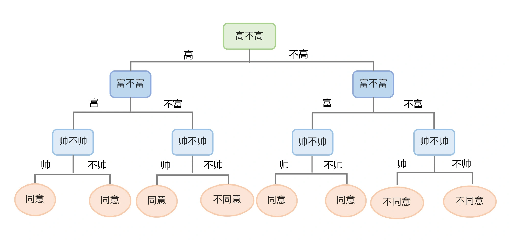

生成一个决策树有两个阶段，分别是构造和剪枝。

构造就是选择什么特征作为节点生成决策树的过程。在构造过程中，有三种节点：

1. 根节点：就是树的最顶端节点。在上图中，“高不高”就是根节点；
2. 内部节点：就是树中间的那些节点，比如说“富不富”、“美不美”；
3. 叶节点：就是树最底部的节点，也就是决策结果“同意”或者“不同意”。

在构造过程中，可以根据信息增益的程度来选择哪个属性作为根节点；哪些属性作为子节点；什么时候停止并得到目标状态，也就是叶节点。

在构造的过程中，选择不同的特征作为根节点，然后根节点下面选择不同的特征形成内部节点，就可以得到另外一棵决策树，也就是一个新的模型,由于 if…else 可以无限制地写下去，对于任何训练集，只要树的深度足够，决策树肯定能够达到 100% 的准确率。这并不是一件好事，因为这样的模型认为其它所有数据的特点都和训练集中的数据完全一样的，所以它的泛化能力会很差。对于这种情况，要在构造过程中对决策树进行剪枝，让树的深度不要太深，以免决策树太过于和精确。这样“模糊”一些的决策树，虽然在训练集上面的分数会降低，但是能够得到更强的泛化能力。

剪枝之后树的深度从原来的 3 层变成了 2 层。

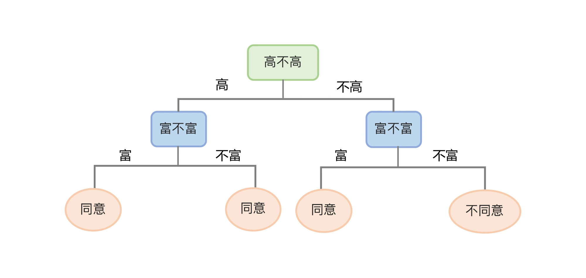

绿色线是当决策树深度为 5 是的模型拟合状态，蓝色线是决策树深度为 2 时的模型拟合状态。很明显，经过深度为 5 的模型训练集损失小，但深度为 2 的模型，泛化能力会更好。

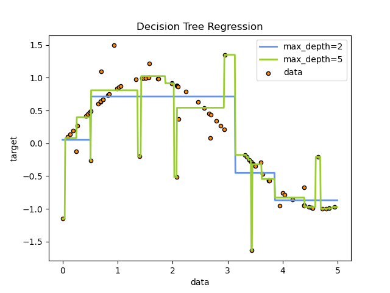

决策树的深度是一个可调的超参数，也就是 max_depth。这个超参数能限制树的最大深度，把超过设定深度的树枝全部剪掉，这也是最常见的剪枝策略。

创建两棵不同决策树模型：一棵是默认的决策树，这个决策树的深度不加限定，将一直分叉直到完全的拟合所有数据点；另一棵是深度为 3 的决策树。分别拟合两棵树，来比较一下它们在训练集和测试集上的分数。

```py
from sklearn.tree import DecisionTreeRegressor #导入决策树回归模型
model_dtr = DecisionTreeRegressor() #创建决策树回归模型
model_dtr_cut = DecisionTreeRegressor(max_depth=3) #创建深度为3的决策树回归模型
model_dtr.fit(X_train, y_train) #拟合决策树模型
model_dtr_cut.fit(X_train, y_train) #拟合深度为3的决策树模型
y_valid_preds_dtr = model_dtr.predict(X_valid) #用决策树模型预测验证集
y_valid_preds_dtr_cut = model_dtr_cut.predict(X_valid) #用深度为2的决策树模型预测验证集
from sklearn.metrics import r2_score,   median_absolute_error #导入Sklearn评估模块
print('训练集上的R平方分数-决策树: %0.4f' % r2_score(y_train, model_dtr.predict(X_train)))
print('训练集上的R平方分数-深度为3的决策树: %0.4f' % r2_score(y_train, model_dtr_cut.predict(X_train)))
print('测试集上的R平方分数-决策树: %0.4f' % r2_score(y_valid, model_dtr.predict(X_valid)))
print('测试集上的R平方分数-深度为3的决策树: %0.4f' % r2_score(y_valid, model_dtr_cut.predict(X_valid)))
```

分数输出如下：

```text
训练集上的R平方分数-决策树: 1.0000
训练集上的R平方分数-深度为3的决策树: 0.8045
测试集上的R平方分数-决策树: 0.2857
测试集上的R平方分数-深度为3的决策树: 0.4870
```

可以看到，未经剪枝的决策树在训练集上的分数是满分，但是在验证集上的得分低得十分离谱。而设定了深度的决策树（也就是剪枝），它的训练集上的分数有所下降，可在验证集上的分数是大幅提升的，体现出了更好的泛化能力。


#### 4.6.2. 线性回归模型的正则化

线性回归模型，其实就是通过梯度下降确定参数的过程。如果数据集中有 3 个特征，公式就是：

y=w1​x1​+w2​x2​+w3​x3​+b

如果在 x1​、x2​、x3​ 这些特征中，有某个特征的值域较大，而如果模型拟合的结果中，其权重参数 w 的值也比较大，那么这个特征就会占据“主导”地位，使模型往这些较大值的位置偏移，形成了对这些值的“过拟合”。

如果能让这类特征项的权重参数变小，也许就可以得到更为平衡的模型，来防止过拟合现象的出现。这种在一定程度上减小这些参数的值的方法，就是机器学习中的正则化（regularization）。在损失函数当中加入的正则项也叫惩罚项，也就是给需要训练的函数加上一些规矩、一些限制，让它们不要自我膨胀。

线性回归的损失函数的正则项有两种添加方法，分别叫做 L1 正则项和 L2 正则项。  

添加 L1 正则项之后，一些特征的权重会变小，一些绝对值较小的系数甚至直接变为 0（相当于抛弃了一些特征），来增强模型的泛化能力。这种回归也叫 Lasso 回归。

添加 L2 正则项之后，模型在不抛弃任何一个特征的情况下，会缩小回归系数，也就是某些特征的权重，让模型相对稳定，通常模型的泛化能力也更好。这种回归也叫 Rigde 回归。

创建模型、训练模型并评估模型的代码如下：

```py
from sklearn.linear_model import LinearRegression #导入线性回归模型
from sklearn.linear_model import Lasso
from sklearn.linear_model import Ridge
model_lr = LinearRegression() #创建线性回归模型
model_lasso = Lasso() #创建Lasso回归模型
model_ridge = Ridge() #创建Ridge回归模型
model_lr.fit(X_train, y_train) #拟合线性回归模型
model_lasso.fit(X_train, y_train) #拟合Lasso回归模型
model_ridge.fit(X_train, y_train) #拟合Ridge回归模型
from sklearn.metrics import r2_score,   median_absolute_error #导入Sklearn评估模块
print('训练集上的R平方分数-线性回归: %0.4f' % r2_score(y_train, model_lr.predict(X_train)))
print('训练集上的R平方分数-Lasso回归: %0.4f' % r2_score(y_train, model_lasso.predict(X_train)))
print('训练集上的R平方分数-Ridge回归: %0.4f' % r2_score(y_train, model_ridge.predict(X_train)))
print('测试集上的R平方分数-线性回归: %0.4f' % r2_score(y_valid, model_lr.predict(X_valid)))
print('测试集上的R平方分数-Lasso回归: %0.4f' % r2_score(y_valid, model_lasso.predict(X_valid)))
print('测试集上的R平方分数-Ridge回归: %0.4f' % r2_score(y_valid, model_ridge.predict(X_valid)))
```

分数输出如下：

```py
训练集上的R平方分数-线性回归: 0.6732
训练集上的R平方分数-Lasso回归: 0.6731
训练集上的R平方分数-Ridge回归: 0.6354
测试集上的R平方分数-线性回归: 0.4719
测试集上的R平方分数-Lasso回归: 0.4737
测试集上的R平方分数-Ridge回归: 0.4992
```

从普通线性回归到 Lasso 回归，再到 Ridge 回归，训练集分数呈现下降的趋势，这就是防止过拟合的惩罚项发挥了作用；在测试集上，分数则正好相反，从普通线性回归和 Lasso 回归，再到 Ridge 回归，反而呈现略微升高的趋势。不过，整体来说，差异似乎不是很大，说明目前这个线性回归模型的过拟合现象其实并不明显。

### 4.7. 模型优化：交叉验证，同时寻找最优的参数

交叉验证：小数据集的资源复用.  

在样本充足的情况下，我们会随机将数据分为 3 个部分：训练集、验证集和测试集。其中，训练集用来训练模型，验证集用来模型调优，测试集用来评估模型性能。

数据集越大，就越不容易出现过拟合的现象。那么，我们如何利用较小的数据集，从而达到较大数据集的效果呢？这就需要交叉验证:将训练数据集分为 k 等份，其中 k-1 份用作训练集，单独的那一份用作验证集，整个过程重复 k 次，这也通常称作 k 折。这样就最大程度重复地使用了训练集中的数据，每一个数据都既做了训练，又做了测试，从而在最大程度上提高模型性能的可信度。

交叉验证具体实现起来有 4 个步骤：

1. 随机清洗数据集，将数据集分为训练集和测试集，将测试集预留出来，放在一边。
2. 将训练数据集分成 k 组（这个 k 值一般是随机设定，比如 3，5，10，实操中以 10 折居多）。在这一步中，我们挑其中 1 组作为验证集，剩下的 k-1 组做训练集（这个过程要重复 k 次）。我们在这些训练集上拟合模型，可以得到 k 个不同的模型。然后再在对应的验证集上对这些模型进行评估，就能得到一系列模型的评估分数。最后，我们把这些评估分数进行平均，这个平均分数就是交叉验证的最终结果了。
3. 按照步骤 1、2，对多个算法进行交叉验证，比如可以针对线性回归、决策树、随机森林等算法。根据每个算法交叉验证的评估结果，从中挑选效果最好的算法模型。
4. 使用测试集评估最终模型的分数。

每个数据样本都有 1 次机会进入验证集中，并用于训练模型 k-1 次。这样一来，我们就拥有了更多的数据量。

在交叉验证中，训练集和验证集的拆分可以通过 sklearn.model_selection 中的 KFold 函数实现。

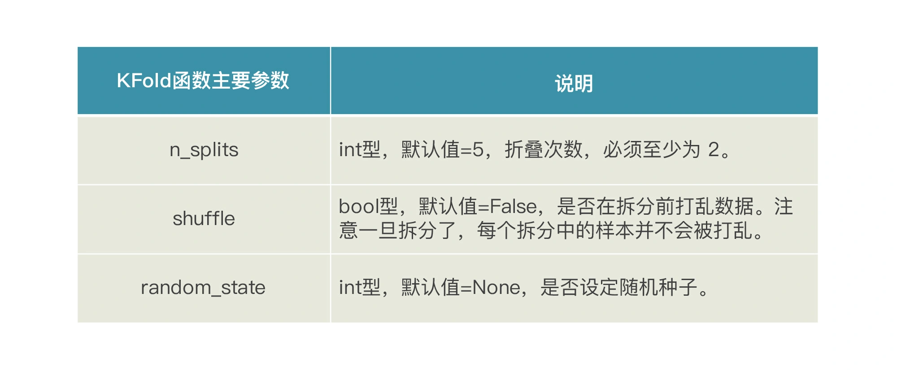

```py
from sklearn.model_selection import KFold #导入K折工具
from sklearn.metrics import r2_score #导入R2分数评估工具
kf5 = KFold(n_splits=5, shuffle=False) #5折验证
i = 1 
for train_index, test_index in kf5.split(df_LTV): 
    X_train = df_LTV.iloc[train_index].drop(['年度LTV'],axis=1) #训练集X
    X_test = df_LTV.iloc[test_index].drop(['年度LTV'],axis=1) #验证集X
    y_train = df_LTV.iloc[train_index]['年度LTV'] #训练集y
    y_test = df_LTV.loc[test_index]['年度LTV'] #验证集y 
    model_lr.fit(X_train, y_train) #训练模型
    print(f"第{i}折验证集R2分数：{r2_score(y_test, model_lr.predict(X_test))}") 
    i += 1
```

输出如下：

```py
第1折验证集R2分数：0.5143622747243847
第2折验证集R2分数：-0.16778272779470416
第3折验证集R2分数：0.23879516275929713
第4折验证集R2分数：0.2482389409435588
第5折验证集R2分数：0.03088299924007265
```

sklearn 还提供了更简单的方式，不用进行上面的 KFold 拆分过程，只用一个 cross_val_score 函数就能直接完成模型的 K 折拆分、训练和验证，一次性得到交叉验证结果。

```py
from sklearn.model_selection import cross_val_score # 导入交叉验证工具
# from sklearn.metrics import mean_squared_error #平均绝对误差
model_lr = LinearRegression() #线性回归模型
scores = cross_val_score(model_lr, #线性回归
                  X_train, #特征集
                  y_train, #标签集
                  cv=5, # 五折验证
                  scoring = 'neg_mean_absolute_error') #平均绝对误差
for i, score in enumerate(scores):
    print(f"第{i+1}折验证集平均绝对误差： {-score}")
```

平均绝对误差，也就是预测值和真值之间的平均差异，误差绝对值越大，效果越不好. 输出的每一折平均绝对误差值如下：

```py
第1折验证集平均绝对误差：3191.99882739
第2折验证集平均绝对误差：1402.45679102
第3折验证集平均绝对误差：1168.49187113
第4折验证集平均绝对误差：1546.15537555
第5折验证集平均绝对误差：1138.41271054
```

> 网格搜索：直到找到最优的参数

scikit-learn 中有一个 GridSearchCV 工具，中文叫做网格搜索，它可以自动调参，轻松找到模型的最优参数。

- 第一步，明确你选择的模型有哪些可调的参数，这个你可以通过查看算法的说明文档来确定；
- 第二步，把模型中各超参数不同取值的排列组合尽可能多地列出来；
- 第三步，调用 GridSearchCV 工具，把可能的排列组合都传进去

完成这三步后，GridSearchCV 会在后台创建出一大堆的并行进程，挨个执行各种超参数的组合，同时还会使用交叉验证的方法（名称中的 CV，意思就是 cross validation），来评估每个超参数组合的模型。最后，GridSearchCV 会帮你选定哪个组合是给定模型的最佳超参数值。

官方文档：https://scikit-learn.org/stable/  

在这儿拿出一些重要的超参数来调一下：

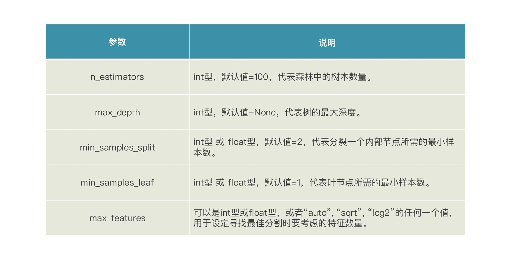

找出随机森林模型的参数后，需要在程序中定义一个字典对象，列出各个超参数，以及希望去尝试的值组合。

```py
model_rfr = RandomForestClassifier() # 随机森林模型
# 对随机森林算法进行参数优化
rf_param_grid = {"max_depth": [None],
                  "max_features": [3, 5, 12],
                  "min_samples_split": [2, 5, 10],
                  "min_samples_leaf": [3, 5, 10],
                  "bootstrap": [False],
                  "n_estimators" :[100,300],
                  "criterion": ["gini"]}
```

调用 GridSearchCV 这个函数：

```py
from sklearn.model_selection import GridSearchCV # 导入网格搜索工具
model_rfr_gs = GridSearchCV(model_rfr,
                            param_grid = rfr_param_grid, cv=3,
                            scoring="r2", n_jobs= 10, verbose = 1)
model_rfr_gs.fit(X_train, y_train) # 用优化后的参数拟合训练数据集
```

将 GridSearchCV 返回的最佳参数组合存储在了 rfr_gs 这个新的随机森林模型。然后，系统就会自动计算每种超参数组合拟合出的模型的准确率 / 损失：

```text
Fitting 3 folds for each of 432 candidates, totalling 1296 fits
[Parallel(n_jobs=10)]: Using backend LokyBackend with 10 concurrent workers.
[Parallel(n_jobs=10)]: Done  30 tasks      | elapsed:   22.0s
[Parallel(n_jobs=10)]: Done 180 tasks      | elapsed:  2.0min
[Parallel(n_jobs=10)]: Done 430 tasks      | elapsed:  4.8min
[Parallel(n_jobs=10)]: Done 780 tasks      | elapsed:  8.7min
[Parallel(n_jobs=10)]: Done 1230 tasks      | elapsed: 12.6min
[Parallel(n_jobs=10)]: Done 1296 out of 1296 | elapsed: 13.2min finished
```

注意的是，随机森林模型可能的超参数组合非常多，因此这个训练过程在我们的电脑上可能会持续很久很久，所以我特意没有设定太多的参数组合，而是选取了其中一部分。不过，这个训练过程也是花了十几分钟才搜索完。

经过 GridSearchCV 自动地换参、拟合并自动交叉验证评估后，最佳参数组合实际上已经被选出了，它就被存储在 rfr_gs 这个新的随机森林中，可以直接用它来做预测。调用 rfr_gs 的 best_params_ 属性，来看一下这个最优模型是由哪些超参数组合而成的：

```py
print(" 最佳参数组合:", rf_gs.best_params_)
```

输出如下：

```text
最佳参数组合: {'bootstrap': True, 'max_depth': 10, 'max_features': 'sqrt', 'min_samples_leaf': 2, 'min_samples_split': 2, 'n_estimators': 50}
```

然后，看看 GridSearchCV 模型的准确性。

```py
from sklearn.metrics import r2_score,   median_absolute_error #导入Sklearn评估模块
print('训练集上的R平方分数-调参后的随机森林: %0.4f' % r2_score(y_train, model_rfr_gs.predict(X_train)))
print('测试集上的R平方分数-调参后的随机森林: %0.4f' % r2_score(y_valid, model_rfr_gs.predict(X_valid)))
```

输出如下：

```text
训练集上的R平方分数-随机森林: 0.7729
测试集上的R平方分数-随机森林: 0.6523
```

## 5. 深度学习-CNN

案例：根据大量已归类的鲜花图片，来建立一个能识别鲜花的模型，给未归类的图片自动贴标签。是一个典型的分类问题，同时也是一个计算机视觉领域的图片识别问题。

### 5.1. 数据收集和预处理

> 1. 数据的导入及可视化

指定 4 个花朵目录，并通过 Open CV（开源计算机视觉库）工具箱，读入图片的数据。OpenCV 是一个跨平台的开源计算机视觉方面的 API 库，这里应用其中的 imread 和 resize 功能读入并裁剪图片到 150*150 像素：

```py
import numpy as np # 导入Numpy
import pandas as pd # 导入Pandas
import os # 导入OS
import cv2 # 导入Open CV工具箱


print(os.listdir('../input/flowers-recognition/flowers')) #打印目录结构
daisy_dir='../input/flowers-recognition/flowers/daisy' #雏菊目录
rose_dir='../input/flowers-recognition/flowers/rose' #玫瑰目录
sunflower_dir='../input/flowers-recognition/flowers/sunflower' #向日葵目录
tulip_dir='../input/flowers-recognition/flowers/tulip' #郁金香目录


X = [] #初始化
y_label = [] #初始化
imgsize = 150 #图片大小
# 定义一个函数读入花的图片
def training_data(label,data_dir):
    print ("正在读入：", data_dir) 
    for img in os.listdir(data_dir): #目录
        path = os.path.join(data_dir,img) #目录+文件名
        img = cv2.imread(path,cv2.IMREAD_COLOR) #读入图片
        img = cv2.resize(img,(imgsize,imgsize)) #设定图片像素维度
        X.append(np.array(img)) #X特征集
        y_label.append(str(label)) #y标签，即花的类别
# 读入目录中的图片
training_data('daisy',daisy_dir) #读入雏菊
training_data('rose',rose_dir) #读入玫瑰
training_data('sunflower',sunflower_dir) #读入向日葵
training_data('tulip',tulip_dir) #读入郁金香
```

> 2. 构建特征集和标签集

用 LabelEncoder 给标签 y 编码，并且把特征集 X 转换为张量数组：

```py
from sklearn.preprocessing import LabelEncoder # 导入标签编码工具
from tensorflow.keras.utils import to_categorical # 导入One-hot编码工具
label_encoder = LabelEncoder()
y = label_encoder.fit_transform(y_label) # 标签编码
y = to_categorical(y,4) # 将标签转换为One-hot编码
X = np.array(X) # 将X从列表转换为张量数组
```

这时候特征集 X 的格式不再是 DataFrame 表结构，而是 NumPy 数组，在机器学习里，把它称为“张量”，它的形状输出如下：

```py
array([[[[214, 237, 233],
         [224, 234, 235],
         [229, 232, 237],
         ...,
         [ 67,  93, 124],
         [ 63,  91, 121],
         [ 61,  93, 115]]]], dtype=uint8)
```

如果用 NumPy 里面 shape（就是张量的形状）的属性，我们就会看到当前特征集 X 的格式是 4 阶的张量。X.shape

```py
X.shape
```

输出如下：

```py
(3265, 150, 150, 3)
```

表示：一共有 3265 张 150 像素 *150 像素的图片，且所有图片的颜色通道数为 RGB 3。

“4 阶张量”代表了图片数据集中的 4 个维度：行（图片数量）、宽（像素宽）、高（像素高）和颜色通道数，缺少其中任何一个，都无法精准描述这个图片数据集。

如果是视频格式的数据集，则需要 5 阶张量才放得下，其形状为（样本，帧，高度，宽度，颜色深度）。此外，文本数据集通常是 3 阶张量，形状为（样本，序号，字编码）。

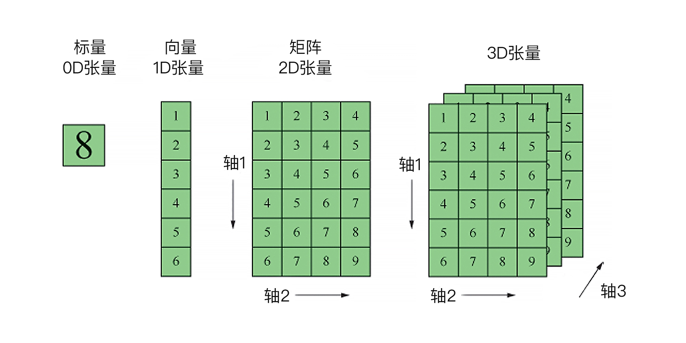

为什么像图片、视频、文本这样的数据集，特征的维度和整体特征空间，体量都如此巨大。就这么一张小小的 150 * 150 像素的 RGB 图片，特征就有可能达到 150 * 150 * 3 的天文数字。所以，除了深层神经网络之外，传统机器学习方法根本解决不了。  

y 的格式也转换成了 One-hot 编码的张量.

```py
array([[1., 0., 0., 0.],
       [1., 0., 0., 0.],
       [1., 0., 0., 0.],
       ...,
       [0., 1., 0., 0.],
       [0., 1., 0., 0.],
       [0., 1., 0., 0.]], dtype=float32)
```

其中，[1., 0., 0., 0.]代表 Daisy（雏菊），[0., 1., 0., 0.]就代表 Rose（玫瑰），[0., 0., 1., 0.]就代表 Sunflower（向日葵），[0., 0., 0., 1.]就代表 Tulip（郁金香）。

> 3. 特征工程和数据集拆分

由于神经网络特别喜欢小范围的数值，这里我们只需要做个归一化处理，把 0-255 的 RPG 像素值压缩到 0-1 之间最好。这个步骤非常重要，不然神经网络会跑不起来：

```py
X = X/255 # 将X张量归一化
```

数据集的拆分

```py
from sklearn.model_selection import train_test_split # 导入拆分工具
X_train, X_test, y_train, y_test = train_test_split(X, y, #拆分数据集
                             test_size=0.2,random_state=1)
```

### 5.2. 选择算法建立模型

对于图像分类识别问题来说，选择深度学习中的卷积神经网络 CNN。

> 1. 选择算法

深层神经网络是由大量的人工神经元相互联结而成，这些神经元都具有可以调整的参数，而训练机器、建立模型的过程，也就是确定网络参数的过程。一旦参数确定，模型也就确定下来了。

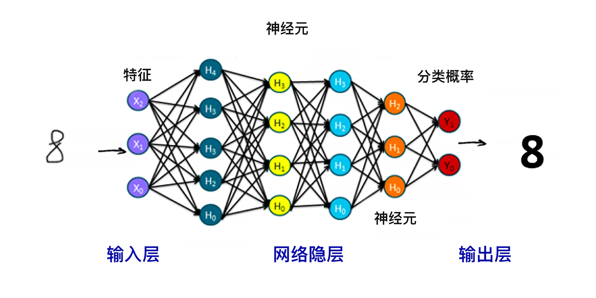

深度学习和传统机器学习算法相比，它的优势: 深度学习特别擅长处理非结构化的数据。  
传统的模型需要先做各种各样的特征工程，让数据变得“计算机友好”，再输入模型进行学习。而深度学习模型则可以自动进行特征提取，因此就省略掉了手工做特征工程的环节。  

在这个领域呈现的是 TensorFlow 和 PyTorch 两强争霸的格局。这二者都是开源项目，一个来自 Google，一个来自 Facebook。PyTorch 因为编辑开发环境更具亲和力，支持快速和动态的训练，现在越来越受学术界和研究型开发者的欢迎，而 TensorFlow 则因为可以直接部署机器学习模型，能快速地开发和构建 AI 相关产品，它仍然在保持着工业界的霸主地位。TensorFlow 的另一个优势是有简单的内置高级 API，这个 API 就是非常有名的 Keras，这也是初学者进入深度学习领域的最佳入门选择。Keras 把 TensorFlow 的底层深度学习功能进行了良好的封装，是最好用、最适合初学者上手的深度学习工具包了。所以，就选择 Keras 来搭建神经网络。

> 2. 建立模型

一个典型的卷积网络结构如下所示，它实现了一个图像分类功能：输入的是图像，输出的是图像的类别标签。

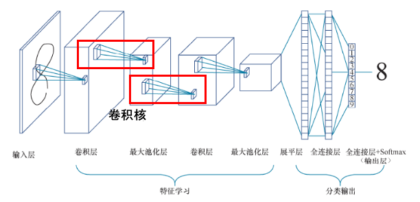

整体来看，卷积神经网络由输入层、一个或多个卷积层和输出层的全连接层组成。

从左往右： 

1. 网络左边是数据输入部分，也就是输入层。这一层会对数据做初始处理，比如标准化、图片压缩、降维等，让最初的数据集变成形状为（ 样本，图像高度，图像宽度，颜色深度）的数据集。
2. 到了中间的卷积层。这一层主要负责抽取图片的特征，其中的卷积核（上图中红框部分）也叫滤波器，能够自动进行图像特征的提取。一般卷积层之后会接一个池化层，主要用来降低特征空间的维度，其中，池化层又包括最大池化和平均池化，它们的区别就在于输出时计算图片区域池化窗口内元素的最大值还是平均值。通常，卷积 + 池化的架构会重复几次，形成深度卷积网络。在这个过程中，图片特征张量的尺寸通常会逐渐减小，而深度将逐渐加深。就像在图中画的那样，特征图从一张扁扁的纸片形状变成了胖胖的矩形。
3. 之后是一个展平层，主要负责将网络展平。展平之后通常会接一个普通的全连接层。而最右边的输出层也是全连接层，用 Softmax 进行激活分类输出层，所有神经网络都是用 Softmax 做多分类的激活函数。

卷积网络的核心特点就是“卷积 + 池化”的架构，而“卷积层”中的参数，其实是远少于全连接层的。这是因为卷积网络中各层的神经元之间，包括输入层的特征和卷积层之间，不是彼此全部连接的，而是以卷积的方式有选择性的局部连接。这种结构除了能大大减少参数的数量之外，还有有利于对图像特征的提取。

搭建一个能够为花朵图片分类的卷积神经网络：

```py
from tensorflow.keras import layers # 导入所有层 行1
from tensorflow.keras import models # 导入所有模型 行2
cnn = models.Sequential() # 贯序模型 行3
cnn.add(layers.Conv2D(32, (3, 3), activation='relu', # 输入卷积层 行4
                        input_shape=(150, 150, 3))) 
cnn.add(layers.MaxPooling2D((2, 2))) # 最大池化层 行5
cnn.add(layers.Conv2D(64, (3, 3), activation='relu')) # 卷积层 行6
cnn.add(layers.MaxPooling2D((2, 2))) # 最大池化层 行7
cnn.add(layers.Conv2D(128, (3, 3), activation='relu')) # 卷积层 行8
cnn.add(layers.MaxPooling2D((2, 2))) # 最大池化层 行9
cnn.add(layers.Conv2D(128, (3, 3), activation='relu')) # 卷积层 行10
cnn.add(layers.MaxPooling2D((2, 2))) # 最大池化层 行11
cnn.add(layers.Flatten()) # 展平层 行12
cnn.add(layers.Dense(512, activation='relu')) # 全连接层 行13
cnn.add(layers.Dense(4, activation='softmax')) # 分类输出层 行14
cnn.compile(loss='categorical_crossentropy', # 损失函数 行15
            optimizer='RMSprop', # 优化器
            metrics=['acc']) # 评估指标
```

神经网络中最主要的结构就是“层”，各种各样不同的层像拼积木一样组合起来，就形成了各种各样的神经网络。而对于我们的卷积神经网络 CNN 来说，其中最重要的就是 Conv2D 这个卷积层，它是我们这个神经网络的主要功能层，决定了我们所构建的神经网络是一个卷积神经网络。

```py
from IPython.display import SVG # 实现神经网络结构的图形化显示
from tensorflow.keras.utils import model_to_dot # 导入model_to_dot工具
SVG(model_to_dot(cnn).create(prog='dot', format='svg')) # 绘图
```

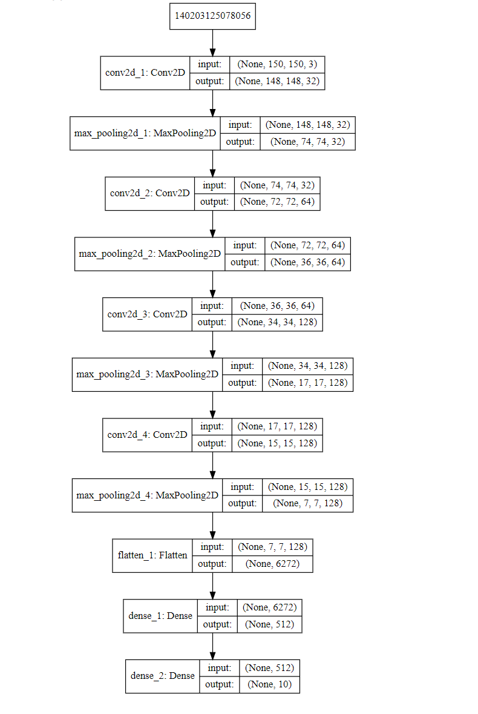

1. 首先，通过 cnn = models.Sequential() 创建一个序贯模型（代码行 3）。序贯模型也是最简单的模型，就是像盖楼一样，一层一层往上堆叠着搭新的层。
2. 然后，通过 cnn.add(layers.Conv2D(32, (3, 3), activation=‘relu’, input_shape=(150, 150, 3))) 语句（代码行 4）在模型中加入了神经网络的输入层。输入层需要通过 input_shape=(150, 150, 3) 指定输入的特征数据集的形状。如果形状不对，等会儿拟合时就会报错。
3. 从代码行 5 开始直到行 13，为神经网络添加了各种各样的中间层（也叫隐层），这些层如何添加、配置，有足够的自由去尝试。少可以两三层，多可以几万层。
4. cnn.add(layers.Conv2D(64, (3, 3), activation=‘relu’))（代码行 6）这个语句是用来添加输入层之后的中间卷积层的，这里面的 64 是输出空间的维度，也就是卷积过程中输出滤波器的数量，而 (3, 3) 则指定 2D 卷积窗口的高度和宽度。cnn.add(layers.MaxPooling2D((2, 2)))（代码行 7）这个语句是用来添加池化层，(2, 2) 也是指定 2D 卷积窗口的高度和宽度。
5. 以此类推，卷积层 + 池化层的组合会持续出现，然后再输出层之前需要有展品层（代码行 12）和全连接层（代码行 13）。
6. 代码行 14，cnn.add(layers.Dense(10, activation=‘softmax’)) 这一行叫做输出层，其中 activation='softmax’这个参数，就用于多分类输出。

怎么看一个神经网络是普通神经网络 DNN，还是 CNN 或者 RNN 呢？这其中的关键就是看输入层和中间层主要是什么类型。DNN 的输入层和中间层主要是 Dense 层，CNN 的输入层和中间层主要是 Conv1D、Conv2D 或者 Conv3D，RNN 的输入层和中间层主要是 SimpleRNN 或者 GRU 或者 LSTM 层。

### 5.3. 模型的训练和拟合

fit 语句来进行训练：

```py
# 训练网络并把训练过程信息存入history对象
history = cnn.fit(X_train,y_train, #训练数据
                  epochs=10, #训练轮次（梯度下降）
                  validation_split=0.2) #训练的同时进行验证
```

validation_split，它可以在训练的同时，自动把训练集部分拆出来，进行验证，在每一个训练轮次中，求出该轮次在训练集和验证集上面的损失和预测准确率。

```py
Train on 2089 samples, validate on 523 samples
Epoch 1/5
2089/2089 [==============================] - 86s 41ms/step - loss: 1.3523 - acc: 0.3978 - val_loss: 1.0567 - val_acc: 0.5411
Epoch 2/5
2089/2089 [==============================] - 85s 41ms/step - loss: 1.0167 - acc: 0.5692 - val_loss: 1.0336 - val_acc: 0.5526
Epoch 3/5
2089/2089 [==============================] - 85s 41ms/step - loss: 0.8912 - acc: 0.6343 - val_loss: 0.9183 - val_acc: 0.6310
Epoch 4/5
2089/2089 [==============================] - 84s 40ms/step - loss: 0.8295 - acc: 0.6596 - val_loss: 0.9289 - val_acc: 0.6138
Epoch 5/5
2089/2089 [==============================] - 85s 41ms/step - loss: 0.7228 - acc: 0.7056 - val_loss: 1.0086 - val_acc: 0.5736
... ...
```

这个输出的信息包括了训练的轮次（梯度下降的次数）、每轮训练的时长、每轮训练过程中的平均损失，以及分类的准确度。这里的每一个轮次，其实就是神经网络对其中的每一个神经元自动调参、通过梯度下降进行最优化的过程。


### 5.4. 模型性能的评估

把每轮的损失和准确率做一个可视化，绘制出损失曲线，来展示模型在训练集上评估分数和损失的变化过程。

```py
def show_history(history): # 显示训练过程中的学习曲线
    loss = history.history['loss'] #训练损失
    val_loss = history.history['val_loss'] #验证损失
    epochs = range(1, len(loss) + 1) #训练轮次
    plt.figure(figsize=(12,4)) # 图片大小
    plt.subplot(1, 2, 1) #子图1
    plt.plot(epochs, loss, 'bo', label='Training loss') #训练损失
    plt.plot(epochs, val_loss, 'b', label='Validation loss') #验证损失
    plt.title('Training and validation loss') #图题
    plt.xlabel('Epochs') #X轴文字
    plt.ylabel('Loss') #Y轴文字
    plt.legend() #图例
    acc = history.history['acc'] #训练准确率
    val_acc = history.history['val_acc'] #验证准确率
    plt.subplot(1, 2, 2) #子图2
    plt.plot(epochs, acc, 'bo', label='Training acc') #训练准确率
    plt.plot(epochs, val_acc, 'b', label='Validation acc') #验证准确率
    plt.title('Training and validation accuracy') #图题
    plt.xlabel('Epochs') #X轴文字
    plt.ylabel('Accuracy') #Y轴文字
    plt.legend() #图例
    plt.show() #绘图
show_history(history) # 调用这个函数
```

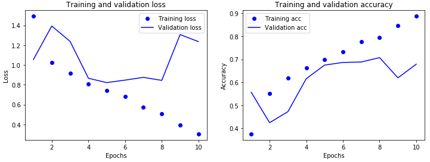

训练集的损失呈现下降趋势，但是测试集上的损失则呈现跳跃，这说明这个神经网络性能不是很稳定，似乎有过拟合的现象.

在测试集上进行分类结果的评分。

```py
result = cnn.evaluate(X_test, y_test) #评估测试集上的准确率
print('CNN的测试准确率为',"{0:.2f}%".format(result[1]))
```

输入如下：

```py
653/653 [==============================] - 10s 15ms/step
CNN的测试准确率为 0.69%
```

可以应用模型的 predict 属性把 X 特征集传入，进行花朵图片的分类。

```py
prediction = cnn.predict(X_test) #预测测试集的图片分类
prediction[0] #第一张图片的分类
```

输出如下：

```py
array([0.0030566 , 0.13018326, 0.00846946, 0.8582906 ], dtype=float32)
```

此时输出的是分类概率。上面的输出结果表示，第一类花 Daisy（雏菊）的概率为 0.03，第二类花 Rose（玫瑰）的概率为 0.13，第三类花 Sunflower（向日葵）的概率为 0.008，第四类花 Tulip（郁金香）的概率为 0.858。

选出最大的那个概率，并把它当作 CNN 的分类结果：

```py
print('第一张测试图片的分类结果为:', np.argmax(prediction[0]))
```

输出如下：

```py
第一张测试图片的分类结果为: 3
```

## 6. 深度学习-RNN

案例：App 从 2019 年上线以来，App 的日激活数稳步增长。运营团队已经拉出两年以来每天的具体激活数字，任务是，建立起一个能够预测未来激活率走势的机器学习模型。

### 6.1. 收集数据和预处理

> 1. 数据可视化

用 plot 这个 API，绘制出激活数的历史走势图，其中时间为横坐标，App 激活数为纵坐标的图像：

```py
import matplotlib.pyplot as plt #导入matplotlib.pyplot
plt.style.use('fivethirtyeight') #设定绘图风格
df_app["Activation"].plot(figsize=(12,4),legend=True) #绘制激活数
plt.title('App Activation Count') #图题
plt.show() #绘图
```

> 2. 数据清洗

看看有没有 NaN 值：

```py
df_app.isna().sum() #有NaN吗？
```

对于 App 激活数，只想保证数据集里全部都是正值，所以，可以用下面的语句查看有没有负值和零值：

```py
(df_app.Activation < 0).values.any() #有负值吗？
```

输出如下：

```py
False
```

说明整个数据集没有一个 0 值或者负值。那我们也不需要做任何的清洗工作了。接下来，我们进入直接训练集和测试集的拆分。

> 3. 拆分训练集和测试集

假设以 2020 年 10 月 1 日为界，只给模型读入 2020 年 10 月 1 日之前的数据，之后的数据留作对模型的测试。

```py
# 按照2020年10月1日为界拆分数据集
Train = df_app[:'2020-09-30'].iloc[:,0:1].values #训练集
Test = df_app['2020-10-01':].iloc[:,0:1].values #测试集
```

- df_app[:‘2020-09-30’]代表 10 月 1 日之前的数据，用于训练模型；df_app[‘2020-10-01’:]代表 10 月 1 日之后，用于对训练好的模型进行测试。
- 代码中的 iloc 属性，是 Pandas 中对 DataFrame 对象以行和列位置为索引抽取数据。其中的第一个参数代表行索引，指定“:”就表示抽取所有行；而第二个参数中的“0:1”代表要抽取的列索引的位置为第 2 列，也就是“激活数”这一列。
- 最后，.values 这个属性就把 Pandas 对象转换成了 Numpy 数组

```py
Train #显示训练集对象
```

输出如下：

```py
array([[419],
       [432],
       ...
       [872],
       [875]])
```

对于神经网络来说，输入的张量形状非常重要,用 NumPy 中的.shape 属性查看当前数据对象的形状。

```py
print('训练集的形状是：', Train.shape)
print('测试集的形状是：', Test.shape)

训练集的形状是： (639, 1)
测试集的形状是： (117, 1)
```

训练集是 639 行的一维数组，测试集是 117 行的一维数组，但它们都是二阶张量。

> 4. 特征工程

神经网络非常不喜欢数值跨度大的数据，所以，我们对训练特征数据集进行归一化缩放。

```py
from sklearn.preprocessing import MinMaxScaler #导入归一化缩放器
Scaler = MinMaxScaler(feature_range=(0,1)) #创建缩放器
Train = Scaler.fit_transform(Train) #拟合缩放器并对训练集进行归一化
```

> 5. 构建特征集和标签集

这个数据集的标签就是 App 激活数，特征是时序数据。如果要预测今天的 App 下载数量，那时序数据特征的典型构造方法就是，把之前 30 天或者 60 天的 App 下载数量作为特征信息被输入机器学习模型。

创建了一个具有 60 个时间步长（所谓步长，就是时间相关的历史特征数据点）和 1 个输出的数据结构。

```py
# 创建具有 60 个时间步长和 1 个输出的数据结构 - 训练集
X_train = [] #初始化
y_train = [] #初始化
for i in range(60,Train.size): 
    X_train.append(Train[i-60:i,0]) #构建特征
    y_train.append(Train[i,0]) #构建标签
X_train, y_train = np.array(X_train), np.array(y_train) #转换为NumPy数组
X_train = np.reshape(X_train, (X_train.shape[0],X_train.shape[1],1)) #转换成神经网络所需的张量形状
```

显示一下目前 X_train 集的形状：

```py
X_train.shape #X_train的形状


X_train的形状是： (579, 60, 1)
```

是一个三阶张量，每一阶上面的维度是 579（579 行数据）、60（每一个当日激活数往前 60 天的激活数）和 1（每一个时间点只有激活数一个特征）。

同样的方法构建测试集：

```py
TrainTest = df_app["Activation"][:] #整体数据
inputs = TrainTest[len(TrainTest)-len(Test) - 60:].values #Test加上前60个时间步
inputs = inputs.reshape(-1,1) #转换形状
inputs  = Scaler.transform(inputs) #归一化
# 创建具有 60 个时间步长和 1 个输出的数据结构 - 测试集
X_test = [] #初始化
y_test = [] #初始化
for i in range(60,inputs.size): 
    X_test.append(inputs[i-60:i,0]) #构建特征
    y_test.append(inputs[i,0]) #构建标签
X_test = np.array(X_test) #转换为NumPy数组
X_test = np.reshape(X_test, (X_test.shape[0],X_test.shape[1],1)) #转换成神经网络所需的张量形状
```

### 6.2. 选择算法并建立模型

RNN 模型: 循环神经网络是神经网络的一种，和其它类型的神经网络相比，最大的不同是它建立了自身的记忆机制，增加了时间相关的状态信息在各层神经元间的循环传递机制。即一个序列的当前输出与前面各个神经元的输出也是有关的，即隐藏层之间不再是不相连的，而是有连接的。这就让循环神经网络能够更加自由和动态地获取输入的信息，而不受到定长输入空间的限制。

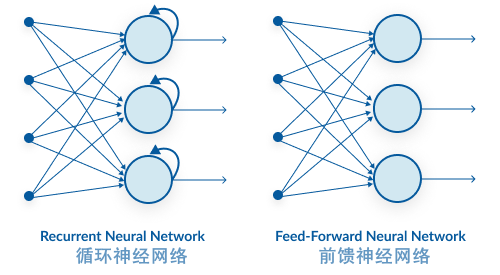

因此，向循环神经网络中输入的数据都有这样的特点， 数据集中不仅要包含当前的特征值，还要包括前一刻或者前几刻的状态。

要预测的内容，和之前一段时间的特征值密切相关，就适合选择循环神经网络来建立模型进行处理。

在 Kares 中，主要有三种循环神经网络层可以搭建循环神经网络，分别是 Simple RNN、LSTM 和 GRU.

Simple RNN，顾名思义，就是最简单的循环神经网络结构，它的结构如下图所示。这个结构比较简单，只是在输入特征 X 的基础之上加入了 ht​ 这个时间状态信息，也就是“记忆”功能。

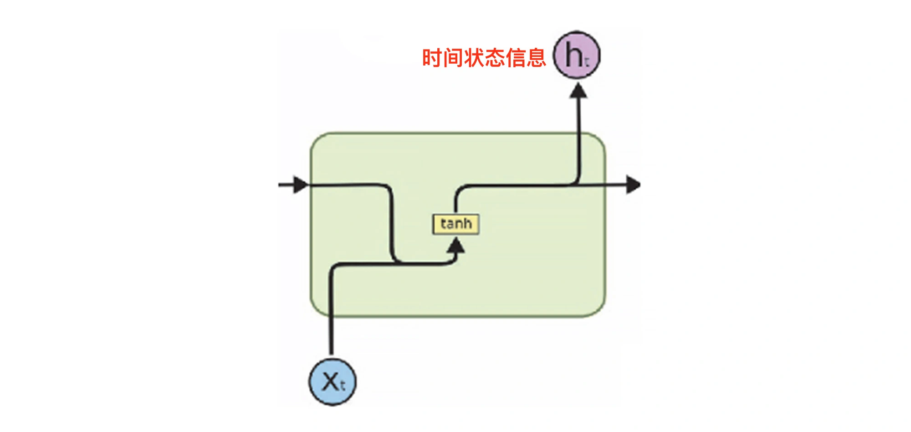

不过这种结构有一个缺陷，就是会出现“短期记忆的问题”。神经网络在训练的过程中，参数是从后面的层向前面的层反向传播的，同时还会在每一步计算梯度，做梯度下降，用于更新神经网络中的权重。如果前一层对当前层的影响很小，那么梯度值就会很小，反之亦然。如果前一层的梯度很小，那么当前层的梯度会更小。这就使得梯度在我们反向传播时呈指数缩小。而较小的梯度意味着它不会影响权重更新。所以，对于 Simple RNN 来说，较早期输入的信息对预测判断的影响会比较小，这就是“短期记忆问题”。对于这个项目的数据集来说，时间跨度比较大，Simple RNN 是很难捕捉到这种长期的时间关联的。

LSTM（Long Short-Term Memory，长短期记忆网络）可以很好地解决这个问题。LSTM 的神经元由一个遗忘门、一个输入门、一个输出门和一个记忆细胞组成，来记录额外的信息。记忆细胞负责记住时间相关的信息，而三个门负责调节进出神经元的信息流。在这个过程中，每个记忆单元可获得连续的梯度流，能学习数百个时间步长的序列而误差保持原值，从而解决梯度消失问题。

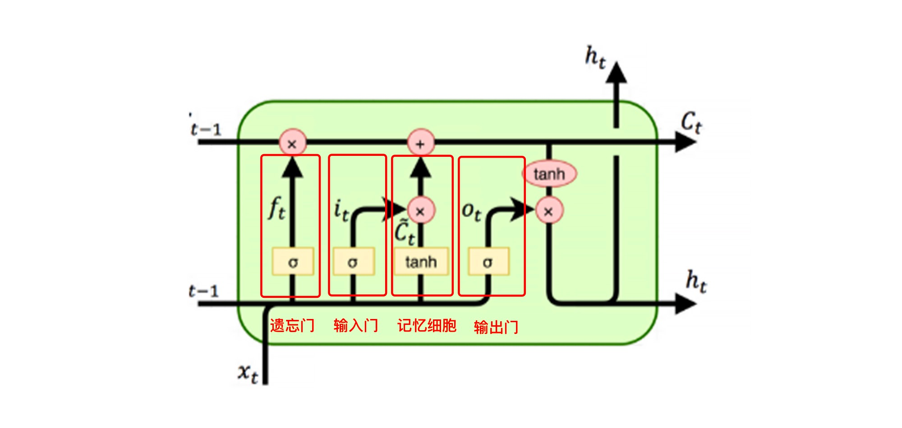

GRU 也是为了解决 Simple RNN 的短期记忆问题，它的复杂性介于 Simple RNN 和 LSTM 之间，在结构上要比 LSTM 简单一些。

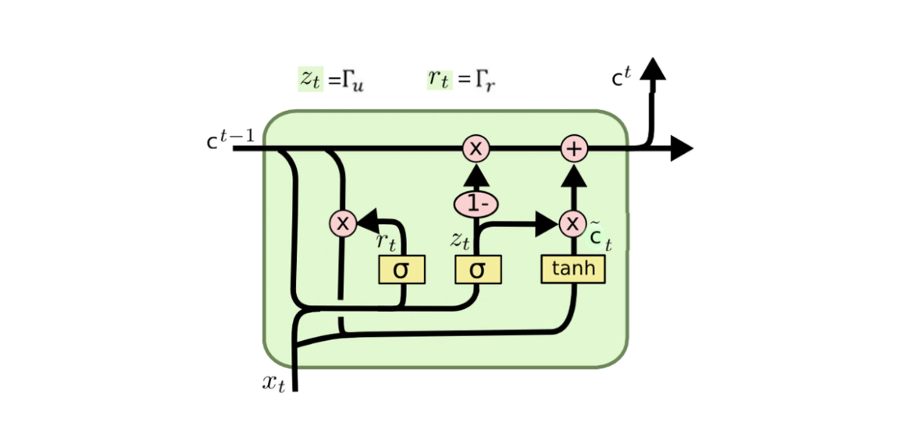

对于预测 App 激活数走势这个项目来说，如果仅从性能角度考虑，那 LSTM 是最理想的，就构建一个以 LSTM 为主要层结构的循环神经网络：

```py
from tensorflow.keras.models import Sequential #导入序贯模型
from tensorflow.keras.layers import Dense, LSTM #导入全连接层和LSTM层
# LSTM网络架构
RNN_LSTM = Sequential() #序贯模型
RNN_LSTM.add(LSTM(units=50, return_sequences=True, input_shape=(X_train.shape[1],1))) #输入层LSTM,return_sequences返回输出序列
RNN_LSTM.add(LSTM(units=50, return_sequences=True)) #中间1层LSTM，return_sequences返回输出序列
RNN_LSTM.add(LSTM(units=50, return_sequences=True)) #中间2层LSTM，return_sequences返回输出序列
RNN_LSTM.add(LSTM(units=50)) #中间3层LSTM
RNN_LSTM.add(Dense(units=1)) #输出层Dense
# 编译网络
RNN_LSTM.compile(loss='mean_squared_error', #损失函数
                 optimizer='rmsprop', #优化器
                 metrics=['mae']) #评估指标
RNN_LSTM.summary() #输出神经网络结构信息
```

### 6.3. 训练并评估模型

训练 50 次，并在训练的同时进行 80/20 比例的数据验证：

```py
history = regressor.fit(X_train, y_train, epochs=50, validation_split=0.2) # 训练并保存训练历史信息
```

### 6.4. 利用模型进行预测

在预测结束之后，需要用 inverse_transform 对预测值做反归一化。否则，激活数将是一个 0-1 之间的值。

```py
predicted_stock_price = regressor.predict(X_test) #预测
predicted_stock_price = sc.inverse_transform(predicted_stock_price) #反归一化
plot_predictions(test_set,predicted_stock_price) #绘图
```

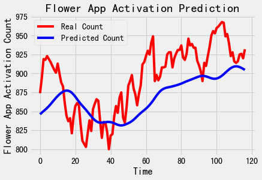

## 7. 提升神经网络预测准确率

### 7.1. 数据方面的考量：图像数据增广

数据增广 (data augmentation)，也叫数据增强，它能通过已有的图片，增加数据量，从而提高卷积网络图像处理问题的性能，增强模型的泛化能力。  

对原始的图像进行数据增广的方式有很多，比如水平翻转，还有一定程度的位移、颠倒、倾斜、裁剪、颜色抖动（color jittering）、平移、虚化或者增加噪声等，这些都比较常用。此外，还可以尝试多种操作的组合， 比如同时做旋转和随机尺度变换，还可以提升所有像素在 HSV 颜色空间中的饱和度和明度，以及在色调通道对每张图片的所有像素增加一个 -0.1~0.1 之间的值等。


这样一来，无论是图片的数目，还是多样性，模型在训练时都能够观察到数据的更多内容，从而拥有更好的准确率和泛化能力。

在 Keras 中，可以用 Image Data Generator 工具来定义一个数据增广器

```py
# 定义一个数据增强器，并设定各种增强选项
from tensorflow.keras.preprocessing.image import ImageDataGenerator #数据增强器
augs_gen = ImageDataGenerator( #各种增强参数，具体说明可参见Keras文档
           featurewise_center=False,
           samplewise_center=False,         
           featurewise_std_normalization=False,          
           samplewise_std_normalization=False,  
           zca_whitening=False, 
           rotation_range=10,  
           zoom_range = 0.1, 
           width_shift_range=0.2,  
           height_shift_range=0.2,
           horizontal_flip=True,  
           vertical_flip=False) 
augs_gen.fit(X_train) # 针对训练集拟合数据增强器
```

用这个数据增广器对卷积神经网络模型 CNN 进行优化，CNN 网络模型的结构和编译参数都和原来的模型一样，唯一的区别是在训练时，需要通过 augs_gen.flow 动态生成被增强后的训练集。

```py
history = cnn.fit( # 拟合   
    augs_gen.flow(X_train,y_train,batch_size=16), # 增强后的训练集
    epochs = 30,  # 指定轮次
    verbose = 1) # 指定是否显示训练过程中的信息
```

增广之前：

```py
result = cnn.evaluate(X_test, y_test) #评估测试集上的准确率
print('数据增强之前CNN的测试准确率为',"{0:.2f}%".format(result[1]*100))

# 21/21 [==============================] - 0s 7ms/step - loss: 4.4355 - acc: 0.6003
# 数据增强之前CNN的测试准确率为 60.03%
```

增广之后：

```py
# 21/21 [==============================] - 0s 8ms/step - loss: 0.6121 - acc: 0.7856
# 数据增强之后CNN的测试准确率为 78.56%
```

### 7.2. 训练时的考量：防止网络过拟合

神经网络在训练数据集上的损失在一直变小，直到趋近于 0，达到非常高的拟合准确度。然而，验证集上的损失并不是在稳定地减小，一开始是跟着训练集的损失的减小而逐渐变小，到后来，又呈现出爬升以及大小弹跳的状态。这就意味着过拟合已经出现了，这个过程就像下面这张图显示一样：

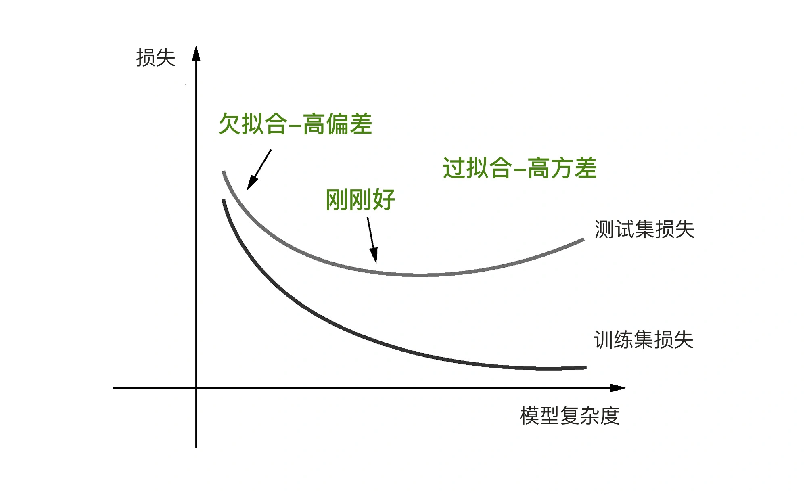

对于小数据而言，深度神经网络由于参数数量太多，容易出现过拟合的风险。而对于神经网络这么复杂的模型来说，要避免过拟合还挺难做到的。

杰弗里·欣顿（Geoffrey Hinton）和他的学生发现了一种解决方式：他们把一种叫做 Dropout 的层添加到了神经网络中，将该层的一部分神经元的输出特征随机丢掉（设为 0），相当于随机消灭一部分神经元：

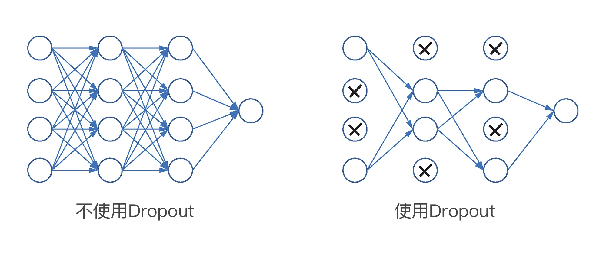

对于大型的深层神经网络来说，添加 Dropout 层已经是一个标准配置了。

```py
from tensorflow.keras.models import Sequential #导入序贯模型
from tensorflow.keras.layers import Dense, LSTM, Dropout #导入全连接层,LSTM层和Dropout层
from tensorflow.keras.optimizers import Adam
# LSTM网络架构
RNN_LSTM = Sequential() #序贯模型
RNN_LSTM.add(LSTM(units=50, return_sequences=True, input_shape=(X_train.shape[1],1))) #输入层LSTM,return_sequences返回输出序列
RNN_LSTM.add(Dropout(0.2)) #Dropout层减少过拟合
RNN_LSTM.add(LSTM(units=50, return_sequences=True)) #中间层LSTM，return_sequences返回输出序列
RNN_LSTM.add(Dropout(0.2)) #Dropout层减少过拟合
RNN_LSTM.add(LSTM(units=50, return_sequences=True)) #中间层LSTM，return_sequences返回输出序列
RNN_LSTM.add(Dropout(0.2)) #Dropout层减少过拟合
RNN_LSTM.add(LSTM(units=50)) #中间层LSTM
RNN_LSTM.add(Dropout(0.2)) #Dropout层减少过拟合
RNN_LSTM.add(Dense(units=1)) #输出层Dense
# 编译网络
RNN_LSTM.compile(loss='mse', #损失函数
             optimizer='rmsprop', #优化器
             metrics=['mae']) #评估指标
RNN_LSTM.summary() #输出神经网络结构信息
```

Dropout(0.2) 层中的 0.2，也就是在 Dropout 层中会被随机丢弃掉的神经元的比例，通常设为 0.2 ～ 0.5。注意，Dropout 只是对训练集起作用，在测试时没有神经元被丢掉。

添加了 Dropout 层之后，RNN 网络训练过程的损失曲线：

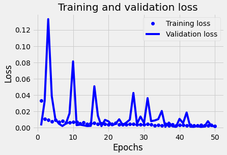

添加了 Dropout 层之后，损失曲线显得更平滑了，尽管仍然有震荡的现象，但是震荡的幅度呈现逐渐减小的趋势，而且验证集损失也随着轮次的增多而减小。

对测试集预测后显示预测曲线如下：

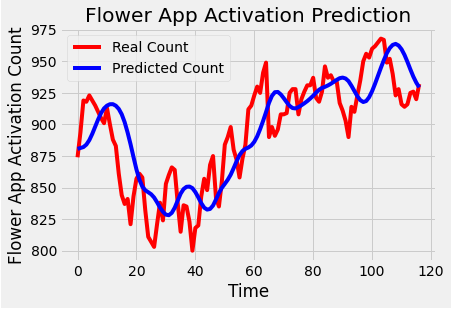

计算一下调优前后的均方误差，并进行比较：

```py
print("调优前MSE损失值 {}.".format(mean_squared_error(y_test, y_pred)))
print("添加Dropout层之后的MSE损失值 {}.".format(mean_squared_error(test, y_pred_dropout)))

# 调优前MSE损失值 0.06139160691187054.
# 添加Dropout层后得MSE损失值 0.034998731473164235.
```

比起没有添加 Dropout 层的均方误差，加入 Dropout 层后的模型均方误差从 0.06 减小到了 0.03。

增加 Dropout 层并不是唯一可以在模型创建过程中可以调节的内容，还可以通过增加或者减少模型的层数、通过改变层的类型（比如用 GRU 或者 SimpleRNN 来替换 LSTM）来找到对于当前数据集最为适配的网络结构，从而减小误差，优化模型的性能。不过，这个过程并没有固定原则，只能反复去尝试。

### 7.3. 调参时的考量：更新优化器并设置学习速率

和线性回归函数一样，神经网络也是通过梯度下降来实现参数的最优化，不过，有一点不同的是：线性回归函数仅存在一个全局最低点，而神经网络因为函数十分复杂，会出现很多的局部最低点，在每一个局部最低点，导数的值都为 0。没有求导后的正负，梯度下降也就没有任何方向感，所以这时候，神经网络的参数也不知道应该往哪里“走”，因此，神经网络模型并不能够总是得到最佳的训练结果。

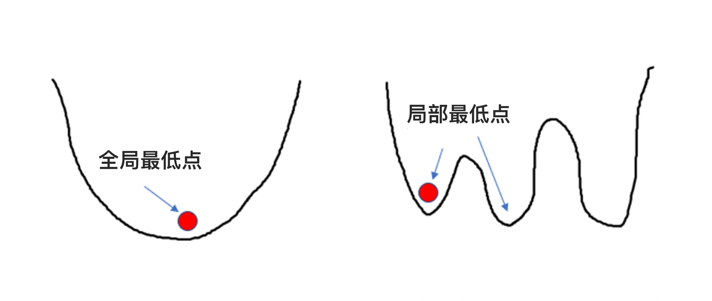

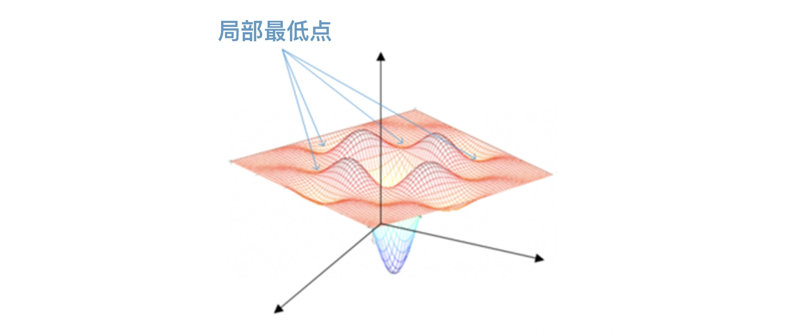


基于这个问题，人们发明了一系列的神经网络优化器，这些优化器可以在编译神经网络时作为参数传入神经网络，解决局部最低点的问题。

以 SGD 优化器为例。SGD 优化器利用了动量的原理，也就是在梯度下降时，借助惯性越过当前的局部最低点，来寻找网络中损失更小的地方。

可以想象一个小球从山坡上滑下来，在下坡的过程中，遇到一个局部最低点，如果小球此时的速度很慢，就会卡在这个局部最低点上。这时候，小球无论是向左移动还是向右移动，都很难越过去，对于模型来说，无论是向左还是向右，都会导致损失值增大。

给这个 SGD 优化器传入一个叫“学习速率”的参数，来调节小球的快慢（也就是梯度下降的快慢），可以把“学习速率”直观理解为“加速度”。如果 SGD 优化器的学习速率很小，那小球就冲不出这个局部最低点，参数就无法继续优化；如果学习速率很大，它就可能帮小球成功越过局部最低点，进入下一个下坡轨道，去寻找更优的权重参数。

除了 SGD 优化器之外，还有许多其他优化器，比如 Adagrad，它也是一种基于梯度的优化方法，叫作自适应梯度（adaptive gradient），也就是不同的参数可以拥有不同的学习速率。

Adagrad 能根据前几轮迭代时的历史梯度值来调整学习速率。对于数据集中的稀疏特征来说，Adagrad 会使用较大的学习速率，此时梯度下降步幅将较大。这里的稀疏特征，意思就是指类别非常多，但是每个类别的特征数量很少，一个很典型的例子就是对文本数据的词向量编码。

对于非稀疏特征，Adagrad 则使用较小的值更新学习速率。因此，这个优化算法适合处理含稀疏特征的数据集，比如，在文本处理的词向量（word embedding）训练过程中，对频繁出现的单词赋予较小的更新，对不经常出现的单词则赋予较大的更新。

RMSprop 优化器，它解决的是 Adagrad 中学习速率有时会急剧下降的问题。RMSProp 抑制学习速率下降的方法不同于普通的动量，它是采用窗口滑动加权平均值，来计算二阶动量。同时，它还可以保存 Adagrad 中每个参数自适应不同的学习速率。

另一种常见的优化器叫 Adam，它是一种基于一阶和二阶矩的自适应估计的随机梯度下降方法。这种优化器计算效率高，内存需求小，是前面各种优化器的集大成者，并且非常适合数据和参数都较大的问题。

> 在构建神经网络的过程中，怎么设定这些优化器呢？答案是 compile 方法。当搭建好神经网络的架构后，需要通过这个方法进行编译。

```py
cnn.compile(loss='categorical_crossentropy', # 损失函数
            optimizer='RMSprop'), # 更新优化器并设定学习速率
            metrics=['acc']) # 评估指标

RNN_LSTM.compile(loss='mse', #损失函数
                 optimizer='rmsprop', #优化器
                 metrics=['mae']) #评估指标
```

这里有 3 个可以调节的参数，分别是 loss、optimizer 和 metrics。其中，optimizer 就是设置优化器，loss 是用来指定损失函数的。对于多元分类问题，一般用 categorical_crossentropy 指定损失函数；对于二元分类问题，一般是用 binary_crossentropy；如果是回归问题，可以选择 mse，也就是均方误差。

评估指标 metrics，对于分类问题，可以使用 acc，也就是分类准确率，作为评估指标；对于回归问题，则可以选择使用 mae，即绝对平均绝对误差。

optimizer 是和性能优化最相关的参数。

## 8. 留存分析：哪些因素会影响用户的留存率

什么是用户留存？留存就是让老用户一直使用你的产品。

### 8.1. 数据的预处理

> 1. 数据导入

```py
import numpy as np #导入NumPy
import pandas as pd #导入Pandas
df_member = pd.read_csv('data.csv') #载入数据集
df_member.head() #显示数据头几行
```

> 2. 数据清洗

```py
df_member.describe() # 显示数据集数值字段概率
```

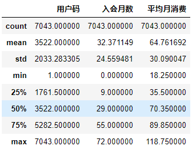

这个 describe 方法把用户码当成了数值性数据。此外，这个表格中没有“总消费”这个字段。推测“总消费”这个字段有点问题，它有可能看起来是数值，但是实际的格式是字符串。

is_numeric_dtype 方法验证一下

```py
from pandas.api.types import is_numeric_dtype #导入is_numeric_dtype工具
is_numeric_dtype(df_member['总消费']) #是否为数值字段？

# False
```

用 to_numeric 这个 API 对它做个转换：

```py
df_member['总消费'] = pd.to_numeric(df_member['总消费'], errors='coerce') #把总消费字段转换成数值字段
df_member['总消费'].fillna(0, inplace=True) #补充0值
```

> 3. 数据可视化

通过饼图来看一看性别、会费支付方式、会员卡类型、已停付会费这四个字段的分布比例。这些分布情况，尤其是留存与流失的会员占比，对于确定当前运营的重点关注点很有指导意义。

```py
import matplotlib.pyplot as plt #导入绘图工具
plt.figure(figsize=(10,8)) #图片大小
plt.subplot(2, 2, 1) #子图1
ax = df_member.groupby('性别').count()['用户码'].plot.pie(autopct='%1.0f%%') #饼图1
plt.subplot(2, 2, 2) #子图2
ax = df_member.groupby('会费支付方式').count()['用户码'].plot.pie(autopct='%1.0f%%') #饼图2
plt.subplot(2, 2, 3) #子图3
ax = df_member.groupby('会员卡类型').count()['用户码'].plot.pie(autopct='%1.0f%%') #饼图3
plt.subplot(2, 2, 4) #子图4
ax = df_member.groupby('已停付会费').count()['用户码'].plot.pie(autopct='%1.0f%%') #饼图4
plt.show() #显示
```

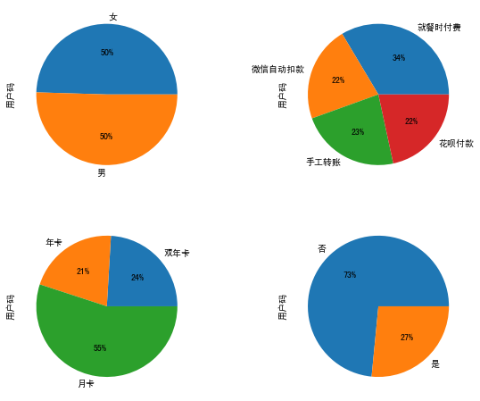

> 4. 特征工程

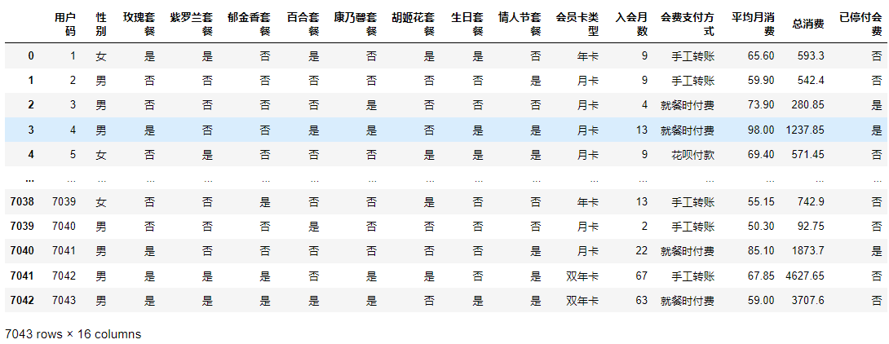

在这个数据集中，最后一列“已停付会费”字段显示有一些用户已流失。目前这个字段的值的类型是汉字，需要转换为 0、1 值才能被模型读入。同理，对“性别”字段也做类似处理。

```py
# 把汉字转换成0、1值
df_member['已停付会费'].replace(to_replace='是', value=1, inplace=True)
df_member['已停付会费'].replace(to_replace='否',  value=0, inplace=True)
df_member['性别'].replace(to_replace='女', value=0, inplace=True)
df_member['性别'].replace(to_replace='男', value=1, inplace=True)
```

对于各种会员套餐类型，把汉字“是”、“否”转换成易于机器读取的布尔类型变量。

```py
# 其它的是、否字段转换成布尔型数据
binary_features = ['玫瑰套餐', '紫罗兰套餐', '郁金香套餐', 
                   '百合套餐', '康乃馨套餐', '胡姬花套餐', 
                   '生日套餐','情人节套餐']
for field in binary_features:
    df_member[field] = df_member[field] == '是'
```

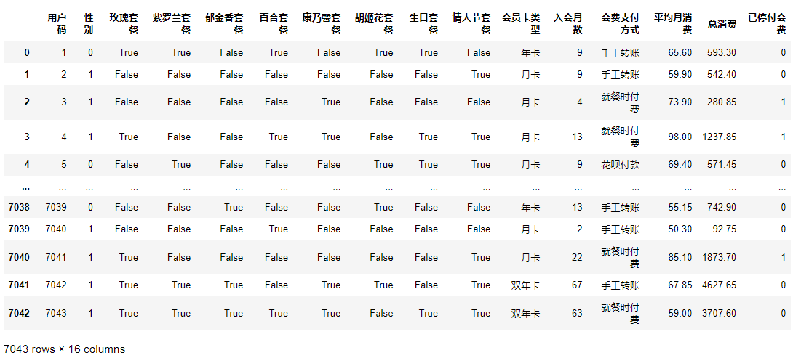

### 8.2. Kaplan-Meier 生存模型：显示整体留存曲线

在 lifelines 工具包中有一个 Kaplan-Meier 生存模型，它能显示整体的用户留存曲线，通过绘制不同群体的留存曲线，就可以观察到数据集中的各个特征对于留存的影响大小。

观察一下哪些指标与“留存时间”的关系最密切：分别是最后一个字段‘已停付会费’，以及第三个字段‘入会月数’”。有了这两个指标，就可以计算出这些用户的生命周期长度，也就是他们大概在入会多长时间后会流失了。

要安装 lifelines 工具包：

```text
pip install lifelines
```

导入 lifelines，用其中的 Kaplan-Meier 生存模型来查看普通用户随时间而变化的留存率。把“入会月数” 和“已停付会费”两个字段输入该模型，这个模型可以拟合用户数据，并以绘制出含置信区间的用户留存曲线。

```py
import lifelines #导入生存分析工具包
kmf = lifelines.KaplanMeierFitter() #创建KMF模型
kmf.fit(df_member['入会月数'], #拟合易速鲜花会员流失数据
        event_observed=df_member['已停付会费'], 
        label='会员预期留存线')
fig, ax = plt.subplots(figsize=(10,6)) #画布
kmf.plot(ax=ax) #绘图
ax.set_title('Kaplan-Meier留存曲线-易速鲜花会员们') #图题
ax.set_xlabel('入会月数') #X轴标签
ax.set_ylabel('留存率(%)') #Y轴标签
plt.show() #显示图片
```

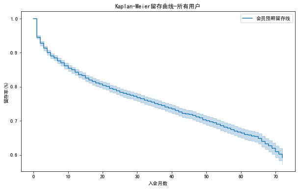

图中的曲线有蓝色的阴影，这个阴影就是置信区间。考虑到图中留存率的蓝色阴影所覆盖的范围，可以说入会月数为 20 个月之后，有 95% 的可能，用户留存的概率在 78%-82% 之间。而在第 70 个月之后，也就是注册为会员 5 年之后，留存率有 95% 的可能在 58％-64% 这个概率区间。

上面的留存曲线并不能提供更多的用户特定分组的留存情况的对比信息，还需要从用户特征入手，分组绘制留存曲线，然后在同一张图中显示，这样可以挖掘出更多影响用户留存率的因素。

根据用户特征来绘制不同的细分留存曲线。先创建一个函数，让这个函数根据用户具体特征，也就是生存分析中的因子，来专门绘制留存曲线：

```py
def life_by_cat(feature, t='入会月数', event='已停付会费', df=df_member, ax=None): #定义分类留存曲线函数
    for cat in df[feature].unique(): #遍历类别
        idx = df[feature] == cat #当前类别
        kmf = lifelines.KaplanMeierFitter() #创建KaplanMeier模型
        kmf.fit(df[idx][t], event_observed=df[idx][event], label=cat) #拟合模型
        kmf.plot(ax=ax, label=cat) #绘图
```

先看看会员费缴纳方式对留存的影响，只需要把这个字段传输进刚才定义的 life_by_cat 函数即可：

```py
fig_pmt, ax_pmt = plt.subplots(figsize=(10,6)) #画布
life_by_cat(feature='会费支付方式', ax=ax_pmt) #调用函数
ax_pmt.set_title('会费支付方式对留存的影响') #图题
ax_pmt.set_xlabel('入会月数') #X轴标签
ax_pmt.set_ylabel('留存率(%)') #Y轴标签
plt.show() #显示图片
```

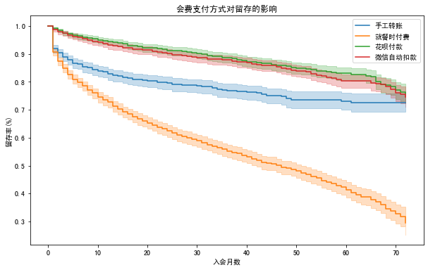

可以看到，如果选择就餐时付会员费，那么流失率将大幅上升。有理由怀疑，如果要客户下次就餐时支付会员费，那会使很多用户干脆不再前来就餐。另一个对留存有负面影响的支付方式是手工转账支付会员费。而最佳的会员费支付方案是说服用户采用微信自动扣款，或通过花呗付款。

### 8.3. Cox 危害系数模型：预测用户留存概率

Cox 危害系数模型（proportional hazards model）会分析每一个字段对于生存的影响，然后预测出某一个人大概在多久之后会“死亡”，并给出随时间延长，生存的概率值大小，也就是可能性。这个场景中的“死亡”，也就是指会员的流失。

所谓“危害”，可以理解为风险因子，它用来表示分析该特征（或称为因子）是否会增加或减少生存机会，在这里，就是指对应特征对用户流失的影响之大小了。然后对用户个体就可以根据这些字段作为特征进行预测分析，判断未来用户留存或者流失的概率。由于 Cox 危害系数模型可读取的格式是虚拟变量编码，而现在各字段的数据格式是分类编码，在调用该方法之前，还需要进一步做点数据的整理工作，把每个字段都规范成为 Cox 模型可以读取的格式。

> 1. 数据预处理

先通过 Pandas 中的 pd.get_dummies 方法，可以把多类别字段分解为多个二元类别字段，虚拟变量。比如把“会员卡类型”字段，拆分为“会员卡类型 - 年卡”、“会员卡类型 - 月卡”、“会员卡类型 - 双年卡”等。这样一来，输入 Cox 危害系数模型的所有字段都是二元类别字段，都只有 1，0（是，否）两个类别。

```py
#把分类字段转换为哑编码
category_features = ['会员卡类型', '会费支付方式'] #要转换的分类的字段
df_member = pd.get_dummies(df_member, #哑变量的个数会比总类别数少1 
                           drop_first=True, #这是因为drop_first=True
                           columns=category_features) #这能够避免回归中的多重共线性问题 
df_member #显示数据
```

> 2. 创建并拟合模型

```py
cph = lifelines.CoxPHFitter() #创建CoxPH模型
cph.fit(df_member, duration_col='入会月数', #拟合模型
        event_col='已停付会费', show_progress=False)
```

> 3. 显示留存概率曲线

```py
#显示会员生存曲线
cph.predict_survival_function(df_member.loc[3]).plot()
```

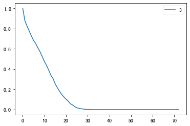

对这个用户来说，初始的留存概率当然是 1.0；在注册会员 10 个月之后，他留存下来的可能性降低到 50% 左右；在注册会员 20 个月之后，他留存的概率减少到了 20% 以下；30 个月之后，这个用户就极有可能会流失，此时的留存概率几乎为 0。

已经能够预测出用户的留存时间长短，但是怎么知道每一个指标（特征字段），对用户流失的影响有多大呢？其实，Cox 危害系数模型仍然能帮到我们。

### 8.4. Cox 危害系数模型：分析影响留存的因子

Cox 危害系数模型的用途不仅限于预测用户留存的概率，它还可以用来挖掘各个特征字段和用户留存（也就是生命周期）的关联程度。

```py
fig, ax = plt.subplots(figsize=(12,7)) #画布
ax.set_title('各个特征的留存相关系数') #图题
cph.plot(ax=ax) #绘图
```


